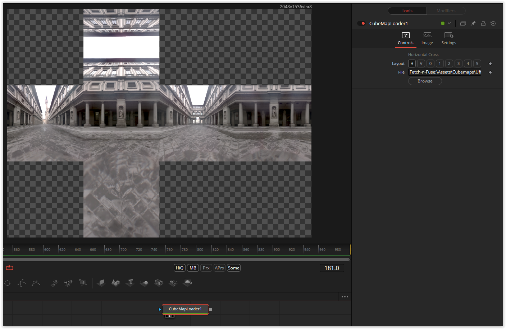

# CubeMapLoader

nmbr73 built a tool for using a cubemap for a shader fuse. A horizontal and vertical layout, as well as single images are available. The textures should be downloaded from Shadertoy.

[]

