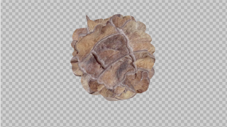
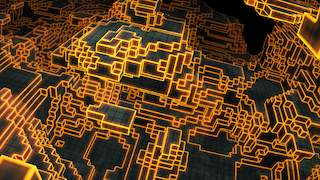

Shadertoys
==========
 

DCTL shader fuses for use within Fusion and/or DaVinci Resolve's Fusion page (aka "DaFusion"). These are based on WebGL shaders released on [Shadertoy.com](https://www.shadertoy.com/) with a license that allows for porting (see each Fuse's source code for the respective license information); please note that neither we are related to Shadertoy.com, nor is this an official Shadertoy.com repository; but we are obviously and definitely huge fans of this amazing website!

Furthermore must be mentioned that this repository is only an incubator to develop such fuses and to exchange on experiences, approaches and solutions. If you are searching for production ready extensions to really use for your day to day work, then the [Reactor](https://www.steakunderwater.com/wesuckless/viewtopic.php?f=32&t=1814) is the right and de facto go to place for you. As soon as an implementation in this repo achieves an appropriate maturity we will suggest it for inclusion into the Reactor - thereby Reactor is the one and only source for the outcomes and stable versions of our experiments. You should find the stable Fuses in Reactor under the same name but without any of the annoying '`ST_`', '`BETA_`', whatsoever prefixes.

<!--

-->

Background
----------
 

This code is mainly based on the work of **Chris Ridings** and his *[Guide to Writing Fuses for Resolve/fusion](https://www.chrisridings.com/guide-to-writing-fuses-for-resolve-fusion-part-1/)* and the [FragmentShader.fuse](https://www.chrisridings.com/wp-content/uploads/2020/05/FragmentShader.fuse) from his *[Davinci Resolve Page Curl Transition](https://www.chrisridings.com/page-curl/)* article; **Bryan Ray**, who did a whole series of blog posts on *[OpenCL Fuses](http://www.bryanray.name/wordpress/opencl-fuses-index/)*; **JiPi**, who did an excellent post on how to *[Convert a Shadertoy WebGL Code to DCTL](https://www.steakunderwater.com/wesuckless/viewtopic.php?f=17&t=4460)* accompanied by a (German) [DCTL Tutorial](https://youtu.be/dbrPWRldmbs) video. As an introduction and if you want to know more about shaders in general, a look into *[The Book of Shaders](https://thebookofshaders.com)* is highly recommended. Again the [We Suck Less](https://www.steakunderwater.com/wesuckless/index.php) forum is the place where you will find tons of information and all the experts. And last but not least are all these fuses based on work shared by those wonderful people on [Shadertoy.com](https://www.shadertoy.com/).

Installation
------------

### Repository
Just copy the whole folder resp. clone the repository into your `Fusion/Fuses/` directory, or pick and choose only the `.fuse` files you are interested in and copy them into the target folder. If you don't know how to clone a repository or if you don't know where to find the `Fusion/Fuses/` folder, don't bother - in this case it's just not the right kind of installation for you and we have other options to offer.

### ZIP-File

Find on [GitHub Pages](https://nmbr73.github.io/Shadertoys/) the Links to download the full `.tar.gz` or `.zip` archive. After unpacking you can again copy the whole folder into you `Fuses` directory or keep only single `.fuse` files.

### Fuse-Installers

You can drag'n'drop the `*-Installer.lua` files (which you find in the repo or the ZIP archive) into your Fusion working area to copy the corresponding fuse into the appropriate path.

### Installer

Alternatively you can also use the installer of the v0.1-alpha.1 release: drag'n'drop the `Shadertoys_Installer.lua` onto you Fusion working area, perform the installation and restart DaVinci Resolve.

<!--

-->

<!--

-->

Usage
-----

In the Fusion page of DaVinci Resolve right click into the working area. In the context menu under 'Add tool' you'll find a 'Shadertoys/' submenu. That submenu corresponds to the repository's directory structure and provides access to all fuses installed.

Alternatively you can open the *'Select Tool'* dialog (Shift+Space Bar) and start typing "ST-" to filter for all our shadertoy fuses.

Connect
-------

<!--

-->

... meet us on Discord

<!-- regrettably the iframe works on github pages bit not on github :-/ ...  iframe src="https://discord.com/widget?id=793508729785155594&theme=dark" width="350" height="500" allowtransparency="true" frameborder="0" sandbox="allow-popups allow-popups-to-escape-sandbox allow-same-origin allow-scripts"></iframe -->

Contribute
----------
  

...

See also the [Wiki](https://github.com/nmbr73/Shadertoys/wiki) (under construction) for some more details on how to port GLSL to DCTL.

Fuses
-----

Okay, so far there's not much here, which of course seems a bit silly after that long and thorough introduction ... but hey: it's a start.

- [Abstract Shaders](AbstractShader/)
  - [BumpyReflectingBalls](AbstractShader/BumpyReflectingBalls.md) ported by [JiPi](Profiles/JiPi.md)
  - [Crazyness](AbstractShader/Crazyness.md) ported by [nmbr73](Profiles/nmbr73.md)
  - [Cross Distance](AbstractShader/CrossDistance.md) ported by [nmbr73](Profiles/nmbr73.md)
  - [Favela](AbstractShader/Favela.md) ported by [nmbr73](Profiles/nmbr73.md)
  - [FlightThroughANebula](AbstractShader/FlightThroughANebula.md) ported by [JiPi](Profiles/JiPi.md) :new:
  - [Kali 3D](AbstractShader/Kali3D.md) ported by [JiPi](Profiles/JiPi.md)
  - [Noisecube](AbstractShader/Noisecube.md) ported by [JiPi](Profiles/JiPi.md)
  - [Rainbow Slices](AbstractShader/RainbowSlices.md) ported by [nmbr73](Profiles/nmbr73.md)
  - [Vine](AbstractShader/Vine.md) ported by [JiPi](Profiles/JiPi.md)
- Blob
  - [FunWithMetaballs](BlobShader/FunWithMetaballs.md) ported by [JiPi](Profiles/JiPi.md)
  - [TorturedBlob](BlobShader/TorturedBlob.md) ported by [JiPi](Profiles/JiPi.md)
- Distortion
  - [FbmWarp](DistortionShader/FbmWarp.md) ported by [JiPi](Profiles/JiPi.md) :new:
- Miscellaneous
  - [Fire_Water](MiscShader/Fire_Water.md) ported by [JiPi](Profiles/JiPi.md)
  - [FractalLand](MiscShader/FractalLand.md) ported by [nmbr73](Profiles/nmbr73.md)
  - [WildKifs4D](MiscShader/WildKifs4D.md) ported by [JiPi](Profiles/JiPi.md)
- Object
  - [Dancy Tree Doodle](ObjectShader/DancyTreeDoodle.md) ported by [JiPi](Profiles/JiPi.md)
  - [Dancy Tree Doodle 3D](ObjectShader/DancyTreeDoodle3D.md) ported by [JiPi](Profiles/JiPi.md)
  - [Lonely Voxel](ObjectShader/LonelyVoxel.md) ported by [JiPi](Profiles/JiPi.md)
  - [HW3Swing](ObjectShader/HW3Swing.md) ported by [JiPi](Profiles/JiPi.md)
- [Planet Shaders](PlanetShader/)
  - [Cracker Cars](PlanetShader/CrackerCars.md) ported by [JiPi](Profiles/JiPi.md)
  - [EARF](PlanetShader/EARF.md) ported by [JiPi](Profiles/JiPi.md)
  - [Fake3DScene](PlanetShader/Fake3DScene.md) ported by [JiPi](Profiles/JiPi.md)
  - [RayCastSphere](PlanetShader/RayCastSphere.md) ported by [JiPi](Profiles/JiPi.md)
- Recursiv
  - [Spilled](RecursivShader/Spilled.md) ported by [JiPi](Profiles/JiPi.md)
  - [TDSOTM_Nebula](RecursivShader/TDSOTM_Nebula.md) ported by [JiPi](Profiles/JiPi.md) :new:
- Tunnel
  - [Try Not To Hit The Walls](TunnelShader/TNTHTW.md) ported by [JiPi](Profiles/JiPi.md)
  - [Velocibox.fuse](TunnelShader/Velocibox.md) ported by [nmbr73](Profiles/nmbr73.md)

Work in Progress
----------------

- [Voxel Edges](AbstractShader/VoxelEdges.md) currently under construction by [nmbr73](Profiles/nmbr73.md)
- [FbmWarp](AbstractShader/FbmWarp.md) currently under construction by [JiPi](Profiles/JiPi.md)
- [InteractiveThinks](Working/InteractiveThinks.md) currently under construction by [JiPi](Profiles/JiPi.md)

Overview
========

Work in Progress
----------------

### JiPi

Coming Soon

### nmbr73

