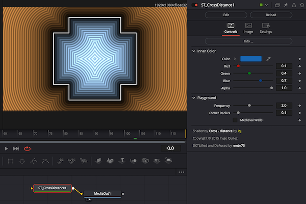
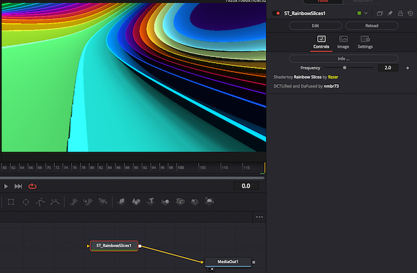

Shadertoys
==========

DCTL Shader Fuses for use within DaVinci Resolve's Fusion page (aka DaFusion). These are based on WebGL shaders realeased on [Shadertoy.com](https://www.shadertoy.com/) with a license that allows for porting (see each fuse's source code for the respective license information).

Background
----------

This code is mainly based on the work of **Chris Ridings** and his *[Guide to Writing Fuses for Resolve/fusion](https://www.chrisridings.com/guide-to-writing-fuses-for-resolve-fusion-part-1/)* and the [FragmentShader.fuse](https://www.chrisridings.com/wp-content/uploads/2020/05/FragmentShader.fuse) from his *[Davinci Resolve Page Curl Transition](https://www.chrisridings.com/page-curl/)* article; **Bryan Ray**, who did a whole series of Blog posts on *[OpenCL Fuses](http://www.bryanray.name/wordpress/opencl-fuses-index/)*; **JiPi**, who did an excelent post on how to *[Convert a Shadertoy WebGL Code to DCTL](https://www.steakunderwater.com/wesuckless/viewtopic.php?f=17&t=4460)* accompanied by a (German) [DCTL Tutorial](https://youtu.be/dbrPWRldmbs) Video and who last but not least was very patient in helping me and answering my questions. As an introduction and if you want to know more about shaders in general, I highly recommend to have a look at *[The Book of Shaders](https://thebookofshaders.com)*.

Installation
------------

Just copy the whole folder resp. clone the repository into your `Fusion/Fuses/` directory (macOS: `~/Library/Application Support/Blackmagic Design/DaVinci Resolve/`; Windows 10: `%APPDATA%\\Blackmagic Design\\DaVinci Resolve\\Support\\`) or pick and choose only the .fuse files you are interested in and copy them into the target folder.

Alternatively you can also use the installer: drag'n'drop the `Shadertoys_Installer.lua` onto you Fuison working area, perform the installation and restart DaVinci Resolve.

Usage
-----

In the Fusion page of DaVinci Resolve right click into the working area. In the context menu under 'Add tool' you'll find a 'Fuses/Shadertoys/' submenu. That submenu corresponds to the repositorie's directory structure and provides access to all fuses installed.

Alternatifely you can open the *'Select Tool'* dialog (Shift+Space Bar) and start typing "ST-" to filter for all our shadertoy fuses.

Fuses
-----

Okay, so far there's not much here, which of course seems a bit silly after that long and thorough introduction ... but hey: it's a start.

### CrossDistance.fuse

Based on '_[Cross - distance](https://www.shadertoy.com/view/XtGfzw)_' by [iq](https://www.shadertoy.com/user/iq) and ported by [nmbr73](https://www.youtube.com/c/nmbr73). This was my very first attempt to play with Fuses and the conversion of WebGL to DCTL.

### RainbowSlices.fuse

Based on '_[Rainbow Slices](https://www.shadertoy.com/view/XdsGD4)_' by [fizzer](https://www.shadertoy.com/user/fizzer) and ported by [nmbr73](https://www.youtube.com/c/nmbr73). This is a quick and dirty convesion that will definiely need some rework. But it turned out to be very easy to tranlate so far and as this version already runs on Metal I wanted to share the itermediate result.

### DancyTreeDoodle.fuse

Based on '_[DancyTreeDoodle](https://www.shadertoy.com/view/wslGz7)_' by [wyatt](https://www.shadertoy.com/user/wyatt) and ported by [J-i-P-i](https://www.youtube.com/channel/UCItO4q_3JgMVV2MFIPDGQGg). This is also a quick and dirty conversion for a little AudioWaveform Video. 

### Fake3DScene.fuse

Based on '_[Fake3DScene](https://www.shadertoy.com/view/MddSWB)_' by [LaBodilsen](https://www.shadertoy.com/user/LaBodilsen) and ported by [J-i-P-i](https://www.youtube.com/channel/UCItO4q_3JgMVV2MFIPDGQGg). A little Shader for occasionally. 

### TNTHTW.fuse

Based on '_[Try not to hit the walls](https://www.shadertoy.com/view/XsKcDG)_' by [hisojarvi](https://www.shadertoy.com/user/hisojarvi) and ported by [J-i-P-i](https://www.youtube.com/channel/UCItO4q_3JgMVV2MFIPDGQGg). A Classic. 

### Favela.fuse :ok_hand:

Based on '_[Favela](https://www.shadertoy.com/view/ldGcDh)_' by [duvengar](https://www.shadertoy.com/user/duvengar) and ported by [nmbr73](https://www.youtube.com/c/nmbr73). Now also runs under Cuda and OpenCL.

### Noisecube.fuse :zap:

Based on '_[Noisecube](https://www.shadertoy.com/view/4sGBD1)_' by [flimshaw](https://www.shadertoy.com/user/flimshaw) and ported by [J-i-P-i](https://www.youtube.com/channel/UCItO4q_3JgMVV2MFIPDGQGg). A flight through a Phongshader

### LonelyVoxel.fuse :star2:

Based on '_[LonelyVoxel](https://www.shadertoy.com/view/Mslczn)_' by [SudoNhim](https://www.shadertoy.com/user/SudoNhim) and ported by [J-i-P-i](https://www.youtube.com/channel/UCItO4q_3JgMVV2MFIPDGQGg). A cube with rounded corners and a very nice bump map.

### CrackerCars.fuse :red_car:

Based on '_[CrackerCars](https://www.shadertoy.com/view/4sdXzr)_' by [zackpudil](https://www.shadertoy.com/user/zackpudil) and ported by [J-i-P-i](https://www.youtube.com/channel/UCItO4q_3JgMVV2MFIPDGQGg). Cute little racing cars roar around on small planets. All colors are changeable

