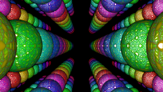

<!-- +++ DO NOT REMOVE THIS COMMENT +++ DO NOT ADD OR EDIT ANY TEXT BEFORE THIS LINE +++ IT WOULD BE A REALLY BAD IDEA +++ -->

Flight through a colorful ball grid

The surface of the balls can be influenced by a texture, so you can achieve very nice flowing appearances. The grid can be enlarged, the color distribution can be changed and you can "manually" fly through the grid if you switch off the "autopilot" with the Stop button and use the three levers Rotation 1 to 3 :-)

Have fun playing

<!-- +++ DO NOT REMOVE THIS COMMENT +++ DO NOT EDIT ANY TEXT THAT COMES AFTER THIS LINE +++ TRUST ME: JUST DON'T DO IT +++ -->
