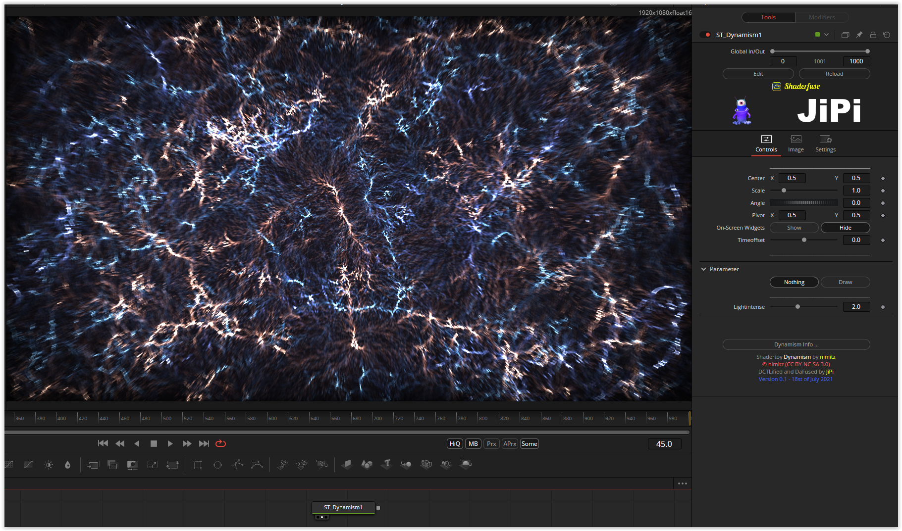

Dynamism.fuse :boom:
===========

Based on '_[Dynamism](https://www.shadertoy.com/view/MtKSWW)_' by [nimitz](https://www.shadertoy.com/user/nimitz) and ported by [JiPi](../../Site/Profiles/JiPi.md).

Accidentally came across this beautiful shader while browsing older WSL posts. At the time, it seemed too complicated to convert. With the current knowledge, however, it went quickly. The bokeh effect can be changed using the draw parameter, otherwise there are no parameters.

Have fun playing

## Compatibility
- [ ] Tested on macOS/Metal
- [ ] Tested on macOS/OpenCL
- [x] Tested on Windows/Cuda
- [x] Tested on Windows/OpenCL
