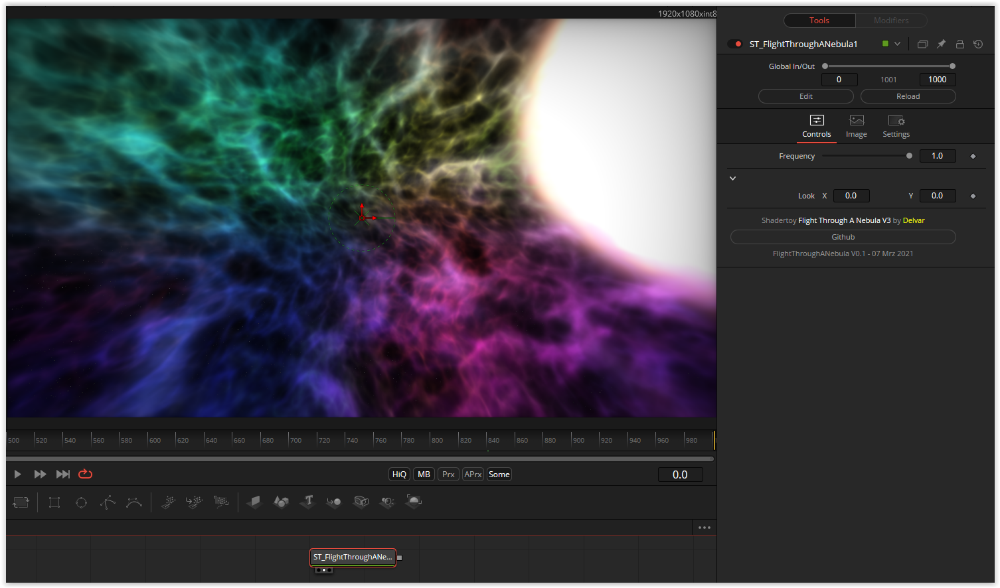

# FlightThroughANebula

This Fuse is based on the Shadertoy '_[Flight Through A Nebula V3](https://www.shadertoy.com/view/tsK3Rd)_' by [morgan3d](https://www.shadertoy.com/user/morgan3d). Conversion to DCTL and encapsulation into a fuse done by [JiPi](../../Site/Profiles/JiPi.md). See [Abstract](README.md) for more fuses in this category.

<!-- +++ DO NOT REMOVE THIS COMMENT +++ DO NOT ADD OR EDIT ANY TEXT BEFORE THIS LINE +++ IT WOULD BE A REALLY BAD IDEA +++ -->

In the original, `Texelfetch()` and GreyNoise-Volumes are used. But even without this, this shader is successful.

Have fun playing

<!-- +++ DO NOT REMOVE THIS COMMENT +++ DO NOT EDIT ANY TEXT THAT COMES AFTER THIS LINE +++ TRUST ME: JUST DON'T DO IT +++ -->

## Problems

Number of problems: 1

- Thumbnail seems to be not a 320x180 pixel PNG

