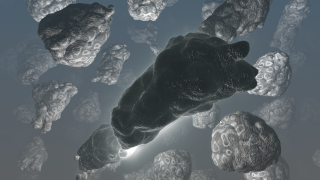

OtherWorlds
==================

Based on '_[Other worlds \ bump experiment](https://www.shadertoy.com/view/Ns2XzR)_' by [byt3_m3chanic](https://www.shadertoy.com/user/byt3_m3chanic) and porting by [JiPi](Profiles/JiPi.md).

Asteroids float weightlessly through space. Bright lights dance in the middle of the asteroid swarm.
A fascinating shader that took some work. I have implemented excessive parameters here.
In addition to the mandatory Center / Scale / Angle / Pivot / Frequency and Look parameters, here are:

drift
-----
The sinus movement of the camera can be adjusted in terms of stroke, offset and frequency

Glow
----
In addition to the intensity, the frequency can be adjusted so that an underwater impression can be created because the angle of the light is changed. The color of the glow can be adjusted, there is also a parameter that sets the strength of the color (Glow Color).

Scene frequency
---------------
This can be used to change the timing of the camera flight independently of the other timings. If you want to change the timing of all animations equally, there is the standard parameter "Frequency". Manual timing (Actime) is also possible with the "stop" checkbox.

Bumpmap
--------
The texture in the Image1 input is used as height information for the surface of the asteroids. The depth can be adjusted with this parameter.

Asteroid painting
-----------------
The shader provides a painting of the asteroides. An additional painting can be set with the "Paint" parameter which is not activ in the original, I found it very nice. The "Paint Intense" parameter refers to the standard painting, it can be set here. The paint color is also adjustable.

Surface level
-------------
The surface level refers to the bright lights that can be changed with this.

Diffuse, Reflect, Specular and Ambient
--------------------------------------
speak for themselves.

Fog
---
Unfortunately, this parameter is not very easy to set. Since the shader does not specifically treat the background, changing this value can cause an unintentional color gradient to appear in the background. The value should therefore be changed very carefully. Especially when it comes to the interaction with the background colors.

Background colors
-----------------
You can change the color of the upper and lower part separately.

Max Distance
------------
The standard setting in the original is 4. You can increase this value to 10 and thus get a significantly greater depth and accordingly more asteroids. It should be noted, however, that the Fog parameter must be carefully adjusted, otherwise the additional asteroids will all be in the fog. So careful testing is required here.

Please note
===========
A collision avoidance, i.e. avoiding the camera flight through an object, is unfortunately missing here, so that it can happen that it briefly gets dark. However, the automatic camera flight has no collisions.

Please note that the limits have not yet been adjusted, i.e. the slider does not give the really possible adjustment range. Please enter larger and smaller values ​​using the keyboard.

I hope you enjoy playing with this shader as much as I do.

## Compability
- [ ] Tested on macOS/Metal :bomb::bomb::bomb:
- [ ] Tested on macOS/OpenCL
- [x] Tested on Windows/Cuda
- [x] Tested on Windows/OpenCL