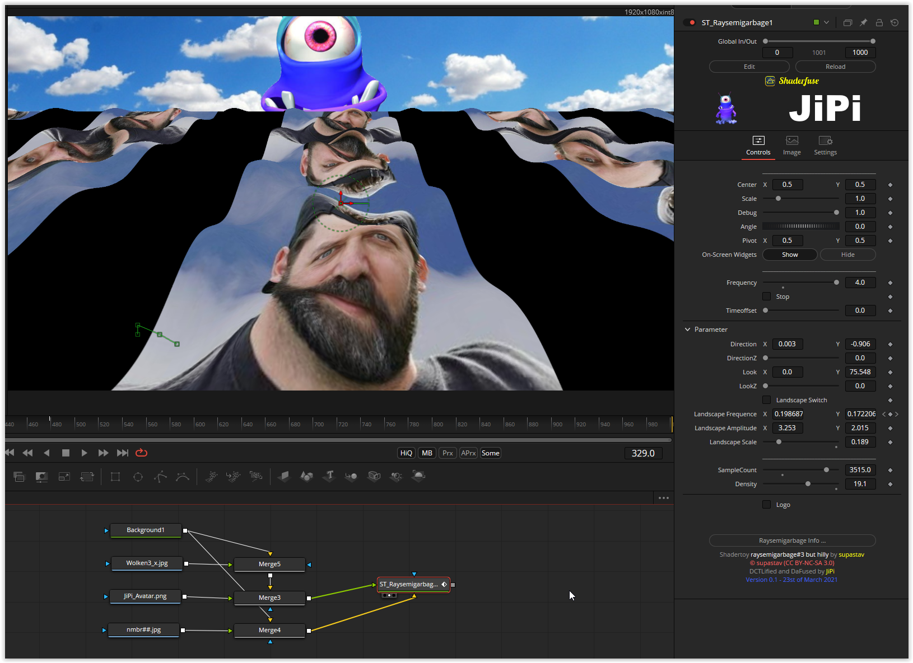

A very small shader, but I found it very good for getting to know the basic principles.
We have a raymarching function that can be set with the two parameters SampleCount & density. We have the two three-dimensional parameters Direction & Look (Camera) to set the view of the scene. The standard block scale, offset, angle and pivot relate to the scanning and are completely independent of raymarching.
The shader shows a texture (Image1) on a surface that can be distorted in the X and Y directions (sinus/cosinus). A second texture can be loaded for the horizon (sky) (Image2).
Due to the many parameters, you can now understand the mode of action very well. No garbage, just a cute little shader :-)

Have fun playing
