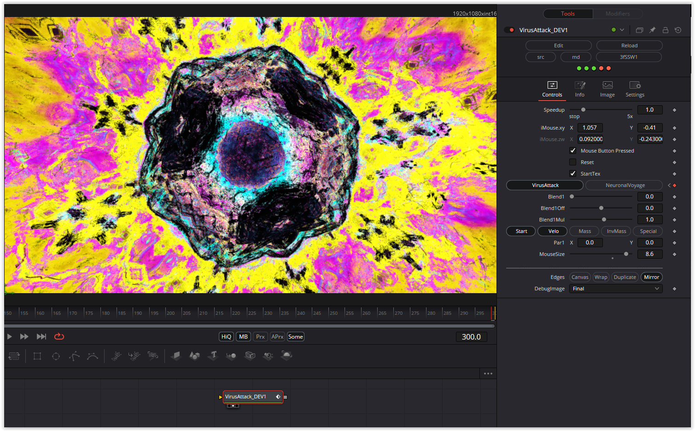

This Fuse contains these two shaders:
Virus Attack
https://www.shadertoy.com/view/3fSSW1
Neuronal Voyage
https://www.shadertoy.com/view/wfSXD1

All shaders have the same basic structure.

Enjoy playing

### Description of the Shader in Shadertoy:
 spike proteins - good target for vaccine - haha
