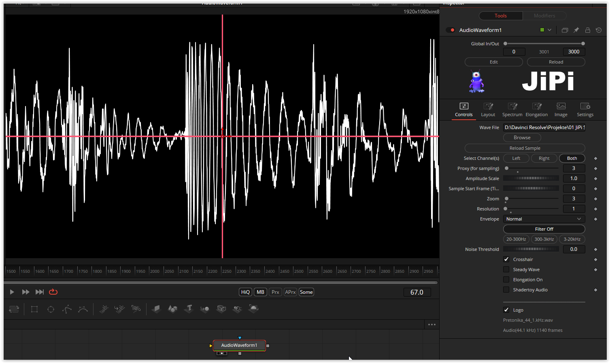

# AudioWaveform

AudioWaveform.fuse is a tool with which you can visualize a wave file in Fusion, as a waveform or as a spectrum. The data can then be used to influence other parameters.
When using the shader toys that require an audio input, there is now the option of using the AudioWaveform.fuse to operate them. There is also a switch that then operates a second output and provides an image (512x2 pixels) for the shader fuses.
You can use Resolve's renderer to convert an MP3 into a wave file:
- Disable export video checkbox (Video tab)
- Format Wave, Linear PCM, 44100 or 48000, 16 Bit Depth (Audio Tab)

Here are links to the WeSuckLess forum where you can get more info about the AudioWaveform.fuse.

https://www.steakunderwater.com/wesuckless/viewtopic.php?t=4191

https://www.steakunderwater.com/wesuckless/viewtopic.php?t=4627

