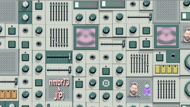

# InerciaIntended

This Fuse is based on the Shadertoy '_[ 20221105_inercia intended one](https://www.shadertoy.com/view/cs2GWD)_' by [0b5vr](https://www.shadertoy.com/user/0b5vr). Conversion to DCTL and encapsulation into a fuse done by [JiPi](../../Site/Profiles/JiPi.md). See [Audio](README.md) for more fuses in this category.

<!-- +++ DO NOT REMOVE THIS COMMENT +++ DO NOT ADD OR EDIT ANY TEXT BEFORE THIS LINE +++ IT WOULD BE A REALLY BAD IDEA +++ -->

A cluttered control panel with moving knobs, flashing LEDs and level meters.
FinalColor and SpecColor affect the entire shader.
MTL0Color changes the knobs and dials
MTL1Color changes the background of the level meter
MTL2Color changes the LED's (LED/Sliders)
MTL3Color changes all metal elements
MTL4Color changes the graphics display
MTL5Color changes the buttons
SpecPower adjusts the Speculate effect
With AnimationSpeed ​​the change of the two camera positions can be changed. The two camera positions, which are approached alternately, can be changed with Anim1 and Anim2, but this can result in constellations in which no image can be rendered.
With SinusColorize, the fields can be assigned random colors.
The level display can be changed with the Level Meter parameter so that a stereo display is also possible.
The level display can be changed with activated "ManualLineLevel" with the LevelAudio. Otherwise, the Shadertoy audio (512X2Pixel Texture) is used and the AudioWaveform.fuse can be used on the iChannel0. The frequency to be used can be set (0.0 -> bass, 1.0 -> treble). A gain or offset is present.
Wavfreq refers to the wave motion of the faceplate.
A texture (iChannel1) can be displayed on the speakers. Either blended in or printed on, with the ability to adjust the alpha value. Something has to be tried here, since an increase in size due to the report means that "only" one logo fits.

Have fun playing

<!-- +++ DO NOT REMOVE THIS COMMENT +++ DO NOT EDIT ANY TEXT THAT COMES AFTER THIS LINE +++ TRUST ME: JUST DON'T DO IT +++ -->

## Compatibility

⬛ macOS / Metal: NOT TESTED! 
⬛ macOS / OpenCL: NOT TESTED! 
🟩 Windows / CUDA: checked 
🟥 Windows / OpenCL 

## Problems

Number of problems: 3

- macOS_Metal compatibility not checked
- macOS_OpenCL compatibility not checked
- Windows_OpenCL compatibility: 💣 missing functionality

