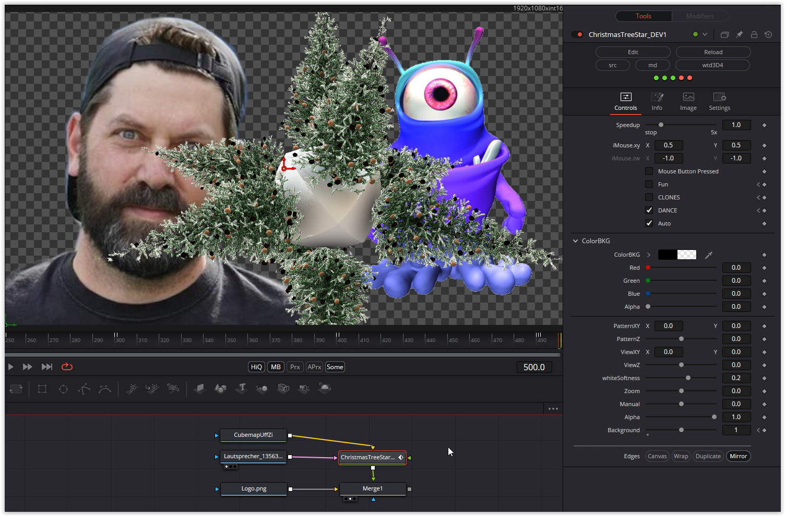

The difficulty here was to replace the cube buffer, which does not exist in DCTL, as best as possible. In addition, extensive structures are used here, which are in turn stored in arrays. The automatic camera movement can be switched off and controlled manually. The planet with the trees can be isolated (Background = 1 and Alpha 0 for ColorBKG). The Fun, CLONES and DANCE switches activate funny variants.

Have fun playing

### Description of the Shader in Shadertoy:
Remix of my [url=https://www.shadertoy.com/view/wdfGzr]Baubles[/url] shader.
Alternate versions:
[url=https://www.shadertoy.com/view/3l3GRS]More trees![/url]
[url=https://www.shadertoy.com/view/Wt33zS]Bokeh & Fairy Lights[/url]
