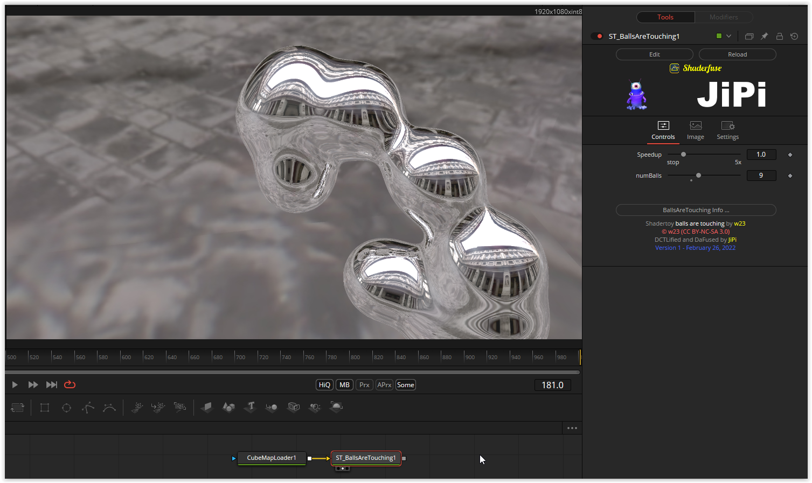

# BallsAreTouching

Based on '_[balls are touching](https://www.shadertoy.com/view/MdlGWn)_' by [w23](https://www.shadertoy.com/user/w23) and ported by [JiPi](../../Site/Profiles/JiPi.md).

## Compatibility
- [x] Tested on macOS/Metal
- [ ] Tested on macOS/OpenCL
- [X] Tested on Windows/Cuda
- [X] Tested on Windows/OpenCL
