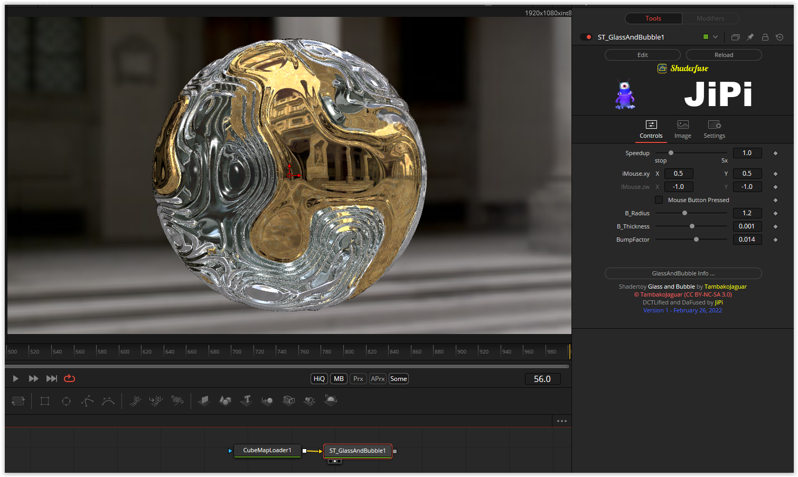

# GlassAndBubble

Based on '_[Glass and Bubble](https://www.shadertoy.com/view/XdVSRV)_' by [TambakoJaguar](https://www.shadertoy.com/user/TambakoJaguar) and ported by [JiPi](../../Site/Profiles/JiPi.md).

## Compatibility
- [ ] Tested on macOS/Metal
- [ ] Tested on macOS/OpenCL
- [X] Tested on Windows/Cuda
- [X] Tested on Windows/OpenCL
