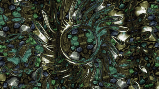

DisplacementShader
==================

Based on '_[DisplacementShader](https://www.shadertoy.com/view/4l2cD3)_' by [Coolok](https://www.shadertoy.com/user/Shane) and porting by [JiPi](Profiles/JiPi.md).

Nothing special, but still a very nice effect. Possibly also useful for transitions.

Have fun playing

## Compatibility
- [x] Tested on macOS/Metal
- [ ] Tested on macOS/OpenCL
- [x] Tested on Windows/Cuda
- [x] Tested on Windows/OpenCL