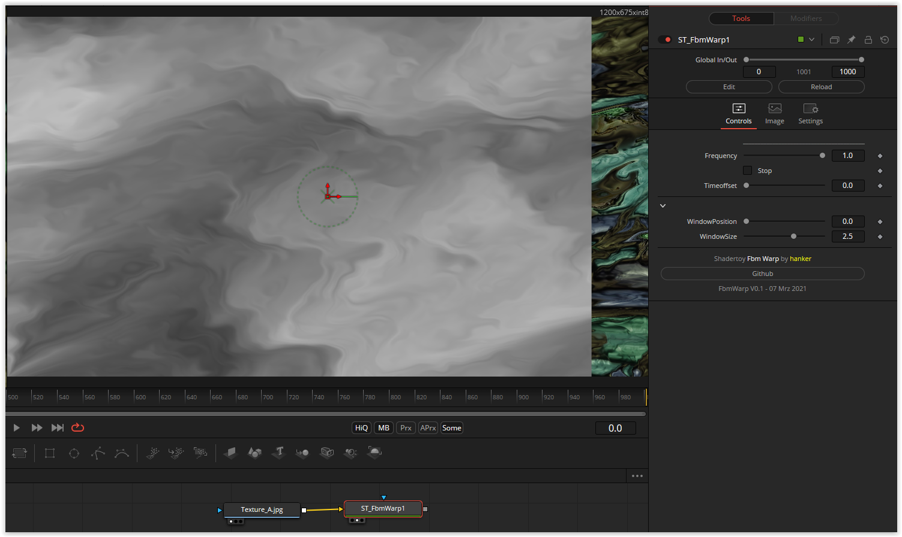

This shader obviously takes advantage of a trick in WebGL that doesn't quite work that way in DCTL. A small adjustment made at least the principle function possible. If the result looks a little different, it is not worse.

Have fun playing
