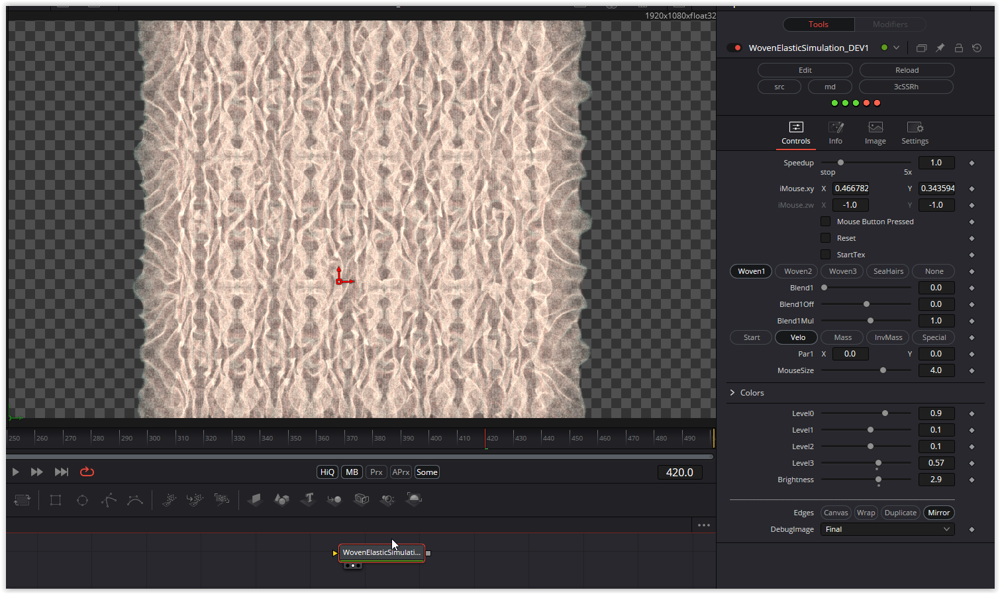

This fuse contains these three shaders:
WovenElasticSimulation (https://www.shadertoy.com/view/3cSSRh)
WovenElasticSimulation2 (https://www.shadertoy.com/view/WfSSzh)
WovenElasticSimulation3 (https://www.shadertoy.com/view/3fBSR1)
SeaHairs (https://www.shadertoy.com/view/tfBSzh)

All shaders have the same basic structure. Switching between shaders creates new shapes. The shape can also be modified by creating a texture or changing the mouse parameters.

Have fun playing

### Description of the Shader in Shadertoy:
jfa
