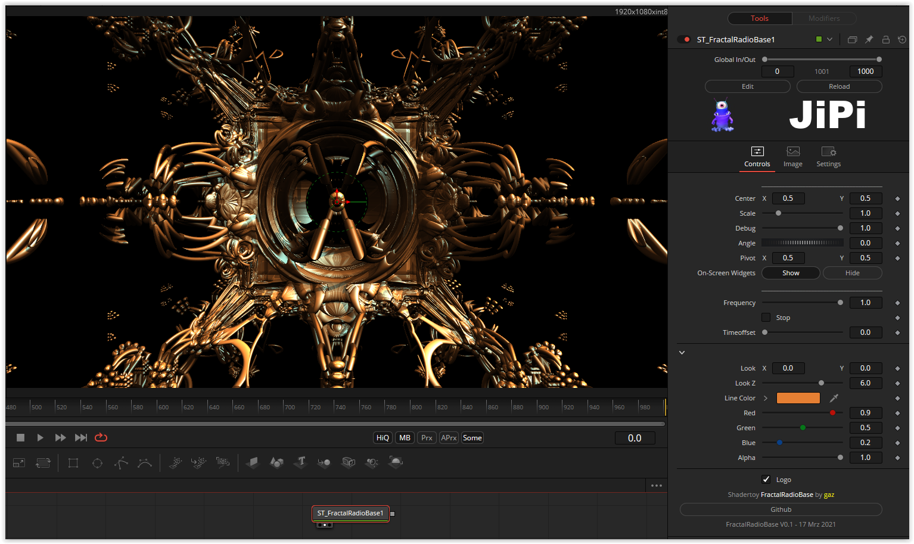

An alien antenna hovers through the universe. So far only a few parameters are available.
In the original, very nice details were added via BufferA, but this has been omitted here in the conversion.

Have fun playing
