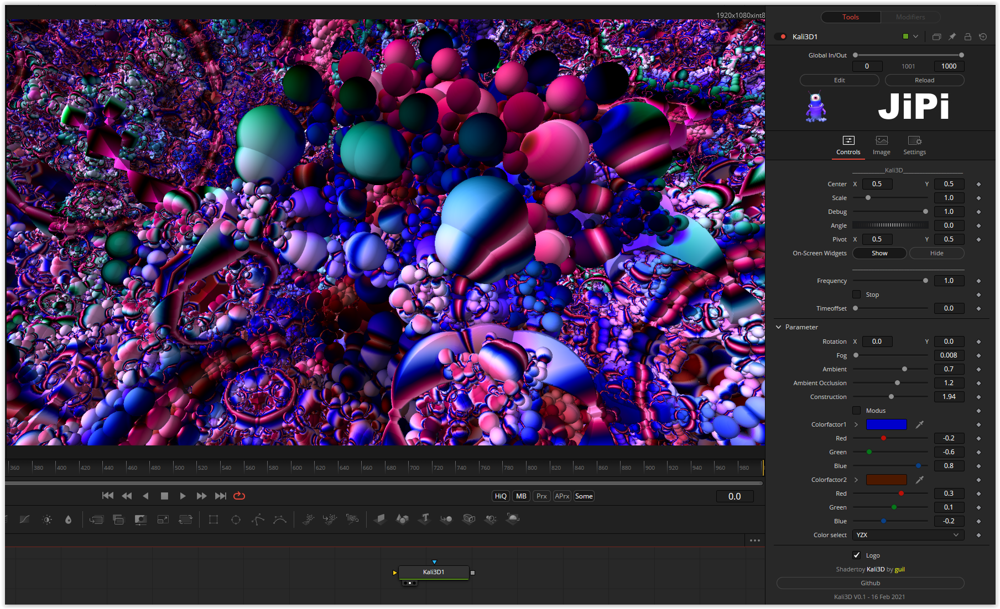

A flight through an abstract universe - colorful and very changeable

Programmed completely without matrices and very compact. Both shape and color are more likely to be left to chance than specifically changeable, but that also makes it exciting.

Have fun playing