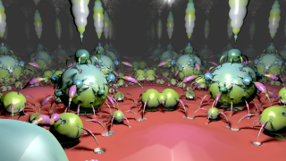

Rendezvous
==================

Based on '_[Rendezvous](https://www.shadertoy.com/view/ldjGDw)_' by [Dave_Hoskins](https://www.shadertoy.com/user/Dave_Hoskins) and porting by [JiPi](Profiles/JiPi.md).


A flight through a colorful fractal landscape that breathes and seems to be alive. An impressively compact code for the definition of the landscape and you don't necessarily need matrices to program a great camera flight, as you can see.


Have fun

```
float Map( vec3 p )
{
	float scale = 1.0;
	float add = sin(iTime)*.2+.1;

	for( int i=0; i < 9;i++ )
	{
		p = 2.0*clamp(p, -CSize, CSize) - p;
		float r2 = dot(p,p);
		float k = max((1.15)/r2, 1.);
		p     *= k;
		scale *= k;
	}
	float l = length(p.xy);
	float rxy = l - 4.0;
	float n = l * p.z;
	rxy = max(rxy, -(n) / (length(p))-.07+sin(iTime*2.0+p.x+p.y+23.5*p.z)*.02);
    float x = (1.+sin(iTime*2.));x =x*x*x*x*.5;
    float h = dot(sin(p*.013),(cos(p.zxy*.191)))*x;
	return ((rxy+h) / abs(scale));

}
```
[](Rendezvous.fuse)

## Compatibility
- [x] Tested on macOS/Metal
- [ ] Tested on macOS/OpenCL
- [x] Tested on Windows/Cuda
- [x] Tested on Windows/OpenCL
