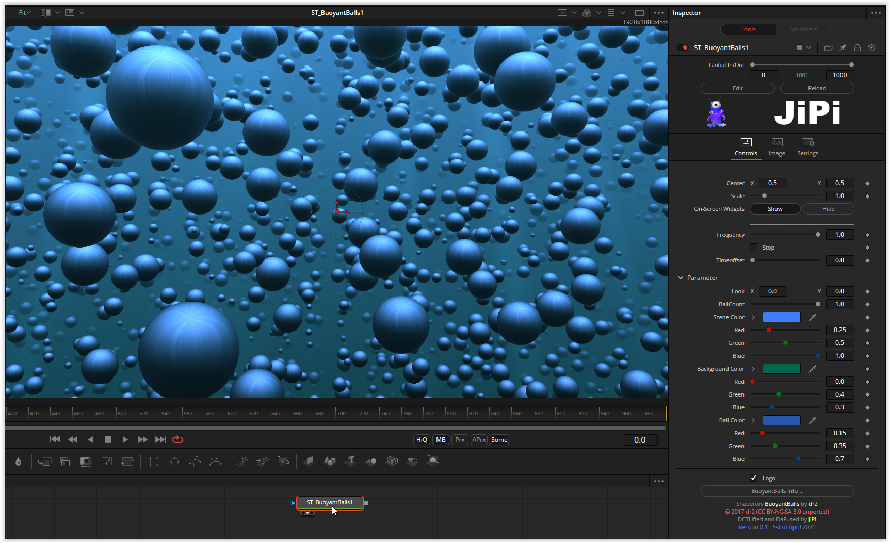

Balls that rise weightlessly in the water. There aren't too many parameters yet. In addition to the number of balls, the color of the scene, the background color and the color of the balls can be changed.
During the conversion, the greatest effort was also here in resolving the global variables for OpenCL.

Have fun playing
