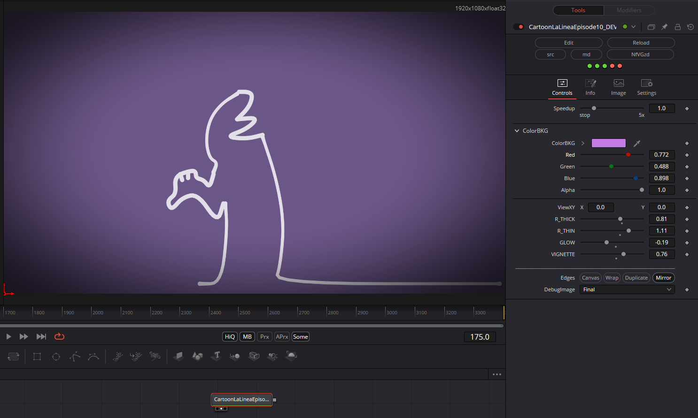

It’s a wonderful idea to create these cartoon characters as shaders. I love the stories featuring this character. I spent a long time looking for the error here—the image wasn't rendering correctly—until I stumbled upon those `++` operators again; unfortunately, they don't work with global variables (for whatever reason)—a nasty bug. It took quite a few debugging cycles to figure it out.

Have fun playing around with it.

### Description of the Shader in Shadertoy:
Karma hits our charismatic line hard in this recreation of the lovely classic cartoon by Osvaldo Cavandoli  :)

Press the Reset Time  button if there is no sound or if its out of sync
