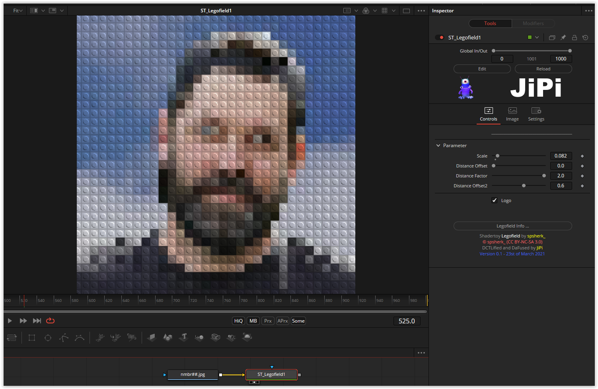

# Legofied

This Fuse is based on the Shadertoy '_[Legofied](https://www.shadertoy.com/view/XtBSzy)_' by [Gijs](https://www.shadertoy.com/user/Gijs). Conversion to DCTL and encapsulation into a fuse done by [JiPi](../../Site/Profiles/JiPi.md). See [Misc](README.md) for more fuses in this category.

<!-- +++ DO NOT REMOVE THIS COMMENT +++ DO NOT ADD OR EDIT ANY TEXT BEFORE THIS LINE +++ IT WOULD BE A REALLY BAD IDEA +++ -->

Here is a very simple and still very nice shader.

Have fun playing

<!-- +++ DO NOT REMOVE THIS COMMENT +++ DO NOT EDIT ANY TEXT THAT COMES AFTER THIS LINE +++ TRUST ME: JUST DON'T DO IT +++ -->

