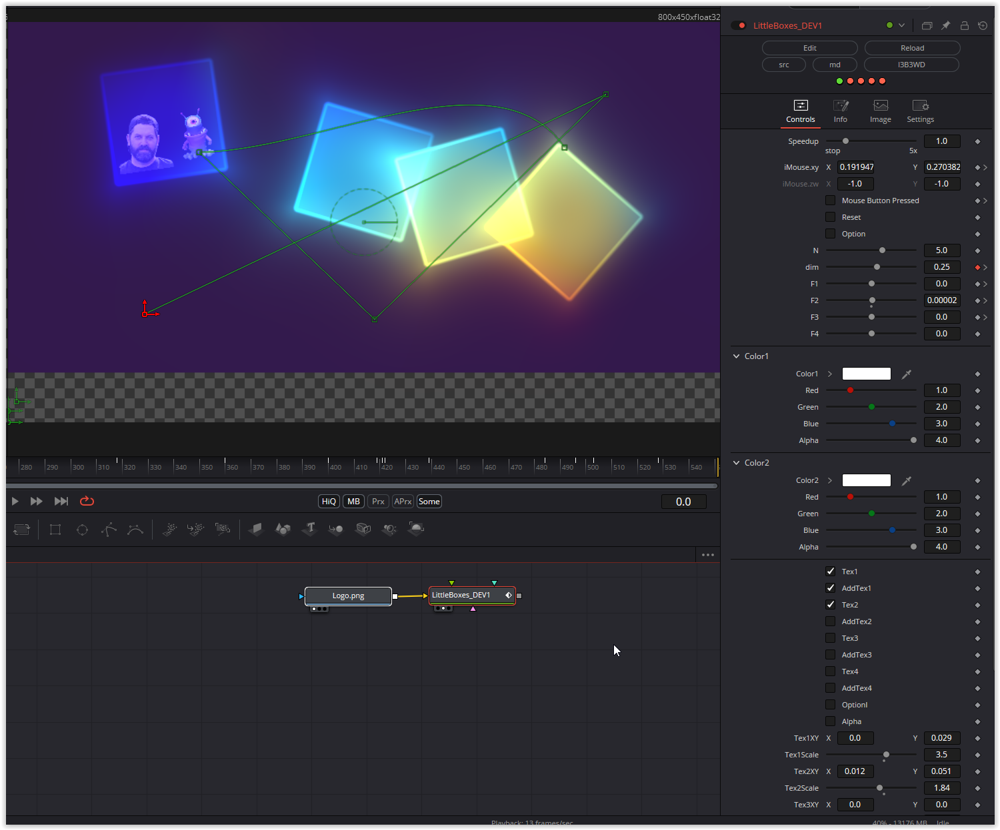

Bouncing colorful cubes that can be thrown with the mouse. The number and size, as well as the forces acting on the cubes (F1-F4) can be changed. Textures can be applied to four cubes and the background can be made transparent (Alpha)

Have fun playing

