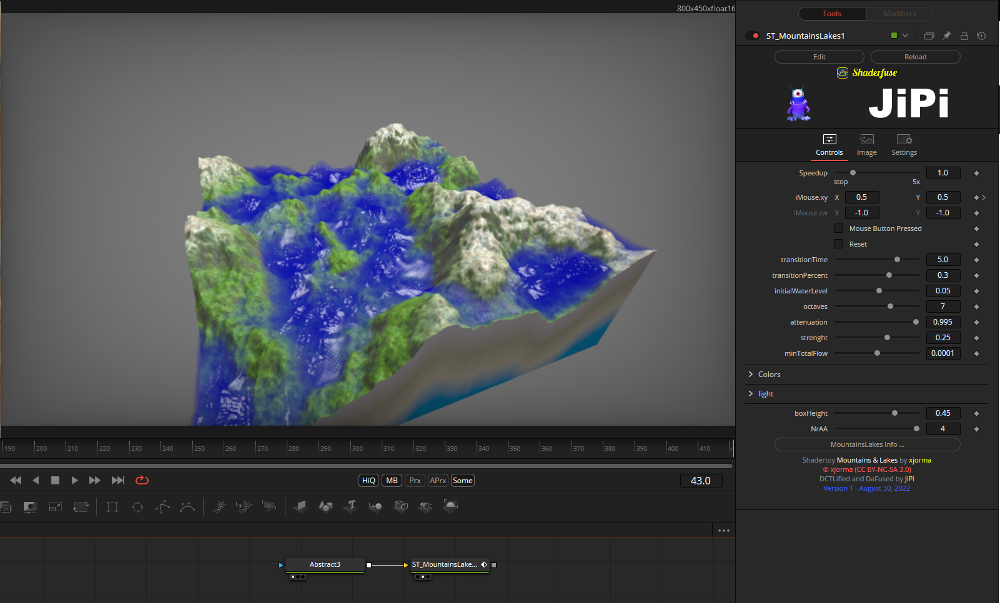

With this shader I started the conversion some time ago without success. I stumbled across this again while searching and this time it wasn't a problem. An uninitialized variable slowed me down a bit, but now this awesome shader is available as a fuse.

In addition to the main colors "Cliff", "Snow" and Background (this also determines the alpha), the background colors can be changed. The antialiasing values can be changed from 1 (off) to 4. And there are still a number of parameters with which the behavior can be influenced.

I hope you enjoy it.

