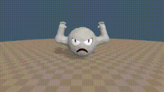
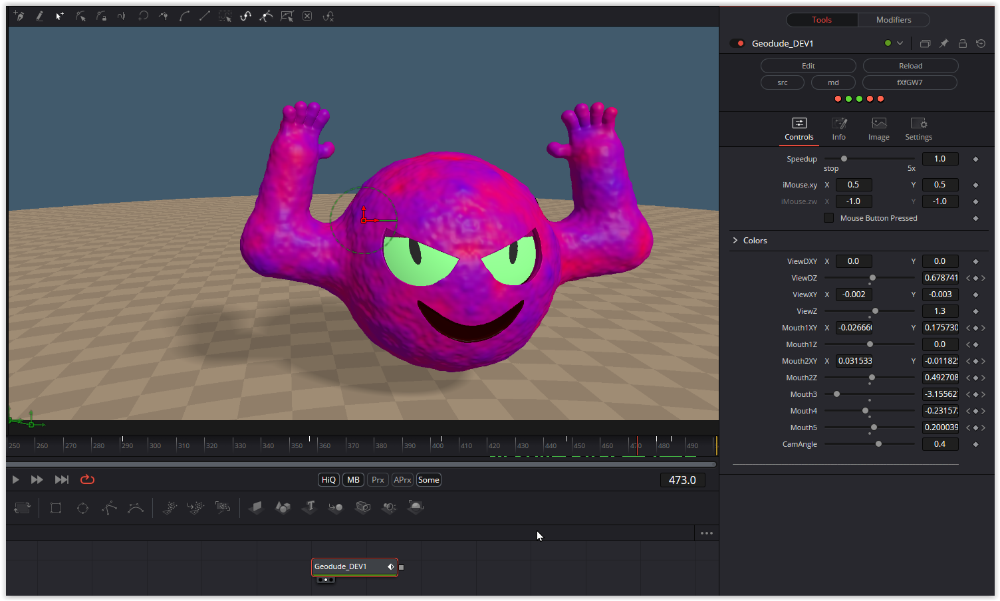

Lots of little monsters. For some, the camera view was already adjustable via mouse parameters; for the others, I added this functionality myself, making it possible to view them from any perspective. Additionally, almost all of their colors can be customized. Geodude's mouth is fully animatable.

Have fun playing!

### Description of the Shader in Shadertoy:
The is the Pokemon Geodude. The eye blinking is something I started with the voltorb shader. The mouth open code was from the ditto shader. Added a unique open palm to fist animation to make this one unique from past pokemon shaders.