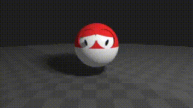
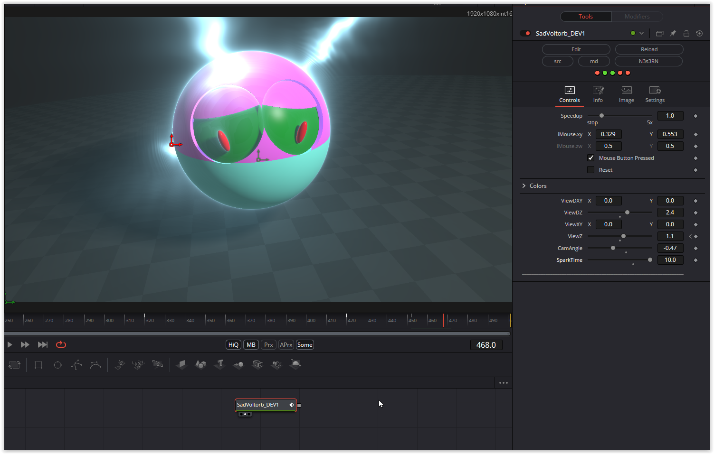

Lots of little monsters. For some, the camera view was already adjustable via mouse parameters; for the others, I added this functionality myself, making it possible to view them from any perspective. Additionally, almost all of their colors can be customized. Geodude's mouth is fully animatable.

Have fun playing!

### Description of the Shader in Shadertoy:
Voltorb but he  is sad
