# News / Featured

#### My Current Shader of the Week (7th of August 2026):

  
[Cartoon: La Linea Episode 10
](Misc/CartoonLaLineaEpisode10.md) by [Espeset](https://www.shadertoy.com/user/Espeset)

#### Current Shader of the Week (25th of September 2026):

  
[The Tetris Dimension](ShaderOfTheWeek/TheTetrisDimension.md) by [Hyeve](https://www.shadertoy.com/user/Hyeve)

### A new Category: Monster
[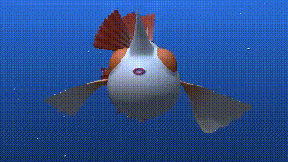](Monster/Goldeen.md)  
[Goldeen](Monster/Goldeen.md) by [noztol](https://www.shadertoy.com/user/noztol)

[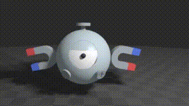](Monster/Magnemite.md)  
[Magnemite](Monster/Magnemite.md) by [noztol](https://www.shadertoy.com/user/noztol)

[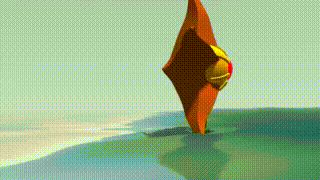](Monster/Staryu.md)  
[Staryu](Monster/Staryu.md) by [noztol](https://www.shadertoy.com/user/noztol)

[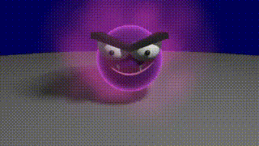](Monster/Gastly.md)  
[Gastly](Monster/Gastly.md) by [noztol](https://www.shadertoy.com/user/noztol)

[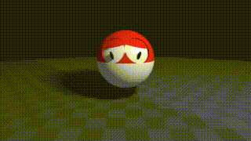](Monster/SadVoltorb.md)  
[Sad Voltorb](Monster/SadVoltorb.md) by [noztol](https://www.shadertoy.com/user/noztol)

[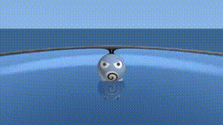](Monster/Poliwag.md)  
[Poliwag](Monster/Poliwag.md) by [noztol](https://www.shadertoy.com/user/noztol)

[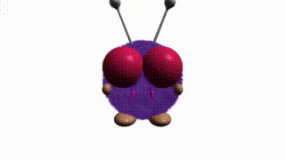](Monster/Venonat.md)  
[Venonat](Monster/Venonat.md) by [noztol](https://www.shadertoy.com/user/noztol)

[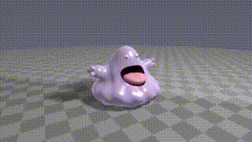](Monster/Grimer.md)  
[Grimer](Monster/Grimer.md) by [noztol](https://www.shadertoy.com/user/noztol)

[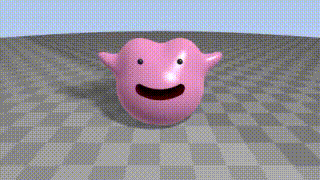](Monster/Ditto.md)  
[Ditto](Monster/Ditto.md) by [noztol](https://www.shadertoy.com/user/noztol)

[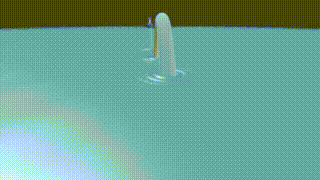](Monster/Dragonair.md)  
[Dragonair](Monster/Dragonair.md) by [noztol](https://www.shadertoy.com/user/noztol)

[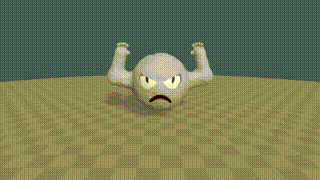](Monster/Geodude.md)  
[Geodude](Monster/Geodude.md) by [noztol](https://www.shadertoy.com/user/noztol)

[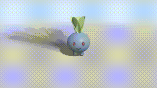](Monster/Oddish.md)  
[Oddish](Monster/Oddish.md) by [noztol](https://www.shadertoy.com/user/noztol)

## Installation

### Reactor

Best way to install the Fuses is to just use [Reactor](https://www.steakunderwater.com/wesuckless/viewtopic.php?f=32&t=1814). Find the 'Shadertoys' package in the - guess what - 'Shaders' category. This is the most convenient and recommended way to if you just what to use them or have a quick look if they might be useful for you.

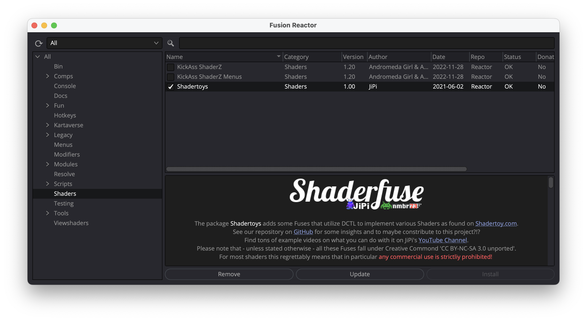

Only thing to take into account is that this way you don't get the latest development versions. Stable toys are bundled from time to time and integrated in Reactor when reviewed. You will find the Shaderfuses installed this way in Effects under 'Shaderfuse'.

### Installer

Alternately to the Reactor package install, you can download a Fuse's '`*-Installer.lua`' installation script in case you want to quickly try out the latest version of a single Fuse. Drag and drop that script onto your Fusion workspace and follow installer's instructions. You will find Fuses installed this way in Effects under 'Shaderfuse (beta)' and node instances of such Fuses will have a '_BETA' suffix in your composition.

If you want to try out multiple Shaderfuses this way, you can download all the latest installers as [Shaderfuse-Installers.zip](Shaderfuse-Installers.zip). Unpack the that archive and then drag and drop the installers of your choice onto Fusion.

## Usage

In the Fusion page of DaVinci Resolve right click into the working area. In the context menu under 'Add tool' you'll find a 'Shaderfuse' submenu (resp. 'Shaderfuse (beta)' for their variants installed using an installer). That submenu corresponds to the Fuse categories you see on this page and provides access to all fuses installed.

Alternatively you can open the *'Select Tool'* dialog (Shift+Space Bar) and start typing "`sf.`" to filter for the shadertoy fuses (or use "sf-b." for the beta versions installed via an installer script).

And last but not least in 'Effects' (Fusion) resp. the 'Effects Library' (DaVinci Resolve) pane under 'Tools' you should now find an entry 'Shaderfuse' (resp. 'Shaderfuse (beta)') that lists all the categories and the different fuses.

Please note, that there a some specific shaders that might need additional Fuses at their input to be used. These are in particular all the [Cubemap](Cubemap/README.md) and [Audio](Audio/README.md) shaders.
