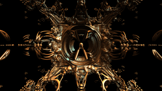

<!--                                                             -->
<!--           THIS IS AN AUTOMATICALLY GENERATED FILE           -->
<!--                                                             -->
<!--                  D O   N O T   E D I T ! ! !                -->
<!--                                                             -->
<!--  ALL CHANGES WILL BE OVERWRITTEN WITHOUT ANY FURTHER NOTICE -->
<!--                                                             -->

# Shaders

## Abstract Shaders

<table><tr>
<td></td>
<td>

:boom:

<nobr>Fuse: [BumpyReflectingBalls](Abstract/BumpyReflectingBalls.md)</nobr> 
<nobr>Category: [Abstract](Abstract/OVERVIEW.md)</nobr> 

'dctlfuse_category' could not be determined

</td></tr>
<tr>
<td></td>
<td>

:boom:

<nobr>Fuse: [Crazyness](Abstract/Crazyness.md)</nobr> 
<nobr>Category: [Abstract](Abstract/OVERVIEW.md)</nobr> 

'dctlfuse_category' could not be determined

</td></tr>
<tr>
<td></td>
<td>

:four_leaf_clover:

<nobr>Fuse: [CrossDistance](Abstract/CrossDistance.md)</nobr> 
<nobr>Category: [Abstract](Abstract/OVERVIEW.md)</nobr> 
<nobr>Shadertoy: [Cross - distance](https://www.shadertoy.com/view/XtGfzw)</nobr> 
<nobr>Author: [iq](https://www.shadertoy.com/user/iq)</nobr> 
<nobr>Ported by: [nmbr73](../Site/Profiles/nmbr73.md)</nobr> 

</td></tr>
<tr>
<td></td>
<td>

:four_leaf_clover:

<nobr>Fuse: [Favela](Abstract/Favela.md)</nobr> 
<nobr>Category: [Abstract](Abstract/OVERVIEW.md)</nobr> 
<nobr>Shadertoy: [Favela](https://www.shadertoy.com/view/ldGcDh)</nobr> 
<nobr>Author: [duvengar](https://www.shadertoy.com/user/duvengar)</nobr> 
<nobr>Ported by: [nmbr73](../Site/Profiles/nmbr73.md)</nobr> 

</td></tr>
<tr>
<td></td>
<td>

:boom:

<nobr>Fuse: [FlightThroughANebula](Abstract/FlightThroughANebula.md)</nobr> 
<nobr>Category: [Abstract](Abstract/OVERVIEW.md)</nobr> 

'dctlfuse_category' could not be determined

</td></tr>
<tr>
<td></td>
<td>

:boom:

<nobr>Fuse: [Kali3D](Abstract/Kali3D.md)</nobr> 
<nobr>Category: [Abstract](Abstract/OVERVIEW.md)</nobr> 

'dctlfuse_category' could not be determined

</td></tr>
<tr>
<td></td>
<td>

:boom:

<nobr>Fuse: [Mosaic](Abstract/Mosaic.md)</nobr> 
<nobr>Category: [Abstract](Abstract/OVERVIEW.md)</nobr> 

'dctlfuse_category' could not be determined

</td></tr>
<tr>
<td></td>
<td>

:boom:

<nobr>Fuse: [Noisecube](Abstract/Noisecube.md)</nobr> 
<nobr>Category: [Abstract](Abstract/OVERVIEW.md)</nobr> 

'dctlfuse_category' could not be determined

</td></tr>
<tr>
<td></td>
<td>

:boom:

<nobr>Fuse: [RainbowSlices](Abstract/RainbowSlices.md)</nobr> 
<nobr>Category: [Abstract](Abstract/OVERVIEW.md)</nobr> 

'dctlfuse_category' could not be determined

</td></tr>
<tr>
<td></td>
<td>

:four_leaf_clover:

<nobr>Fuse: [StainedLights](Abstract/StainedLights.md)</nobr> 
<nobr>Category: [Abstract](Abstract/OVERVIEW.md)</nobr> 
<nobr>Shadertoy: [Stained Lights](https://www.shadertoy.com/view/WlsSzM)</nobr> 
<nobr>Author: [104](https://www.shadertoy.com/user/104)</nobr> 
<nobr>Ported by: [nmbr73](../Site/Profiles/nmbr73.md)</nobr> 

</td></tr>
<tr>
<td></td>
<td>

:boom:

<nobr>Fuse: [Vine](Abstract/Vine.md)</nobr> 
<nobr>Category: [Abstract](Abstract/OVERVIEW.md)</nobr> 

'dctlfuse_category' could not be determined

</td></tr>
</table>

## Blob Shaders

<table><tr>
<td></td>
<td>

:boom:

<nobr>Fuse: [FunWithMetaballs](Blob/FunWithMetaballs.md)</nobr> 
<nobr>Category: [Blob](Blob/OVERVIEW.md)</nobr> 

'dctlfuse_category' could not be determined

</td></tr>
<tr>
<td></td>
<td>

:boom:

<nobr>Fuse: [TorturedBlob](Blob/TorturedBlob.md)</nobr> 
<nobr>Category: [Blob](Blob/OVERVIEW.md)</nobr> 

'dctlfuse_category' could not be determined

</td></tr>
</table>

## Distortion Shaders

<table><tr>
<td></td>
<td>

:four_leaf_clover:

<nobr>Fuse: [DisplacementShader](Distortion/DisplacementShader.md)</nobr> 
<nobr>Category: [Distortion](Distortion/OVERVIEW.md)</nobr> 
<nobr>Shadertoy: [DisplacementShader](https://www.shadertoy.com/view/MtBfR3)</nobr> 
<nobr>Author: [Coolok](https://www.shadertoy.com/user/Coolok)</nobr> 
<nobr>Ported by: [JiPi](../Site/Profiles/JiPi.md)</nobr> 

</td></tr>
<tr>
<td></td>
<td>

:boom:

<nobr>Fuse: [FbmWarp](Distortion/FbmWarp.md)</nobr> 
<nobr>Category: [Distortion](Distortion/OVERVIEW.md)</nobr> 

'dctlfuse_category' could not be determined

</td></tr>
</table>

## Fractals Shaders

<table><tr>
<td></td>
<td>

:four_leaf_clover:

<nobr>Fuse: [EnergyPlant](Fractals/EnergyPlant.md)</nobr> 
<nobr>Category: [Fractals](Fractals/OVERVIEW.md)</nobr> 
<nobr>Shadertoy: [EnergyPlant](https://www.shadertoy.com/view/ttjBD1)</nobr> 
<nobr>Author: [gaz](https://www.shadertoy.com/user/gaz)</nobr> 
<nobr>Ported by: [JiPi](../Site/Profiles/JiPi.md)</nobr> 

</td></tr>
<tr>
<td></td>
<td>

:four_leaf_clover:

<nobr>Fuse: [Fractal03](Fractals/Fractal03.md)</nobr> 
<nobr>Category: [Fractals](Fractals/OVERVIEW.md)</nobr> 
<nobr>Shadertoy: [Fractal03](https://www.shadertoy.com/view/3lKcDV)</nobr> 
<nobr>Author: [gaz](https://www.shadertoy.com/user/gaz)</nobr> 
<nobr>Ported by: [JiPi](../Site/Profiles/JiPi.md)</nobr> 

</td></tr>
<tr>
<td></td>
<td>

:four_leaf_clover:

<nobr>Fuse: [FractalEngine](Fractals/FractalEngine.md)</nobr> 
<nobr>Category: [Fractals](Fractals/OVERVIEW.md)</nobr> 
<nobr>Shadertoy: [FractalEngine](https://www.shadertoy.com/view/ttSBRm)</nobr> 
<nobr>Author: [gaz](https://www.shadertoy.com/user/gaz)</nobr> 
<nobr>Ported by: [JiPi](../Site/Profiles/JiPi.md)</nobr> 

</td></tr>
<tr>
<td></td>
<td>

:four_leaf_clover:

<nobr>Fuse: [FractalGutter](Fractals/FractalGutter.md)</nobr> 
<nobr>Category: [Fractals](Fractals/OVERVIEW.md)</nobr> 
<nobr>Shadertoy: [FractalGutter](https://www.shadertoy.com/view/ttjBD1)</nobr> 
<nobr>Author: [gaz](https://www.shadertoy.com/user/gaz)</nobr> 
<nobr>Ported by: [JiPi](../Site/Profiles/JiPi.md)</nobr> 

</td></tr>
</table>

## Misc Shaders

<table><tr>
<td></td>
<td>

:four_leaf_clover:

<nobr>Fuse: [BuoyantBalls](Misc/BuoyantBalls.md)</nobr> 
<nobr>Category: [Misc](Misc/OVERVIEW.md)</nobr> 
<nobr>Shadertoy: [BuoyantBalls](https://www.shadertoy.com/view/MtsBW8)</nobr> 
<nobr>Author: [dr2](https://www.shadertoy.com/user/dr2)</nobr> 
<nobr>Ported by: [JiPi](../Site/Profiles/JiPi.md)</nobr> 

</td></tr>
<tr>
<td></td>
<td>

:boom:

<nobr>Fuse: [Fire_Water](Misc/Fire_Water.md)</nobr> 
<nobr>Category: [Misc](Misc/OVERVIEW.md)</nobr> 

'dctlfuse_category' could not be determined

</td></tr>
<tr>
<td></td>
<td>

:boom:

<nobr>Fuse: [FractalLand](Misc/FractalLand.md)</nobr> 
<nobr>Category: [Misc](Misc/OVERVIEW.md)</nobr> 

'dctlfuse_category' could not be determined

</td></tr>
<tr>
<td></td>
<td>

:four_leaf_clover:

<nobr>Fuse: [IHeartFourier](Misc/IHeartFourier.md)</nobr> 
<nobr>Category: [Misc](Misc/OVERVIEW.md)</nobr> 
<nobr>Shadertoy: [IHeartFourier](https://www.shadertoy.com/view/tltSWr)</nobr> 
<nobr>Author: [harry7557558](https://www.shadertoy.com/user/harry7557558)</nobr> 
<nobr>Ported by: [JiPi](../Site/Profiles/JiPi.md)</nobr> 

</td></tr>
<tr>
<td></td>
<td>

:boom:

<nobr>Fuse: [WildKifs4D](Misc/WildKifs4D.md)</nobr> 
<nobr>Category: [Misc](Misc/OVERVIEW.md)</nobr> 

'dctlfuse_category' could not be determined

</td></tr>
</table>

## Object Shaders

<table><tr>
<td></td>
<td>

:boom:

<nobr>Fuse: [DancyTreeDoodle](Object/DancyTreeDoodle.md)</nobr> 
<nobr>Category: [Object](Object/OVERVIEW.md)</nobr> 

'dctlfuse_category' could not be determined

</td></tr>
<tr>
<td></td>
<td>

:boom:

<nobr>Fuse: [DancyTreeDoodle3D](Object/DancyTreeDoodle3D.md)</nobr> 
<nobr>Category: [Object](Object/OVERVIEW.md)</nobr> 

'dctlfuse_category' could not be determined

</td></tr>
<tr>
<td></td>
<td>

:four_leaf_clover:

<nobr>Fuse: [EggHunt](Object/EggHunt.md)</nobr> 
<nobr>Category: [Object](Object/OVERVIEW.md)</nobr> 
<nobr>Shadertoy: [EggHunt](https://www.shadertoy.com/view/ttyfDV)</nobr> 
<nobr>Author: [sylvain69780](https://www.shadertoy.com/user/sylvain69780)</nobr> 
<nobr>Ported by: [JiPi](../Site/Profiles/JiPi.md)</nobr> 

</td></tr>
<tr>
<td></td>
<td>

:boom:

<nobr>Fuse: [FractalRadioBase](Object/FractalRadioBase.md)</nobr> 
<nobr>Category: [Object](Object/OVERVIEW.md)</nobr> 

'dctlfuse_category' could not be determined

</td></tr>
<tr>
<td></td>
<td>

:boom:

<nobr>Fuse: [HW3Swing](Object/HW3Swing.md)</nobr> 
<nobr>Category: [Object](Object/OVERVIEW.md)</nobr> 

'dctlfuse_category' could not be determined

</td></tr>
<tr>
<td></td>
<td>

:boom:

<nobr>Fuse: [LonelyVoxel](Object/LonelyVoxel.md)</nobr> 
<nobr>Category: [Object](Object/OVERVIEW.md)</nobr> 

'dctlfuse_category' could not be determined

</td></tr>
<tr>
<td></td>
<td>

:four_leaf_clover:

<nobr>Fuse: [WalkingCubes](Object/WalkingCubes.md)</nobr> 
<nobr>Category: [Object](Object/OVERVIEW.md)</nobr> 
<nobr>Shadertoy: [WalkingCubes](https://www.shadertoy.com/view/Xl3XR4)</nobr> 
<nobr>Author: [xorxor](https://www.shadertoy.com/user/xorxor)</nobr> 
<nobr>Ported by: [JiPi](../Site/Profiles/JiPi.md)</nobr> 

</td></tr>
</table>

## Planet Shaders

<table><tr>
<td></td>
<td>

:boom:

<nobr>Fuse: [CrackerCars](Planet/CrackerCars.md)</nobr> 
<nobr>Category: [Planet](Planet/OVERVIEW.md)</nobr> 

'dctlfuse_category' could not be determined

</td></tr>
<tr>
<td></td>
<td>

:boom:

<nobr>Fuse: [EARF](Planet/EARF.md)</nobr> 
<nobr>Category: [Planet](Planet/OVERVIEW.md)</nobr> 

'dctlfuse_category' could not be determined

</td></tr>
<tr>
<td></td>
<td>

:boom:

<nobr>Fuse: [Fake3DScene](Planet/Fake3DScene.md)</nobr> 
<nobr>Category: [Planet](Planet/OVERVIEW.md)</nobr> 

'dctlfuse_category' could not be determined

</td></tr>
<tr>
<td></td>
<td>

:boom:

<nobr>Fuse: [RayCastSphere](Planet/RayCastSphere.md)</nobr> 
<nobr>Category: [Planet](Planet/OVERVIEW.md)</nobr> 

'dctlfuse_category' could not be determined

</td></tr>
</table>

## Recursive Shaders

<table><tr>
<td></td>
<td>

:four_leaf_clover:

<nobr>Fuse: [FallingCuteBombs](Recursive/FallingCuteBombs.md)</nobr> 
<nobr>Category: [Recursive](Recursive/OVERVIEW.md)</nobr> 
<nobr>Shadertoy: [FallingCuteBombs](https://www.shadertoy.com/view/ldy3Rw)</nobr> 
<nobr>Author: [Emil](https://www.shadertoy.com/user/Emil)</nobr> 
<nobr>Ported by: [JiPi](../Site/Profiles/JiPi.md)</nobr> 

</td></tr>
<tr>
<td></td>
<td>

:four_leaf_clover:

<nobr>Fuse: [Spilled](Recursive/Spilled.md)</nobr> 
<nobr>Category: [Recursive](Recursive/OVERVIEW.md)</nobr> 
<nobr>Shadertoy: [spilled](https://www.shadertoy.com/view/MsGSRd)</nobr> 
<nobr>Author: [flockaroo](https://www.shadertoy.com/user/flockaroo)</nobr> 
<nobr>Ported by: [JiPi](../Site/Profiles/JiPi.md)</nobr> 

</td></tr>
<tr>
<td></td>
<td>

:boom:

<nobr>Fuse: [TDSOTM_Nebula](Recursive/TDSOTM_Nebula.md)</nobr> 
<nobr>Category: [Recursive](Recursive/OVERVIEW.md)</nobr> 

'dctlfuse_category' could not be determined

</td></tr>
</table>

## Tunnel Shaders

<table><tr>
<td></td>
<td>

:boom:

<nobr>Fuse: [TNTHTW](Tunnel/TNTHTW.md)</nobr> 
<nobr>Category: [Tunnel](Tunnel/OVERVIEW.md)</nobr> 

'dctlfuse_category' could not be determined

</td></tr>
<tr>
<td></td>
<td>

:boom:

<nobr>Fuse: [Velocibox](Tunnel/Velocibox.md)</nobr> 
<nobr>Category: [Tunnel](Tunnel/OVERVIEW.md)</nobr> 

'dctlfuse_category' could not be determined

</td></tr>
<tr>
<td></td>
<td>

:four_leaf_clover:

<nobr>Fuse: [WindingMengerTunnel](Tunnel/WindingMengerTunnel.md)</nobr> 
<nobr>Category: [Tunnel](Tunnel/OVERVIEW.md)</nobr> 
<nobr>Shadertoy: [WindingMengerTunnel](https://www.shadertoy.com/view/4scXzn)</nobr> 
<nobr>Author: [Shane](https://www.shadertoy.com/user/Shane)</nobr> 
<nobr>Ported by: [JiPi](../Site/Profiles/JiPi.md)</nobr> 

</td></tr>
</table>
