  <!--                                                             -->
  <!--           THIS IS AN AUTOMATICALLY GENERATED FILE           -->
  <!--                                                             -->
  <!--                  D O   N O T   E D I T ! ! !                -->
  <!--                                                             -->
  <!--  ALL CHANGES WILL BE OVERWRITTEN WITHOUT ANY FURTHER NOTICE -->
  <!--                                                             -->

[README](README.md) · **OVERVIEW** · [Abstract](Abstract/README.md) · [Audio](Audio/README.md) · [Blob](Blob/README.md) · [Cubemap](Cubemap/README.md) · [Distortion](Distortion/README.md) · [Fractals](Fractals/README.md) · [Misc](Misc/README.md) · [Object](Object/README.md) · [Planet](Planet/README.md) · [Recursive](Recursive/README.md) · [ShaderOfTheWeek](ShaderOfTheWeek/README.md) · [Simple](Simple/README.md) · [Tunnel](Tunnel/README.md) · [Wedding](Wedding/README.md)

# Shaders

## Abstract Shaders

\
Fuse: [BumpyReflectingBalls](Abstract/BumpyReflectingBalls.md) :four_leaf_clover:\
Category: [Abstract](Abstract/README.md)\
Shadertoy: [BumpyReflectingBalls](https://www.shadertoy.com/view/ltsXDB)\
Author: [metabog](https://www.shadertoy.com/user/metabog)\
Ported by: [JiPi](../Site/Profiles/JiPi.md)

\
Fuse: [Dynamism](Abstract/Dynamism.md) :four_leaf_clover:\
Category: [Abstract](Abstract/README.md)\
Shadertoy: [Dynamism](https://www.shadertoy.com/view/MtKSWW)\
Author: [nimitz](https://www.shadertoy.com/user/nimitz)\
Ported by: [JiPi](../Site/Profiles/JiPi.md)

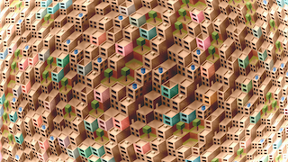\
Fuse: [Favela](Abstract/Favela.md) :four_leaf_clover:\
Category: [Abstract](Abstract/README.md)\
Shadertoy: [Favela](https://www.shadertoy.com/view/ldGcDh)\
Author: [duvengar](https://www.shadertoy.com/user/duvengar)\
Ported by: [nmbr73](../Site/Profiles/nmbr73.md)

\
Fuse: [FlightThroughANebula](Abstract/FlightThroughANebula.md) :four_leaf_clover:\
Category: [Abstract](Abstract/README.md)\
Shadertoy: [Flight Through A Nebula V3](https://www.shadertoy.com/view/tsK3Rd)\
Author: [morgan3d](https://www.shadertoy.com/user/morgan3d)\
Ported by: [JiPi](../Site/Profiles/JiPi.md)

\
Fuse: [Mosaic](Abstract/Mosaic.md) :four_leaf_clover:\
Category: [Abstract](Abstract/README.md)\
Shadertoy: [voronoi solid with borders](https://www.shadertoy.com/view/XtySRc)\
Author: [Darksecond](https://www.shadertoy.com/user/Darksecond)\
Ported by: [JiPi](../Site/Profiles/JiPi.md)

\
Fuse: [Noisecube](Abstract/Noisecube.md) :four_leaf_clover:\
Category: [Abstract](Abstract/README.md)\
Shadertoy: [Noisecube](https://www.shadertoy.com/view/4sGBD1)\
Author: [flimshaw](https://www.shadertoy.com/user/flimshaw)\
Ported by: [JiPi](../Site/Profiles/JiPi.md)

\
Fuse: [OtherWorlds](Abstract/OtherWorlds.md) :four_leaf_clover:\
Category: [Abstract](Abstract/README.md)\
Shadertoy: [Other Worlds\bump experiment](https://www.shadertoy.com/view/Ns2XzR)\
Author: [byt3_m3chanic](https://www.shadertoy.com/user/byt3_m3chanic)\
Ported by: [JiPi](../Site/Profiles/JiPi.md)

\
Fuse: [OverstimulatedNeurons](Abstract/OverstimulatedNeurons.md) :four_leaf_clover:\
Category: [Abstract](Abstract/README.md)\
Shadertoy: [Overstimulated Neurons](https://www.shadertoy.com/view/NdlSD8)\
Author: [Chaotnix](https://www.shadertoy.com/user/Chaotnix)\
Ported by: [JiPi](../Site/Profiles/JiPi.md)

\
Fuse: [RainbowSlices](Abstract/RainbowSlices.md) :four_leaf_clover:\
Category: [Abstract](Abstract/README.md)\
Shadertoy: [Rainbow Slices](https://www.shadertoy.com/view/XdsGD4)\
Author: [fizzer](https://www.shadertoy.com/user/fizzer)\
Ported by: [nmbr73](../Site/Profiles/nmbr73.md)

\
Fuse: [RainbowSpaghetti](Abstract/RainbowSpaghetti.md) :four_leaf_clover:\
Category: [Abstract](Abstract/README.md)\
Shadertoy: [rainbow spaghetti](https://www.shadertoy.com/view/lsjGRV)\
Author: [mattz](https://www.shadertoy.com/user/mattz)\
Ported by: [nmbr73](../Site/Profiles/nmbr73.md)

\
Fuse: [Raysemigarbage](Abstract/Raysemigarbage.md) :four_leaf_clover:\
Category: [Abstract](Abstract/README.md)\
Shadertoy: [raysemigarbage#3 but hilly](https://www.shadertoy.com/view/3tdSW8)\
Author: [supastav](https://www.shadertoy.com/user/supastav)\
Ported by: [JiPi](../Site/Profiles/JiPi.md)

## Audio Shaders

\
Fuse: [AudioHeightfield1](Audio/AudioHeightfield1.md) :four_leaf_clover:\
Category: [Audio](Audio/README.md)\
Shadertoy: [Audio heightfield 1](https://www.shadertoy.com/view/ldXGzN)\
Author: [huttarl](https://www.shadertoy.com/user/huttarl)\
Ported by: [JiPi](../Site/Profiles/JiPi.md)

\
Fuse: [AudioWaveformVisualizer](Audio/AudioWaveformVisualizer.md) :four_leaf_clover:\
Category: [Audio](Audio/README.md)\
Shadertoy: [Audio Waveform Visualizer v3](https://www.shadertoy.com/view/wd3Bzl)\
Author: [oneshade](https://www.shadertoy.com/user/oneshade)\
Ported by: [JiPi](../Site/Profiles/JiPi.md)

\
Fuse: [JamSession](Audio/JamSession.md) :four_leaf_clover:\
Category: [Audio](Audio/README.md)\
Shadertoy: [Jam Session](https://www.shadertoy.com/view/XdsyW4)\
Author: [Passion](https://www.shadertoy.com/user/Passion)\
Ported by: [JiPi](../Site/Profiles/JiPi.md)

\
Fuse: [ReactiveVoronoi](Audio/ReactiveVoronoi.md) :four_leaf_clover:\
Category: [Audio](Audio/README.md)\
Shadertoy: [Reactive Voronoi](https://www.shadertoy.com/view/Ml3GDX)\
Author: [glk7](https://www.shadertoy.com/user/glk7)\
Ported by: [JiPi](../Site/Profiles/JiPi.md)

\
Fuse: [Rlstyle](Audio/Rlstyle.md) :four_leaf_clover:\
Category: [Audio](Audio/README.md)\
Shadertoy: [RLStyle Visualizer](https://www.shadertoy.com/view/llXyzN)\
Author: [clintolibre](https://www.shadertoy.com/user/clintolibre)\
Ported by: [JiPi](../Site/Profiles/JiPi.md)

\
Fuse: [ShadertoyAudioDisplay](Audio/ShadertoyAudioDisplay.md) :four_leaf_clover:\
Category: [Audio](Audio/README.md)\
Shadertoy: [Shadertoy audio display](https://www.shadertoy.com/view/MtVfWh)\
Author: [saidwho12](https://www.shadertoy.com/user/saidwho12)\
Ported by: [JiPi](../Site/Profiles/JiPi.md)

## Blob Shaders

\
Fuse: [FunWithMetaballs](Blob/FunWithMetaballs.md) :four_leaf_clover:\
Category: [Blob](Blob/README.md)\
Shadertoy: [FunWithMetaballs](https://www.shadertoy.com/view/MlyXWV)\
Author: [fwilliams](https://www.shadertoy.com/user/fwilliams)\
Ported by: [JiPi](../Site/Profiles/JiPi.md)

\
Fuse: [TorturedBlob](Blob/TorturedBlob.md) :four_leaf_clover:\
Category: [Blob](Blob/README.md)\
Shadertoy: [TorturedBlob](https://www.shadertoy.com/view/MlKGDK)\
Author: [roywig](https://www.shadertoy.com/user/roywig)\
Ported by: [JiPi](../Site/Profiles/JiPi.md)

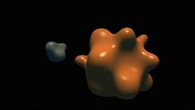\
Fuse: [XRaymarching](Blob/XRaymarching.md) :four_leaf_clover:\
Category: [Blob](Blob/README.md)\
Shadertoy: [XRaymarching](https://www.shadertoy.com/view/XtByWW)\
Author: [Aeless](https://www.shadertoy.com/user/Aeless)\
Ported by: [JiPi](../Site/Profiles/JiPi.md)

## Cubemap Shaders

\
Fuse: [BallsAreTouching](Cubemap/BallsAreTouching.md) :four_leaf_clover:\
Category: [Cubemap](Cubemap/README.md)\
Shadertoy: [balls are touching](https://www.shadertoy.com/view/MdlGWn)\
Author: [w23](https://www.shadertoy.com/user/w23)\
Ported by: [JiPi](../Site/Profiles/JiPi.md)

\
Fuse: [GlassAndBubble](Cubemap/GlassAndBubble.md) :four_leaf_clover:\
Category: [Cubemap](Cubemap/README.md)\
Shadertoy: [Glass and Bubble](https://www.shadertoy.com/view/XdVSRV)\
Author: [TambakoJaguar](https://www.shadertoy.com/user/TambakoJaguar)\
Ported by: [JiPi](../Site/Profiles/JiPi.md)

\
Fuse: [KissTracing](Cubemap/KissTracing.md) :four_leaf_clover:\
Category: [Cubemap](Cubemap/README.md)\
Shadertoy: [KISS Tracing 001: Spheres&Plane](https://www.shadertoy.com/view/sttXWX)\
Author: [tsaari42](https://www.shadertoy.com/user/tsaari42)\
Ported by: [JiPi](../Site/Profiles/JiPi.md)

\
Fuse: [NewtonPendulum](Cubemap/NewtonPendulum.md) :four_leaf_clover:\
Category: [Cubemap](Cubemap/README.md)\
Shadertoy: [Newton Pendulum](https://www.shadertoy.com/view/7sXyzX)\
Author: [leesten](https://www.shadertoy.com/user/leesten)\
Ported by: [JiPi](../Site/Profiles/JiPi.md)

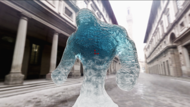\
Fuse: [OceanElemental](Cubemap/OceanElemental.md) :four_leaf_clover:\
Category: [Cubemap](Cubemap/README.md)\
Shadertoy: [OCEAN ELEMENTAL](https://www.shadertoy.com/view/NdS3zK)\
Author: [alro](https://www.shadertoy.com/user/alro)\
Ported by: [JiPi](../Site/Profiles/JiPi.md)

## Distortion Shaders

\
Fuse: [DisplacementShader](Distortion/DisplacementShader.md) :four_leaf_clover:\
Category: [Distortion](Distortion/README.md)\
Shadertoy: [DisplacementShader](https://www.shadertoy.com/view/MtBfR3)\
Author: [Coolok](https://www.shadertoy.com/user/Coolok)\
Ported by: [JiPi](../Site/Profiles/JiPi.md)

\
Fuse: [FbmWarp](Distortion/FbmWarp.md) :four_leaf_clover:\
Category: [Distortion](Distortion/README.md)\
Shadertoy: [Fbm Warp](https://www.shadertoy.com/view/ttGyzG)\
Author: [hanker](https://www.shadertoy.com/user/hanker)\
Ported by: [JiPi](../Site/Profiles/JiPi.md)

## Fractals Shaders

\
Fuse: [ApollianWithATwist](Fractals/ApollianWithATwist.md) :four_leaf_clover:\
Category: [Fractals](Fractals/README.md)\
Shadertoy: [Apollian with a twist](https://www.shadertoy.com/view/Wl3fzM)\
Author: [mrange](https://www.shadertoy.com/user/mrange)\
Ported by: [nmbr73](../Site/Profiles/nmbr73.md)

\
Fuse: [EnergyPlant](Fractals/EnergyPlant.md) :four_leaf_clover:\
Category: [Fractals](Fractals/README.md)\
Shadertoy: [EnergyPlant](https://www.shadertoy.com/view/WdjBWc)\
Author: [gaz](https://www.shadertoy.com/user/gaz)\
Ported by: [JiPi](../Site/Profiles/JiPi.md)

\
Fuse: [Fractal03](Fractals/Fractal03.md) :four_leaf_clover:\
Category: [Fractals](Fractals/README.md)\
Shadertoy: [Fractal03](https://www.shadertoy.com/view/3lKcDV)\
Author: [gaz](https://www.shadertoy.com/user/gaz)\
Ported by: [JiPi](../Site/Profiles/JiPi.md)

\
Fuse: [FractalEngine](Fractals/FractalEngine.md) :four_leaf_clover:\
Category: [Fractals](Fractals/README.md)\
Shadertoy: [FractalEngine](https://www.shadertoy.com/view/ttSBRm)\
Author: [gaz](https://www.shadertoy.com/user/gaz)\
Ported by: [JiPi](../Site/Profiles/JiPi.md)

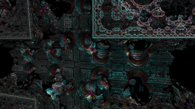\
Fuse: [FractalGutter](Fractals/FractalGutter.md) :four_leaf_clover:\
Category: [Fractals](Fractals/README.md)\
Shadertoy: [FractalGutter](https://www.shadertoy.com/view/ttjBD1)\
Author: [gaz](https://www.shadertoy.com/user/gaz)\
Ported by: [JiPi](../Site/Profiles/JiPi.md)

\
Fuse: [FractalRadioBase](Fractals/FractalRadioBase.md) :four_leaf_clover:\
Category: [Fractals](Fractals/README.md)\
Shadertoy: [FractalRadioBase](https://www.shadertoy.com/view/WlcczS)\
Author: [gaz](https://www.shadertoy.com/user/gaz)\
Ported by: [JiPi](../Site/Profiles/JiPi.md)

\
Fuse: [Kali3D](Fractals/Kali3D.md) :four_leaf_clover:\
Category: [Fractals](Fractals/README.md)\
Shadertoy: [Kali3D](https://www.shadertoy.com/view/MdB3DK)\
Author: [guil](https://www.shadertoy.com/user/guil)\
Ported by: [JiPi](../Site/Profiles/JiPi.md)

\
Fuse: [Rendezvous](Fractals/Rendezvous.md) :four_leaf_clover:\
Category: [Fractals](Fractals/README.md)\
Shadertoy: [Rendezvous](https://www.shadertoy.com/view/ldjGDw)\
Author: [Dave_Hoskins](https://www.shadertoy.com/user/Dave_Hoskins)\
Ported by: [JiPi](../Site/Profiles/JiPi.md)

## Misc Shaders

\
Fuse: [BuoyantBalls](Misc/BuoyantBalls.md) :four_leaf_clover:\
Category: [Misc](Misc/README.md)\
Shadertoy: [BuoyantBalls](https://www.shadertoy.com/view/MtsBW8)\
Author: [dr2](https://www.shadertoy.com/user/dr2)\
Ported by: [JiPi](../Site/Profiles/JiPi.md)

\
Fuse: [Fire_Water](Misc/Fire_Water.md) :four_leaf_clover:\
Category: [Misc](Misc/README.md)\
Shadertoy: [ComplementaryElements](https://www.shadertoy.com/view/tdsBz4)\
Author: [izutionix](https://www.shadertoy.com/user/izutionix)\
Ported by: [JiPi](../Site/Profiles/JiPi.md)

\
Fuse: [FractalLand](Misc/FractalLand.md) :four_leaf_clover:\
Category: [Misc](Misc/README.md)\
Shadertoy: [Fractal Land](https://www.shadertoy.com/view/XsBXWt)\
Author: [Kali](https://www.shadertoy.com/user/Kali)\
Ported by: [nmbr73](../Site/Profiles/nmbr73.md)

\
Fuse: [IHeartFourier](Misc/IHeartFourier.md) :four_leaf_clover:\
Category: [Misc](Misc/README.md)\
Shadertoy: [IHeartFourier](https://www.shadertoy.com/view/tltSWr)\
Author: [harry7557558](https://www.shadertoy.com/user/harry7557558)\
Ported by: [JiPi](../Site/Profiles/JiPi.md)

\
Fuse: [Legofied](Misc/Legofied.md) :four_leaf_clover:\
Category: [Misc](Misc/README.md)\
Shadertoy: [Legofied](https://www.shadertoy.com/view/XtBSzy)\
Author: [Gijs](https://www.shadertoy.com/user/Gijs)\
Ported by: [JiPi](../Site/Profiles/JiPi.md)

\
Fuse: [MountainsLakes](Misc/MountainsLakes.md) :four_leaf_clover:\
Category: [Misc](Misc/README.md)\
Shadertoy: [Mountains & Lakes](https://www.shadertoy.com/view/7tSSDD)\
Author: [xjorma](https://www.shadertoy.com/user/xjorma)\
Ported by: [JiPi](../Site/Profiles/JiPi.md)

\
Fuse: [Seascape](Misc/Seascape.md) :four_leaf_clover:\
Category: [Misc](Misc/README.md)\
Shadertoy: [Seascape](https://www.shadertoy.com/view/Ms2SD1)\
Author: [TDM](https://www.shadertoy.com/user/TDM)\
Ported by: [nmbr73](../Site/Profiles/nmbr73.md)

\
Fuse: [TruePinballPhysics](Misc/TruePinballPhysics.md) :four_leaf_clover:\
Category: [Misc](Misc/README.md)\
Shadertoy: [True Pinball Physics](https://www.shadertoy.com/view/4tBGRm)\
Author: [archee](https://www.shadertoy.com/user/archee)\
Ported by: [JiPi](../Site/Profiles/JiPi.md)

## Object Shaders

\
Fuse: [DancyTreeDoodle](Object/DancyTreeDoodle.md) :four_leaf_clover:\
Category: [Object](Object/README.md)\
Shadertoy: [DancyTreeDoodle](https://www.shadertoy.com/view/wslGz7)\
Author: [wyatt](https://www.shadertoy.com/user/wyatt)\
Ported by: [JiPi](../Site/Profiles/JiPi.md)

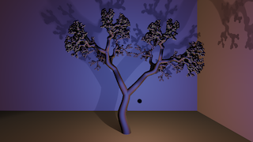\
Fuse: [DancyTreeDoodle3D](Object/DancyTreeDoodle3D.md) :four_leaf_clover:\
Category: [Object](Object/README.md)\
Shadertoy: [DancyTreeDoodle3D](https://www.shadertoy.com/view/4lVyzh)\
Author: [wyatt](https://www.shadertoy.com/user/wyatt)\
Ported by: [JiPi](../Site/Profiles/JiPi.md)

\
Fuse: [EggHunt](Object/EggHunt.md) :four_leaf_clover:\
Category: [Object](Object/README.md)\
Shadertoy: [EggHunt](https://www.shadertoy.com/view/ttyfDV)\
Author: [sylvain69780](https://www.shadertoy.com/user/sylvain69780)\
Ported by: [JiPi](../Site/Profiles/JiPi.md)

\
Fuse: [HW3Swing](Object/HW3Swing.md) :four_leaf_clover:\
Category: [Object](Object/README.md)\
Shadertoy: [HW3Swing](https://www.shadertoy.com/view/4dtyz8)\
Author: [ChloeSnyder](https://www.shadertoy.com/user/ChloeSnyder)\
Ported by: [JiPi](../Site/Profiles/JiPi.md)

\
Fuse: [HappyBouncing](Object/HappyBouncing.md) :four_leaf_clover:\
Category: [Object](Object/README.md)\
Shadertoy: [happy bouncing](https://www.shadertoy.com/view/flyXRh)\
Author: [leon](https://www.shadertoy.com/user/leon)\
Ported by: [JiPi](../Site/Profiles/JiPi.md)

\
Fuse: [HeavenAndHell](Object/HeavenAndHell.md) :four_leaf_clover:\
Category: [Object](Object/README.md)\
Shadertoy: [HeavenAndHell](https://www.shadertoy.com/view/wsKXDV)\
Author: [adurdin](https://www.shadertoy.com/user/adurdin)\
Ported by: [JiPi](../Site/Profiles/JiPi.md)

\
Fuse: [Legos](Object/Legos.md) :four_leaf_clover:\
Category: [Object](Object/README.md)\
Shadertoy: [Legos](https://www.shadertoy.com/view/Xdl3Dj)\
Author: [morgan3d](https://www.shadertoy.com/user/morgan3d)\
Ported by: [JiPi](../Site/Profiles/JiPi.md)

\
Fuse: [LonelyVoxel](Object/LonelyVoxel.md) :four_leaf_clover:\
Category: [Object](Object/README.md)\
Shadertoy: [LonelyVoxel](https://www.shadertoy.com/view/Mslczn)\
Author: [SudoNhim](https://www.shadertoy.com/user/SudoNhim)\
Ported by: [JiPi](../Site/Profiles/JiPi.md)

\
Fuse: [Oblivion](Object/Oblivion.md) :four_leaf_clover:\
Category: [Object](Object/README.md)\
Shadertoy: [Oblivion](https://www.shadertoy.com/view/XtfXDN)\
Author: [Dave_Hoskins](https://www.shadertoy.com/user/Dave_Hoskins)\
Ported by: [JiPi](../Site/Profiles/JiPi.md)

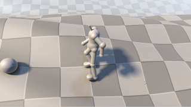\
Fuse: [ProceduralWalkAnimation](Object/ProceduralWalkAnimation.md) :four_leaf_clover:\
Category: [Object](Object/README.md)\
Shadertoy: [ProceduralWalkAnimation](https://www.shadertoy.com/view/WlsSWS)\
Author: [TLC123](https://www.shadertoy.com/user/TLC123)\
Ported by: [JiPi](../Site/Profiles/JiPi.md)

\
Fuse: [ShareX](Object/ShareX.md) :four_leaf_clover:\
Category: [Object](Object/README.md)\
Shadertoy: [ShareX](https://www.shadertoy.com/view/WsKSRK)\
Author: [fre3k](https://www.shadertoy.com/user/fre3k)\
Ported by: [JiPi](../Site/Profiles/JiPi.md)

\
Fuse: [WalkingCubes](Object/WalkingCubes.md) :four_leaf_clover:\
Category: [Object](Object/README.md)\
Shadertoy: [WalkingCubes](https://www.shadertoy.com/view/Xl3XR4)\
Author: [xorxor](https://www.shadertoy.com/user/xorxor)\
Ported by: [JiPi](../Site/Profiles/JiPi.md)

## Planet Shaders

\
Fuse: [CrackerCars](Planet/CrackerCars.md) :four_leaf_clover:\
Category: [Planet](Planet/README.md)\
Shadertoy: [CrackerCars](https://www.shadertoy.com/view/4sdXzr)\
Author: [zackpudil](https://www.shadertoy.com/user/zackpudil)\
Ported by: [JiPi](../Site/Profiles/JiPi.md)

\
Fuse: [EARF](Planet/EARF.md) :four_leaf_clover:\
Category: [Planet](Planet/README.md)\
Shadertoy: [EARF](https://www.shadertoy.com/view/ls3SDj)\
Author: [zackpudil](https://www.shadertoy.com/user/zackpudil)\
Ported by: [JiPi](../Site/Profiles/JiPi.md)

\
Fuse: [Fake3DScene](Planet/Fake3DScene.md) :four_leaf_clover:\
Category: [Planet](Planet/README.md)\
Shadertoy: [Fake3DScene](https://www.shadertoy.com/view/MddSWB)\
Author: [LaBodilsen](https://www.shadertoy.com/user/LaBodilsen)\
Ported by: [JiPi](../Site/Profiles/JiPi.md)

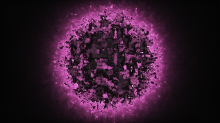\
Fuse: [MightyMorphingPowerSphere](Planet/MightyMorphingPowerSphere.md) :four_leaf_clover:\
Category: [Planet](Planet/README.md)\
Shadertoy: [MightyMorphingPowerSphere](https://www.shadertoy.com/view/MtGSzh)\
Author: [Lallis](https://www.shadertoy.com/user/Lallis)\
Ported by: [JiPi](../Site/Profiles/JiPi.md)

\
Fuse: [RayCastSphere](Planet/RayCastSphere.md) :four_leaf_clover:\
Category: [Planet](Planet/README.md)\
Shadertoy: [RayCastSphere](https://www.shadertoy.com/view/XdjBDG)\
Author: [diroru](https://www.shadertoy.com/user/diroru)\
Ported by: [JiPi](../Site/Profiles/JiPi.md)

\
Fuse: [WildKifs4D](Planet/WildKifs4D.md) :four_leaf_clover:\
Category: [Planet](Planet/README.md)\
Shadertoy: [WildKifs4D](https://www.shadertoy.com/view/wttBzM)\
Author: [iapafoto](https://www.shadertoy.com/user/iapafoto)\
Ported by: [JiPi](../Site/Profiles/JiPi.md)

## Recursive Shaders

\
Fuse: [AnisotropicBlurImage](Recursive/AnisotropicBlurImage.md) :four_leaf_clover:\
Category: [Recursive](Recursive/README.md)\
Shadertoy: [Anisotropic Blur Image Warp](https://www.shadertoy.com/view/ldcSDB)\
Author: [cornusammonis](https://www.shadertoy.com/user/cornusammonis)\
Ported by: [JiPi](../Site/Profiles/JiPi.md)

\
Fuse: [FallingCuteBombs](Recursive/FallingCuteBombs.md) :four_leaf_clover:\
Category: [Recursive](Recursive/README.md)\
Shadertoy: [FallingCuteBombs](https://www.shadertoy.com/view/ldy3Rw)\
Author: [Emil](https://www.shadertoy.com/user/Emil)\
Ported by: [JiPi](../Site/Profiles/JiPi.md)

\
Fuse: [GrowingWeatheringRocks](Recursive/GrowingWeatheringRocks.md) :four_leaf_clover:\
Category: [Recursive](Recursive/README.md)\
Shadertoy: [GrowingWeatheringRocks](https://www.shadertoy.com/view/ftSSDy)\
Author: [stb](https://www.shadertoy.com/user/stb)\
Ported by: [JiPi](../Site/Profiles/JiPi.md)

\
Fuse: [LearningReactionDiffusion](Recursive/LearningReactionDiffusion.md) :four_leaf_clover:\
Category: [Recursive](Recursive/README.md)\
Shadertoy: [LearningReactionDiffusion](https://www.shadertoy.com/view/WlSGzy)\
Author: [TekF](https://www.shadertoy.com/user/TekF)\
Ported by: [JiPi](../Site/Profiles/JiPi.md)

\
Fuse: [Spilled](Recursive/Spilled.md) :four_leaf_clover:\
Category: [Recursive](Recursive/README.md)\
Shadertoy: [spilled](https://www.shadertoy.com/view/MsGSRd)\
Author: [flockaroo](https://www.shadertoy.com/user/flockaroo)\
Ported by: [JiPi](../Site/Profiles/JiPi.md)

\
Fuse: [TDSOTM_Nebula](Recursive/TDSOTM_Nebula.md) :four_leaf_clover:\
Category: [Recursive](Recursive/README.md)\
Shadertoy: [The dark side of the moon](https://www.shadertoy.com/view/4dBSDV)\
Author: [bytewave](https://www.shadertoy.com/user/bytewave)\
Ported by: [JiPi](../Site/Profiles/JiPi.md)

\
Fuse: [Vine](Recursive/Vine.md) :four_leaf_clover:\
Category: [Recursive](Recursive/README.md)\
Shadertoy: [Vine](https://www.shadertoy.com/view/XldSz7)\
Author: [gaz](https://www.shadertoy.com/user/gaz)\
Ported by: [JiPi](../Site/Profiles/JiPi.md)

## ShaderOfTheWeek Shaders

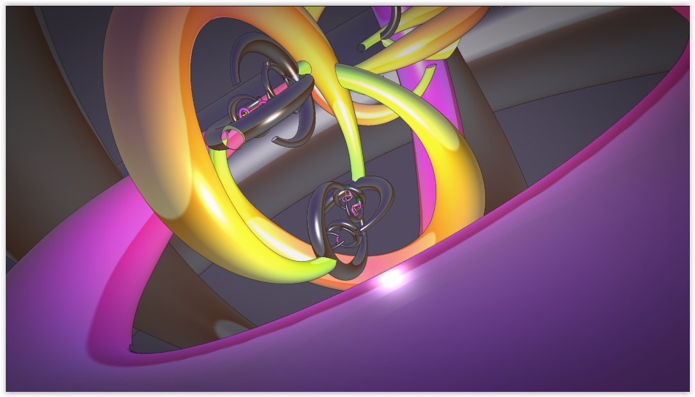\
Fuse: [AlexanderHornedSphereZoom](ShaderOfTheWeek/AlexanderHornedSphereZoom.md) :four_leaf_clover:\
Category: [ShaderOfTheWeek](ShaderOfTheWeek/README.md)\
Shadertoy: [Alexander horned sphere zoom](https://www.shadertoy.com/view/ttyGzW)\
Author: [tmst](https://www.shadertoy.com/user/tmst)\
Ported by: [JiPi](../Site/Profiles/JiPi.md)

\
Fuse: [ClubCave09](ShaderOfTheWeek/ClubCave09.md) :four_leaf_clover:\
Category: [ShaderOfTheWeek](ShaderOfTheWeek/README.md)\
Shadertoy: [20210930_CLUB-CAVE-09](https://www.shadertoy.com/view/ss3SD8)\
Author: [0b5vr](https://www.shadertoy.com/user/0b5vr)\
Ported by: [JiPi](../Site/Profiles/JiPi.md)

\
Fuse: [CoastalLandscape](ShaderOfTheWeek/CoastalLandscape.md) :four_leaf_clover:\
Category: [ShaderOfTheWeek](ShaderOfTheWeek/README.md)\
Shadertoy: [Coastal Landscape](https://www.shadertoy.com/view/fstyD4)\
Author: [bitless](https://www.shadertoy.com/user/bitless)\
Ported by: [JiPi](../Site/Profiles/JiPi.md)

\
Fuse: [ColorProcessing](ShaderOfTheWeek/ColorProcessing.md) :four_leaf_clover:\
Category: [ShaderOfTheWeek](ShaderOfTheWeek/README.md)\
Shadertoy: [Color processing](https://www.shadertoy.com/view/7tfBzs)\
Author: [sinvec](https://www.shadertoy.com/user/sinvec)\
Ported by: [JiPi](../Site/Profiles/JiPi.md)

\
Fuse: [ControllableMachinery](ShaderOfTheWeek/ControllableMachinery.md) :four_leaf_clover:\
Category: [ShaderOfTheWeek](ShaderOfTheWeek/README.md)\
Shadertoy: [Controllable Machinery](https://www.shadertoy.com/view/fsXyDj)\
Author: [dr2](https://www.shadertoy.com/user/dr2)\
Ported by: [JiPi](../Site/Profiles/JiPi.md)

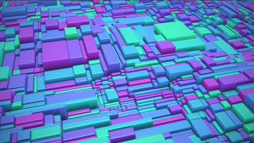\
Fuse: [CubicDispersal](ShaderOfTheWeek/CubicDispersal.md) :four_leaf_clover:\
Category: [ShaderOfTheWeek](ShaderOfTheWeek/README.md)\
Shadertoy: [Cubic Dispersal](https://www.shadertoy.com/view/fldXWS)\
Author: [Tater](https://www.shadertoy.com/user/Tater)\
Ported by: [JiPi](../Site/Profiles/JiPi.md)

\
Fuse: [DangerNoodle](ShaderOfTheWeek/DangerNoodle.md) :four_leaf_clover:\
Category: [ShaderOfTheWeek](ShaderOfTheWeek/README.md)\
Shadertoy: [DangerNoodle](https://www.shadertoy.com/view/wlVSDK)\
Author: [BigWIngs](https://www.shadertoy.com/user/BigWIngs)\
Ported by: [JiPi](../Site/Profiles/JiPi.md)

\
Fuse: [Day94](ShaderOfTheWeek/Day94.md) :four_leaf_clover:\
Category: [ShaderOfTheWeek](ShaderOfTheWeek/README.md)\
Shadertoy: [Day94](https://www.shadertoy.com/view/tdXcWM)\
Author: [jeyko](https://www.shadertoy.com/user/jeyko)\
Ported by: [JiPi](../Site/Profiles/JiPi.md)

\
Fuse: [ExitTheMatrix](ShaderOfTheWeek/ExitTheMatrix.md) :four_leaf_clover:\
Category: [ShaderOfTheWeek](ShaderOfTheWeek/README.md)\
Shadertoy: [Exit the Matrix](https://www.shadertoy.com/view/NlsXDH)\
Author: [Kali](https://www.shadertoy.com/user/Kali)\
Ported by: [JiPi](../Site/Profiles/JiPi.md)

\
Fuse: [FractalFlythrough](ShaderOfTheWeek/FractalFlythrough.md) :four_leaf_clover:\
Category: [ShaderOfTheWeek](ShaderOfTheWeek/README.md)\
Shadertoy: [FractalFlythrough](https://www.shadertoy.com/view/4s3SRN)\
Author: [Shane](https://www.shadertoy.com/user/Shane)\
Ported by: [JiPi](../Site/Profiles/JiPi.md)

\
Fuse: [FractalGliding](ShaderOfTheWeek/FractalGliding.md) :four_leaf_clover:\
Category: [ShaderOfTheWeek](ShaderOfTheWeek/README.md)\
Shadertoy: [Fractal Gliding](https://www.shadertoy.com/view/ftGGDR)\
Author: [AntoineC](https://www.shadertoy.com/user/AntoineC)\
Ported by: [JiPi](../Site/Profiles/JiPi.md)

\
Fuse: [FrozenWasteland](ShaderOfTheWeek/FrozenWasteland.md) :four_leaf_clover:\
Category: [ShaderOfTheWeek](ShaderOfTheWeek/README.md)\
Shadertoy: [Frozen wasteland](https://www.shadertoy.com/view/Xls3D2)\
Author: [Dave_Hoskins](https://www.shadertoy.com/user/Dave_Hoskins)\
Ported by: [JiPi](../Site/Profiles/JiPi.md)

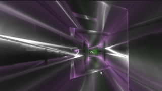\
Fuse: [FuturisticTunnel](ShaderOfTheWeek/FuturisticTunnel.md) :four_leaf_clover:\
Category: [ShaderOfTheWeek](ShaderOfTheWeek/README.md)\
Shadertoy: [Futuristic Tunnel](https://www.shadertoy.com/view/wdScRd)\
Author: [julianlumia](https://www.shadertoy.com/user/julianlumia)\
Ported by: [JiPi](../Site/Profiles/JiPi.md)

\
Fuse: [HyperDough](ShaderOfTheWeek/HyperDough.md) :four_leaf_clover:\
Category: [ShaderOfTheWeek](ShaderOfTheWeek/README.md)\
Shadertoy: [HyperDough](https://www.shadertoy.com/view/7tcGWB)\
Author: [Tater](https://www.shadertoy.com/user/Tater)\
Ported by: [JiPi](../Site/Profiles/JiPi.md)

\
Fuse: [JeweledVortex](ShaderOfTheWeek/JeweledVortex.md) :four_leaf_clover:\
Category: [ShaderOfTheWeek](ShaderOfTheWeek/README.md)\
Shadertoy: [Jeweled Vortex](https://www.shadertoy.com/view/fdjfDc)\
Author: [ChunderFPV](https://www.shadertoy.com/user/ChunderFPV)\
Ported by: [JiPi](../Site/Profiles/JiPi.md)

\
Fuse: [Lover](ShaderOfTheWeek/Lover.md) :four_leaf_clover:\
Category: [ShaderOfTheWeek](ShaderOfTheWeek/README.md)\
Shadertoy: [Lover](https://www.shadertoy.com/view/fsjyR3)\
Author: [wyatt](https://www.shadertoy.com/user/wyatt)\
Ported by: [JiPi](../Site/Profiles/JiPi.md)

\
Fuse: [NightCircuit](ShaderOfTheWeek/NightCircuit.md) :four_leaf_clover:\
Category: [ShaderOfTheWeek](ShaderOfTheWeek/README.md)\
Shadertoy: [Night circuit](https://www.shadertoy.com/view/tdyBR1)\
Author: [gaz](https://www.shadertoy.com/user/gaz)\
Ported by: [JiPi](../Site/Profiles/JiPi.md)

\
Fuse: [OMZGShaderRoyale](ShaderOfTheWeek/OMZGShaderRoyale.md) :four_leaf_clover:\
Category: [ShaderOfTheWeek](ShaderOfTheWeek/README.md)\
Shadertoy: [OMZG Shader Royale](https://www.shadertoy.com/view/stXyWN)\
Author: [NuSan](https://www.shadertoy.com/user/NuSan)\
Ported by: [JiPi](../Site/Profiles/JiPi.md)

\
Fuse: [OnTheSal](ShaderOfTheWeek/OnTheSal.md) :four_leaf_clover:\
Category: [ShaderOfTheWeek](ShaderOfTheWeek/README.md)\
Shadertoy: [On the salt lake](https://www.shadertoy.com/view/fsXcR8)\
Author: [iapafoto](https://www.shadertoy.com/user/iapafoto)\
Ported by: [JiPi](../Site/Profiles/JiPi.md)

\
Fuse: [PartyConcertVisuals2020](ShaderOfTheWeek/PartyConcertVisuals2020.md) :four_leaf_clover:\
Category: [ShaderOfTheWeek](ShaderOfTheWeek/README.md)\
Shadertoy: [@Party Concert Visuals 2020](https://www.shadertoy.com/view/WtscW4)\
Author: [blackle](https://www.shadertoy.com/user/blackle)\
Ported by: [JiPi](../Site/Profiles/JiPi.md)

\
Fuse: [PigSquad](ShaderOfTheWeek/PigSquad.md) :four_leaf_clover:\
Category: [ShaderOfTheWeek](ShaderOfTheWeek/README.md)\
Shadertoy: [Pig Squad 9 Year Anniversary](https://www.shadertoy.com/view/WdBcRh)\
Author: [bpfarrell](https://www.shadertoy.com/user/bpfarrell)\
Ported by: [JiPi](../Site/Profiles/JiPi.md)

\
Fuse: [RME4Crater](ShaderOfTheWeek/RME4Crater.md) :four_leaf_clover:\
Category: [ShaderOfTheWeek](ShaderOfTheWeek/README.md)\
Shadertoy: [RME4 - Crater](https://www.shadertoy.com/view/MlSBDt)\
Author: [patu](https://www.shadertoy.com/user/patu)\
Ported by: [JiPi](../Site/Profiles/JiPi.md)

\
Fuse: [RecursiveDonut](ShaderOfTheWeek/RecursiveDonut.md) :four_leaf_clover:\
Category: [ShaderOfTheWeek](ShaderOfTheWeek/README.md)\
Shadertoy: [Recursive Donut](https://www.shadertoy.com/view/tls3WB)\
Author: [ShnitzelKiller](https://www.shadertoy.com/user/ShnitzelKiller)\
Ported by: [JiPi](../Site/Profiles/JiPi.md)

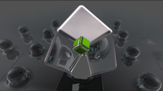\
Fuse: [SimpleRefractionTest](ShaderOfTheWeek/SimpleRefractionTest.md) :four_leaf_clover:\
Category: [ShaderOfTheWeek](ShaderOfTheWeek/README.md)\
Shadertoy: [simple refraction test](https://www.shadertoy.com/view/flcSW2)\
Author: [drschizzo](https://www.shadertoy.com/user/drschizzo)\
Ported by: [JiPi](../Site/Profiles/JiPi.md)

\
Fuse: [SimpleSphereRaymarching](ShaderOfTheWeek/SimpleSphereRaymarching.md) :four_leaf_clover:\
Category: [ShaderOfTheWeek](ShaderOfTheWeek/README.md)\
Shadertoy: [SimpleSphereRaymarching](https://www.shadertoy.com/view/wdjSRc)\
Author: [drschizzo](https://www.shadertoy.com/user/drschizzo)\
Ported by: [JiPi](../Site/Profiles/JiPi.md)

\
Fuse: [SpaceShip](ShaderOfTheWeek/SpaceShip.md) :four_leaf_clover:\
Category: [ShaderOfTheWeek](ShaderOfTheWeek/README.md)\
Shadertoy: [Space ship](https://www.shadertoy.com/view/NlsBzn)\
Author: [A_Toaster](https://www.shadertoy.com/user/A_Toaster)\
Ported by: [JiPi](../Site/Profiles/JiPi.md)

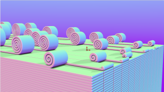\
Fuse: [SpiraledLayers](ShaderOfTheWeek/SpiraledLayers.md) :four_leaf_clover:\
Category: [ShaderOfTheWeek](ShaderOfTheWeek/README.md)\
Shadertoy: [Spiraled Layers](https://www.shadertoy.com/view/Ns3XWf)\
Author: [Tater](https://www.shadertoy.com/user/Tater)\
Ported by: [JiPi](../Site/Profiles/JiPi.md)

\
Fuse: [StarGazingHippo](ShaderOfTheWeek/StarGazingHippo.md) :four_leaf_clover:\
Category: [ShaderOfTheWeek](ShaderOfTheWeek/README.md)\
Shadertoy: [StarGazingHippo](https://www.shadertoy.com/view/4tGfz3)\
Author: [kuvkar](https://www.shadertoy.com/user/kuvkar)\
Ported by: [JiPi](../Site/Profiles/JiPi.md)

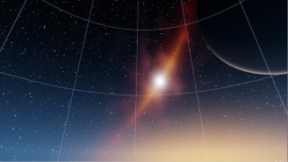\
Fuse: [StarsAndGalaxy](ShaderOfTheWeek/StarsAndGalaxy.md) :four_leaf_clover:\
Category: [ShaderOfTheWeek](ShaderOfTheWeek/README.md)\
Shadertoy: [Stars and galaxy](https://www.shadertoy.com/view/stBcW1)\
Author: [mrange](https://www.shadertoy.com/user/mrange)\
Ported by: [JiPi](../Site/Profiles/JiPi.md)

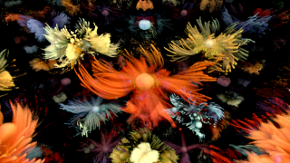\
Fuse: [TasteOfNoise7](ShaderOfTheWeek/TasteOfNoise7.md) :four_leaf_clover:\
Category: [ShaderOfTheWeek](ShaderOfTheWeek/README.md)\
Shadertoy: [Taste Of Noise 7](https://www.shadertoy.com/view/NddSWs)\
Author: [leon](https://www.shadertoy.com/user/leon)\
Ported by: [JiPi](../Site/Profiles/JiPi.md)

\
Fuse: [Terraform](ShaderOfTheWeek/Terraform.md) :four_leaf_clover:\
Category: [ShaderOfTheWeek](ShaderOfTheWeek/README.md)\
Shadertoy: [Terraform](https://www.shadertoy.com/view/NsdXDs)\
Author: [Xor](https://www.shadertoy.com/user/Xor)\
Ported by: [JiPi](../Site/Profiles/JiPi.md)

\
Fuse: [TrippyTriangle](ShaderOfTheWeek/TrippyTriangle.md) :four_leaf_clover:\
Category: [ShaderOfTheWeek](ShaderOfTheWeek/README.md)\
Shadertoy: [Trippy Triangle](https://www.shadertoy.com/view/fslcDS)\
Author: [Tater](https://www.shadertoy.com/user/Tater)\
Ported by: [JiPi](../Site/Profiles/JiPi.md)

\
Fuse: [TruchetKaleidoscopeFTW](ShaderOfTheWeek/TruchetKaleidoscopeFTW.md) :four_leaf_clover:\
Category: [ShaderOfTheWeek](ShaderOfTheWeek/README.md)\
Shadertoy: [Truchet + Kaleidoscope FTW](https://www.shadertoy.com/view/7lKSWW)\
Author: [mrange](https://www.shadertoy.com/user/mrange)\
Ported by: [JiPi](../Site/Profiles/JiPi.md)

\
Fuse: [TwizzlyCircleMess](ShaderOfTheWeek/TwizzlyCircleMess.md) :four_leaf_clover:\
Category: [ShaderOfTheWeek](ShaderOfTheWeek/README.md)\
Shadertoy: [Twizzly Circle Mess](https://www.shadertoy.com/view/sltGRj)\
Author: [SnoopethDuckDuck](https://www.shadertoy.com/user/SnoopethDuckDuck)\
Ported by: [JiPi](../Site/Profiles/JiPi.md)

\
Fuse: [UndulatingColumns](ShaderOfTheWeek/UndulatingColumns.md) :four_leaf_clover:\
Category: [ShaderOfTheWeek](ShaderOfTheWeek/README.md)\
Shadertoy: [Undulating Columns](https://www.shadertoy.com/view/WlXXDH)\
Author: [fizzer](https://www.shadertoy.com/user/fizzer)\
Ported by: [JiPi](../Site/Profiles/JiPi.md)

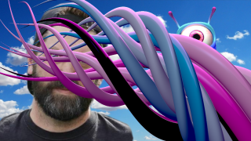\
Fuse: [WednesdayMessingAround](ShaderOfTheWeek/WednesdayMessingAround.md) :four_leaf_clover:\
Category: [ShaderOfTheWeek](ShaderOfTheWeek/README.md)\
Shadertoy: [Wednesday messing around](https://www.shadertoy.com/view/NtcyDn)\
Author: [mrange](https://www.shadertoy.com/user/mrange)\
Ported by: [JiPi](../Site/Profiles/JiPi.md)

## Simple Shaders

\
Fuse: [Crazyness](Simple/Crazyness.md) :four_leaf_clover:\
Category: [Simple](Simple/README.md)\
Shadertoy: [craziness](https://www.shadertoy.com/view/wdjSRc)\
Author: [spsherk_](https://www.shadertoy.com/user/spsherk_)\
Ported by: [nmbr73](../Site/Profiles/nmbr73.md)

\
Fuse: [CrossDistance](Simple/CrossDistance.md) :four_leaf_clover:\
Category: [Simple](Simple/README.md)\
Shadertoy: [Cross - distance](https://www.shadertoy.com/view/XtGfzw)\
Author: [iq](https://www.shadertoy.com/user/iq)\
Ported by: [nmbr73](../Site/Profiles/nmbr73.md)

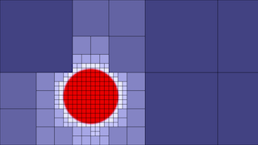\
Fuse: [Quadtree3](Simple/Quadtree3.md) :four_leaf_clover:\
Category: [Simple](Simple/README.md)\
Shadertoy: [quadtree 3](https://www.shadertoy.com/view/lljSDy)\
Author: [FabriceNeyret2](https://www.shadertoy.com/user/FabriceNeyret2)\
Ported by: [nmbr73](../Site/Profiles/nmbr73.md)

\
Fuse: [Rosace3C](Simple/Rosace3C.md) :four_leaf_clover:\
Category: [Simple](Simple/README.md)\
Shadertoy: [rosace 3c](https://www.shadertoy.com/view/Ms3SzB)\
Author: [FabriceNeyret2](https://www.shadertoy.com/user/FabriceNeyret2)\
Ported by: [nmbr73](../Site/Profiles/nmbr73.md)

\
Fuse: [ShatteredLight](Simple/ShatteredLight.md) :four_leaf_clover:\
Category: [Simple](Simple/README.md)\
Shadertoy: [Shattered light](https://www.shadertoy.com/view/stjSRV)\
Author: [conceptblend](https://www.shadertoy.com/user/conceptblend)\
Ported by: [nmbr73](../Site/Profiles/nmbr73.md)

\
Fuse: [StainedLights](Simple/StainedLights.md) :four_leaf_clover:\
Category: [Simple](Simple/README.md)\
Shadertoy: [Stained Lights](https://www.shadertoy.com/view/WlsSzM)\
Author: [104](https://www.shadertoy.com/user/104)\
Ported by: [nmbr73](../Site/Profiles/nmbr73.md)

\
Fuse: [VideoFilters](Simple/VideoFilters.md) :four_leaf_clover:\
Category: [Simple](Simple/README.md)\
Shadertoy: [Video filters](https://www.shadertoy.com/view/XsX3z8)\
Author: [XT95](https://www.shadertoy.com/user/XT95)\
Ported by: [nmbr73](../Site/Profiles/nmbr73.md)

## Tunnel Shaders

\
Fuse: [TNTHTW](Tunnel/TNTHTW.md) :four_leaf_clover:\
Category: [Tunnel](Tunnel/README.md)\
Shadertoy: [Try not to hit the walls](https://www.shadertoy.com/view/XsKcDG)\
Author: [hisojarvi](https://www.shadertoy.com/user/hisojarvi)\
Ported by: [JiPi](../Site/Profiles/JiPi.md)

\
Fuse: [Velocibox](Tunnel/Velocibox.md) :four_leaf_clover:\
Category: [Tunnel](Tunnel/README.md)\
Shadertoy: [Velocibox](https://www.shadertoy.com/view/lsdXD8)\
Author: [zackpudil](https://www.shadertoy.com/user/zackpudil)\
Ported by: [nmbr73](../Site/Profiles/nmbr73.md)

\
Fuse: [WindingMengerTunnel](Tunnel/WindingMengerTunnel.md) :four_leaf_clover:\
Category: [Tunnel](Tunnel/README.md)\
Shadertoy: [WindingMengerTunnel](https://www.shadertoy.com/view/4scXzn)\
Author: [Shane](https://www.shadertoy.com/user/Shane)\
Ported by: [JiPi](../Site/Profiles/JiPi.md)

## Wedding Shaders

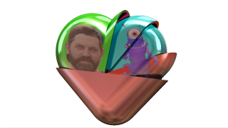\
Fuse: [HeartU2015](Wedding/HeartU2015.md) :four_leaf_clover:\
Category: [Wedding](Wedding/README.md)\
Shadertoy: [heart u 2015](https://www.shadertoy.com/view/lts3RX)\
Author: [mattz](https://www.shadertoy.com/user/mattz)\
Ported by: [JiPi](../Site/Profiles/JiPi.md)

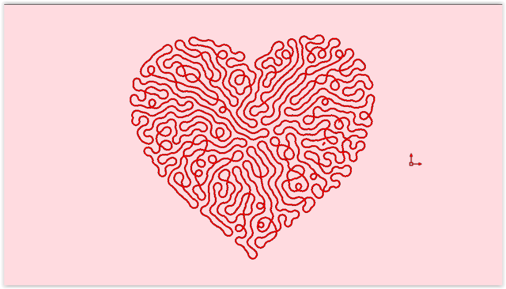\
Fuse: [Valentwine](Wedding/Valentwine.md) :four_leaf_clover:\
Category: [Wedding](Wedding/README.md)\
Shadertoy: [Valentwine](https://www.shadertoy.com/view/fsffW4)\
Author: [Mipmap](https://www.shadertoy.com/user/Mipmap)\
Ported by: [JiPi](../Site/Profiles/JiPi.md)

:four_leaf_clover: 116

