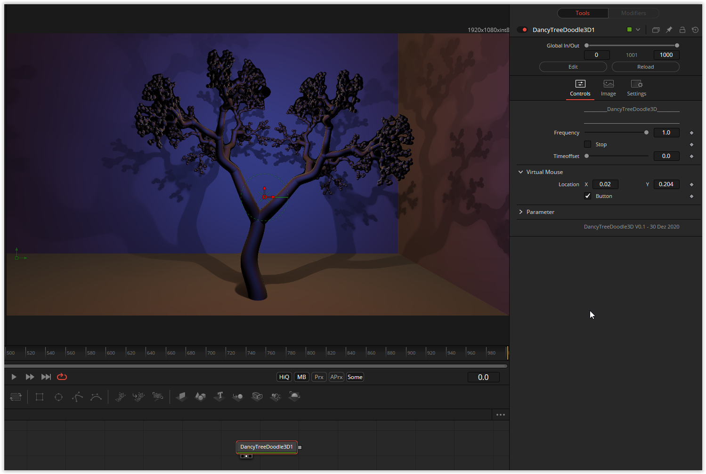

DancyTreeDoodle3D.fuse
======================

Based on '_[DancyTreeDoodle](https://www.shadertoy.com/view/4lVyzh)_' by [wyatt](https://www.shadertoy.com/user/wyatt) and ported by [JiPi](../../Site/Profiles/JiPi.md). There are no parameters for this fuse. Only the port is available.

## Compatibility
- [x] Tested on macOS/Metal
- [x] Tested on macOS/OpenCL
- [x] Tested on Windows/Cuda
- [x] Tested on Windows/OpenCL
