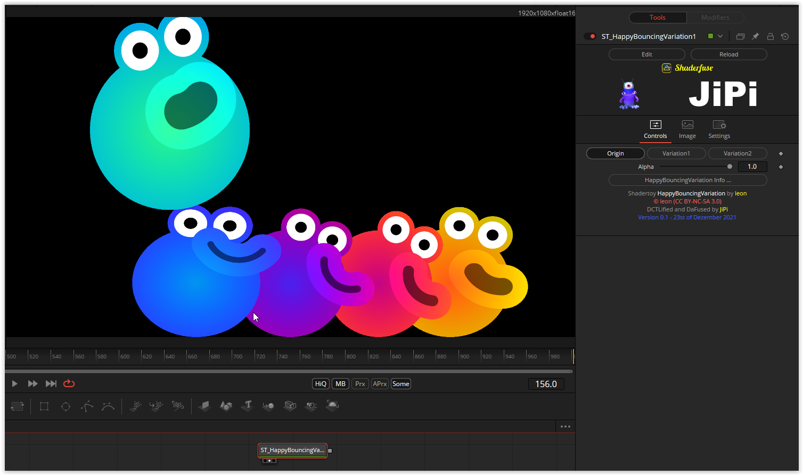

HappyBouncing.fuse
===========

Based on '_[happy bouncing](https://www.shadertoy.com/view/flyXRh)_' by [leon](https://www.shadertoy.com/user/leon) and ported by [JiPi ](../../Site/Profiles/JiPi.md).

A new conversion method is used here. nmbr73 has developed a Python script and an incubator fuse, which enables shaders to be converted much more effectively and conveniently. It's still in the middle of development, but it's already very powerful.
A total of 3 shader toys are combined in this shader fuse:

- HappyBouncing            https://www.shadertoy.com/view/flyXRh Created by leon on 2021-12-21
- HappyBouncingVariations1 https://www.shadertoy.com/view/ftGXR1 Created by leon on 2021-12-22
- HappyBouncingVariations2 https://www.shadertoy.com/view/NlGXR1 Created by leon on 2021-12-22

Have fun playing

## Compatibility
- [x] Tested on macOS/Metal
- [ ] Tested on macOS/OpenCL
- [x] Tested on Windows/Cuda
- [x] Tested on Windows/OpenCL
