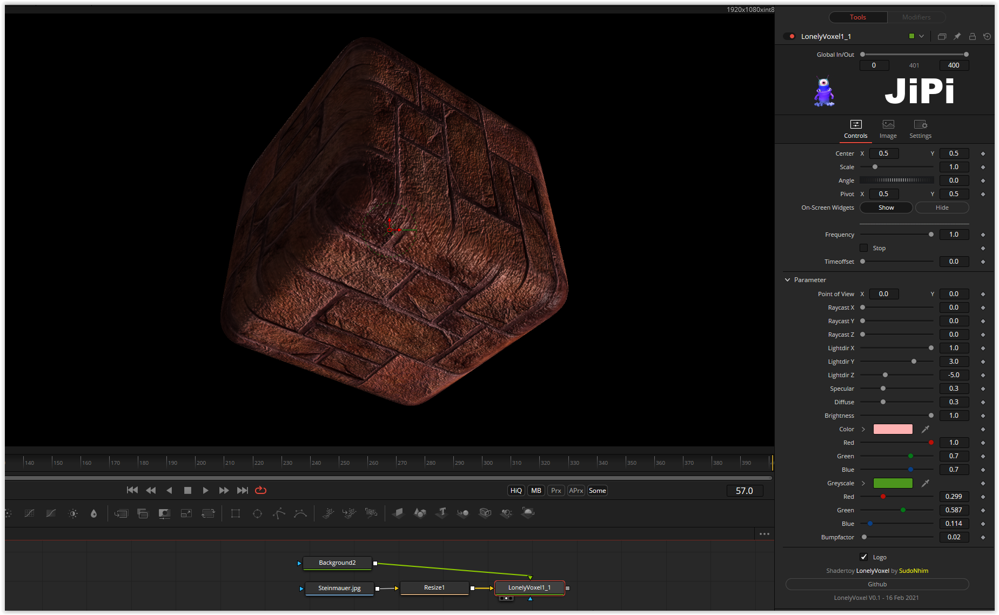

A cube with rounded corners and a very nice bump map.

He is still lonely the voxel. But underlaid with some music in a little intro and you have a sociable composition. A possible extension would be to provide the six sides with different textures. The animation of the texture relative to the movement of the cube is particularly effective.

Have fun playing
