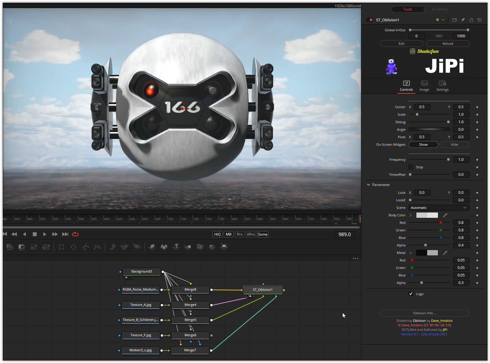

# Oblivion

This Fuse is based on the Shadertoy '_[Oblivion](https://www.shadertoy.com/view/XtfXDN)_' by [Dave_Hoskins](https://www.shadertoy.com/user/Dave_Hoskins). Conversion to DCTL and encapsulation into a fuse done by [JiPi](../../Site/Profiles/JiPi.md). See [Object](README.md) for more fuses in this category.

<!-- +++ DO NOT REMOVE THIS COMMENT +++ DO NOT ADD OR EDIT ANY TEXT BEFORE THIS LINE +++ IT WOULD BE A REALLY BAD IDEA +++ -->

The drone from the science fiction film Oblivion. There are 5 scenes available that can be played back individually. With the Image1, the drone's red eye can be brought to life. With Image2 the floor can be changed, with Image3 the floor and the reflective surface of the drone and with Image 4 the sky.

Have fun playing

<!-- +++ DO NOT REMOVE THIS COMMENT +++ DO NOT EDIT ANY TEXT THAT COMES AFTER THIS LINE +++ TRUST ME: JUST DON'T DO IT +++ -->

## Compatibility

🟩 macOS / Metal: checked 
⬛ macOS / OpenCL: NOT TESTED! 
🟩 Windows / CUDA: checked 
🟩 Windows / OpenCL: checked 

## Problems

Number of problems: 2

- Thumbnail seems to be not a 320x180 pixel PNG
- macOS_OpenCL compatibility not checked

