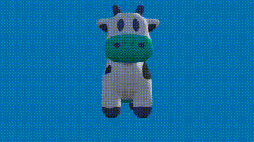
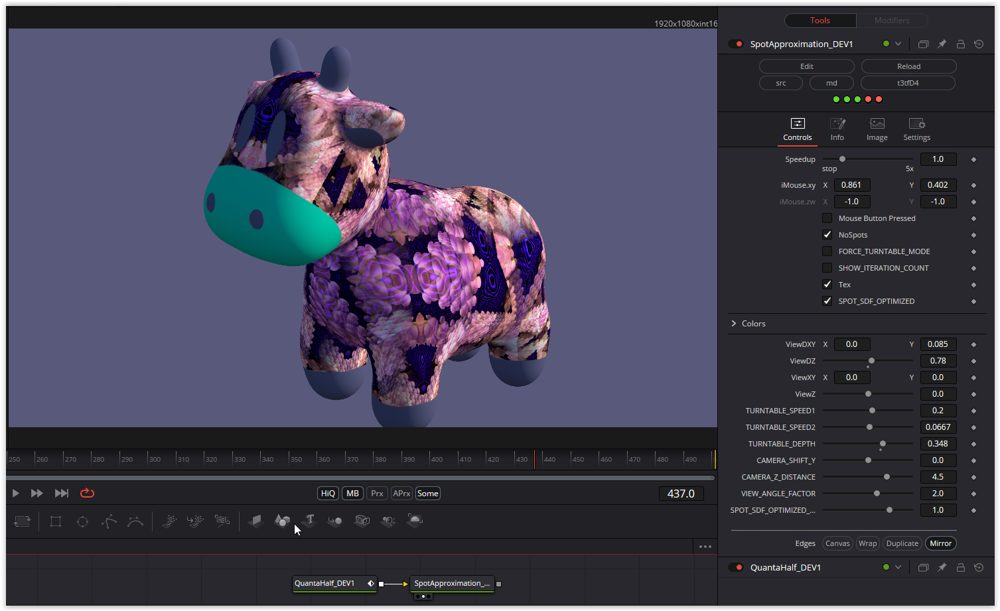

It was a lot of fun again. 3x2 and 2x3 matrices were used here. Finding a suitable solution for this wasn't easy. The cow can be textured, and the spots can then be hidden. Almost all colors are customizable. Automatic rotation can be enabled via FORCE_TURNTABLE_MODE.

Have fun playing!

### Description of the Shader in Shadertoy:
Loose approximation of Keenan Crane's "Spot" cow model using simple SDF primitives and smooth min/max blending.
I used numerical optimization of the parameters to help get a closer fit.
Code is MIT licensed.