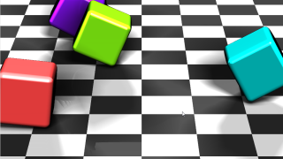

WalkingCubes
==================

Based on '_[WalkingCubes](https://www.shadertoy.com/view/Xl3XR4)_' by [xorxor](https://www.shadertoy.com/user/xorxor) and ported by ported by [JiPi](../../Site/Profiles/JiPi.md).

Four colored boxes run over an inclined surface. The floor can be replaced by a texture, otherwise the parameters are still missing. A very interesting application of the mat3. One for the rotations of the boxes and the other for calculating the visual axis. As a result, both initializations of mat3 were necessary and the block with the overloaded make_mat3 functions were used.


```
#if defined(DEVICE_IS_OPENCL)
 __DEVICE__  __OVERLOADABLE__ mat3 make_mat3( float3 A, float3 B, float3 C)
  {
  mat3 D;
  D.r0 = A;
  D.r1 = B;
  D.r2 = C;
  return D;
  }

__DEVICE__  __OVERLOADABLE__ mat3 make_mat3( float A1, float B1, float C1, float A2, float B2, float C2, float A3, float B3, float C3 )
  {
  mat3 D;
  D.r0 = to_float3(A1,B1,C1);
  D.r1 = to_float3(A2,B2,C2);
  D.r2 = to_float3(A3,B3,C3);
  return D;
  }
#else
inline __host__ __device__ mat3 make_mat3( float3 A, float3 B, float3 C)
  {
  mat3 D;
  D.r0 = A;
  D.r1 = B;
  D.r2 = C;
  return D;
  }

inline __host__ __device__ mat3 make_mat3( float A1, float B1, float C1, float A2, float B2, float C2, float A3, float B3, float C3 )
  {
  mat3 D;
  D.r0 = to_float3(A1,B1,C1);
  D.r1 = to_float3(A2,B2,C2);
  D.r2 = to_float3(A3,B3,C3);
  return D;
  }
#endif
```

[](WalkingCubes.fuse)


Have fun playing


## Compability
- [ ] Tested on macOS/Metal :bomb::bomb::bomb:
- [ ] Tested on macOS/OpenCL :bomb::bomb::bomb:
- [x] Tested on Windows/Cuda
- [x] Tested on Windows/OpenCL
