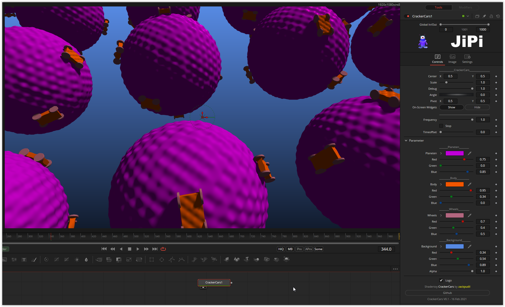

Cute little racing cars roar around on small planets. All colors are changeable



A solution has been found for the tiresome multi-dimensional variable conversion. nmbr73 has defined cute defines ;-)
And OpenCL can have overloaded functions

```
  #define swixy(V) to_float2((V).x,(V).y)
  #define swixx(V) to_float2((V).x,(V).x)
  #define swiyx(V) to_float2((V).y,(V).x)
  #define swiyy(V) to_float2((V).y,(V).y)
```
Have fun
