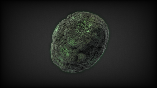

# WildKifs4D

This Fuse is based on the Shadertoy '_[WildKifs4D](https://www.shadertoy.com/view/wttBzM)_' by [iapafoto](https://www.shadertoy.com/user/iapafoto). Conversion to DCTL and encapsulation into a fuse done by [JiPi](../../Site/Profiles/JiPi.md). See [Planet](README.md) for more fuses in this category.

<!-- +++ DO NOT REMOVE THIS COMMENT +++ DO NOT ADD OR EDIT ANY TEXT BEFORE THIS LINE +++ IT WOULD BE A REALLY BAD IDEA +++ -->

A very changing lump with great surface effects

In the original, a very interesting possibility has been created to make the appearance appear more realistic. This is achieved by calculating and merging the entire shader four more times with shifted parameters. Another kernel would be necessary for this. Since this is very performance-intensive, it was omitted here. He already looks very good :-)

Have fun

<!-- +++ DO NOT REMOVE THIS COMMENT +++ DO NOT EDIT ANY TEXT THAT COMES AFTER THIS LINE +++ TRUST ME: JUST DON'T DO IT +++ -->

## Problems

Number of problems: 1

- Thumbnail seems to be not a 320x180 pixel PNG

