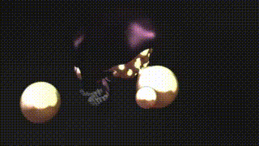
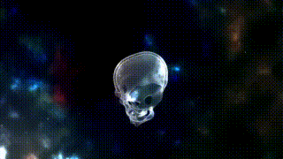
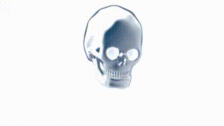

# Shaderfuse

> [!attention] Does not work with the free versions of BMD's software anymore!
>
> Unfortunately, with version 19.1 of DaVinci Resolve, BMD has decided to disable the so-called 'UI Manager' for the free version; from now on, it can only be used through extensions in the paid Studio version. However, essential parts of Shaderfuses (and many other great free tools out there) are based on exactly this component. So unless you have the paid version, the Shaderfuses cannot be installed properly from this version onwards - neither via the Reactor nor our installer scripts.
>
> See for example:
> - [19.1 - Broken Scripts Megathread](https://www.reddit.com/r/davinciresolve/comments/1gpo20i/191_broken_scripts_megathread/) on Reddit
> - [UIManager has been disabled in Resolve Free in v19.1](https://forum.blackmagicdesign.com/viewtopic.php?f=12&t=213158) on the Blackmagic Forum
> - [Blackmagic Design has released Resolve Studio v19.1](https://www.linkedin.com/posts/andrewhazelden_hello-after-several-months-of-development-activity-7262128142125793280-Jd8b/) post on LinkedIn

DCTL shader fuses for use within Fusion and/or DaVinci Resolve's Fusion page (aka "DaFusion").

See the [videos](Videos.md) to get an idea of what this does look like; let yourself be convinced by the charm of the legendary Lazy Artist, who advertises it as an ["Actually MIND BLOWING Free Tool"](https://www.youtube.com/watch?v=vb57Sgh0dtM); or watch Sonny Helzer's full [Reactor "ShaderToys" nodes and a project in fusion](https://www.youtube.com/watch?v=87bNprz53CE) tutorial.

The Fuses are based on WebGL shaders released on [Shadertoy.com](https://www.shadertoy.com/) with a license that allows for porting (see each Fuse's source code and/or info pane for the respective license information); please note that neither we are related to Shadertoy.com, nor is this an official Shadertoy.com repository; but we are obviously and definitely huge fans of this amazing website!

> [!danger] Watch out for each shader's license information!
>
> Most (but not all) shaders contained here are CC BY-NC-SA as on Shadertoy they default to this license if not stated otherwise. Please give proper attribution to the fragment shader's author when using one of the in your work plus you must not use them in any commercial context.

Furthermore must be mentioned that this repository is only an incubator to develop such fuses and to exchange on experiences, approaches and solutions. If you are searching for production ready extensions to really use for your day to day work, then the [Reactor](https://www.steakunderwater.com/wesuckless/viewtopic.php?f=32&t=1814) is the right and de facto go to place for you. As soon as an implementation in this repository achieves an appropriate maturity we will suggest it for inclusion into the Reactor - thereby Reactor is the one and only source for the outcomes and stable versions of our experiments. You should find the stable Fuses in Reactor under the same name but without any of the annoying '`_DEV`', '`_BETA`', or whatsoever suffixes.

## Fuses

See [Shaders](Shaders.md) for a list of all shaders implemented so far - resp. the [Overview](Overview.md) to have with thumbnails a more 'visual experience'. Find what's new with the [latest conversions](Latest Conversions.md), or have a look at the [Shader of the Week](Shader of the Week.md) list.

#### Current Shader of the Week (19th of November 2025):

  
[Cartoon Ride](ShaderOfTheWeek/CartoonRide.md) by [iapafoto](https://www.shadertoy.com/user/iapafoto)

----
#### A brandnew Category: Skulls
----
  
[skully](Skulls/skully.md) by [monsterkodi](https://www.shadertoy.com/user/monsterkodi)

[![The Dark Mark [HP]](Skulls/TheDarkMarkHp.gif)](Skulls/TheDarkMarkHp.md)  
[The_Dark_Mark_[HP]](Skulls/TheDarkMarkHp.md) by [Yusef28](https://www.shadertoy.com/user/Yusef28)

  
[Alas,poorYorick!](Skulls/AlasPoorYorick.md) by [schau](https://www.shadertoy.com/user/schau)

  
[Dull Skull-Brained](Skulls/DullSkullBrained.md) by [Kris_Katur](https://www.shadertoy.com/user/Kris_Katur)

  
[Dull Skull-Bumped](Skulls/DullSkullBumped.md) by [Kris_Katur](https://www.shadertoy.com/user/Kris_Katur)

  
[Dull Skull-Prologue](Skulls/DullSkullPrologue.md) by [Kris_Katur](https://www.shadertoy.com/user/Kris_Katur)

  
[Dull Skull-Reflected](Skulls/DullSkullReflected.md) by [Kris_Katur](https://www.shadertoy.com/user/Kris_Katur)

  
[Lost_Astronaut](Skulls/LostAstronaut.md) by [duvengar](https://www.shadertoy.com/user/duvengar)

  
[DULL Speed SKULL](Skulls/DullSpeedSkull.md) by [Spectraledge](https://www.shadertoy.com/user/Spectraledge)

  
[Fork DULL SKULL frostbyte_ 591](Skulls/ForkDullSkullFrostbyte591.md) by [Frostbyte_](https://www.shadertoy.com/user/Frostbyte_)

## Installation

### Reactor

Best way to install the Fuses is to just use [Reactor](https://www.steakunderwater.com/wesuckless/viewtopic.php?f=32&t=1814). Find the 'Shadertoys' package in the - guess what - 'Shaders' category. This is the most convenient and recommended way to if you just what to use them or have a quick look if they might be useful for you.

Only thing to take into account is that this way you don't get the latest development versions. Stable toys are bundled from time to time and integrated in Reactor when reviewed. You will find the Shaderfuses installed this way in Effects under 'Shaderfuse'.

### Installer

Alternately to the Reactor package install, you can download a Fuse's '`*-Installer.lua`' installation script in case you want to quickly try out the latest version of a single Fuse. Drag and drop that script onto your Fusion workspace and follow installer's instructions. You will find Fuses installed this way in Effects under 'Shaderfuse (beta)' and node instances of such Fuses will have a '_BETA' suffix in your composition.

If you want to try out multiple Shaderfuses this way, you can download all the latest installers as [Shaderfuse-Installers.zip](Shaderfuse-Installers.zip). Unpack the that archive and then drag and drop the installers of your choice onto Fusion.

## Usage

In the Fusion page of DaVinci Resolve right click into the working area. In the context menu under 'Add tool' you'll find a 'Shaderfuse' submenu (resp. 'Shaderfuse (beta)' for their variants installed using an installer). That submenu corresponds to the Fuse categories you see on this page and provides access to all fuses installed.

Alternatively you can open the *'Select Tool'* dialog (Shift+Space Bar) and start typing "`sf.`" to filter for the shadertoy fuses (or use "sf-b." for the beta versions installed via an installer script).

And last but not least in 'Effects' (Fusion) resp. the 'Effects Library' (DaVinci Resolve) pane under 'Tools' you should now find an entry 'Shaderfuse' (resp. 'Shaderfuse (beta)') that lists all the categories and the different fuses.

Please note, that there a some specific shaders that might need additional Fuses at their input to be used. These are in particular all the [Cubemap](Cubemap/README.md) and [Audio](Audio/README.md) shaders.
