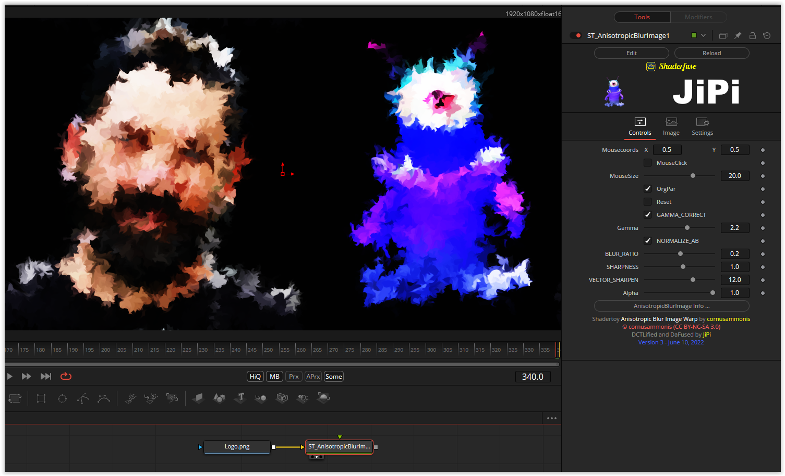

This conversion was created as part of a post in the WeSuckLessForum. A realistic oil shader was sought.
The basis is a diffusion reaction that is controlled with a noise pattern. If no noise pattern is applied to the second image input, the gold noise function is used. However, amazing effects can be created with a self-created pattern.
For those who want to play with the diffusion reaction, there is the OrgPar button, with which almost all parameters can be set.

Have fun playing

