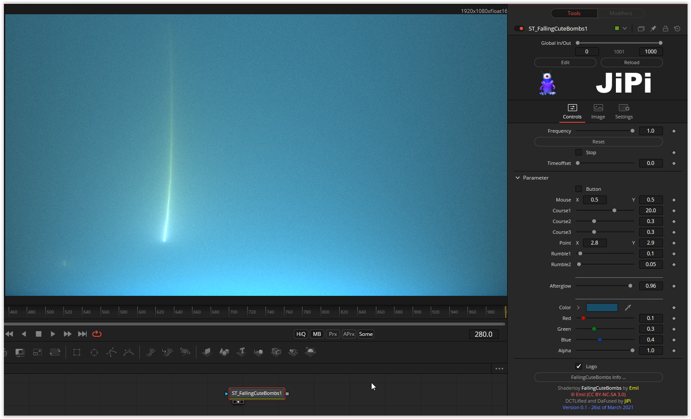

A relatively simple recursive shader, but it wasn't easy to translate either. A few adjustments were necessary, because although a small resolution creates the impression of a falling fireball, individual points become visible in Fusion with a larger one. Theoretically, the shader would have to be adjusted with the resolution, but this is not very easy due to the increase in brightness and fade out (fade) due to the recurrence.
I've added a couple of parameters to play with.

Have fun playing
