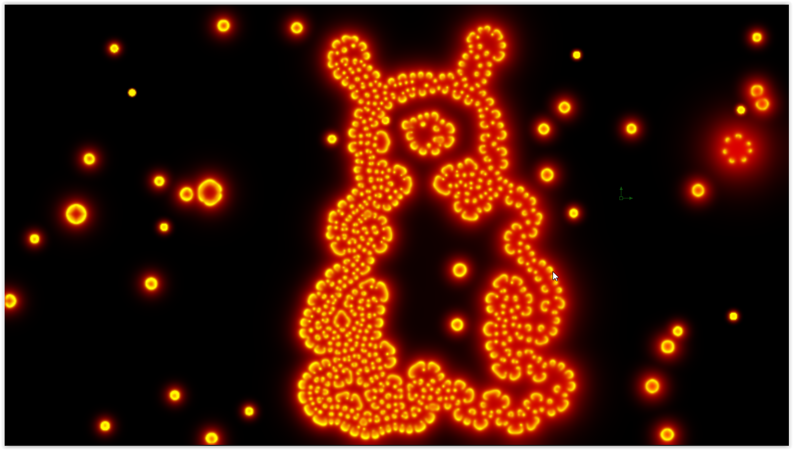

# LearningReactionDiffusion

This Fuse is based on the Shadertoy '_[LearningReactionDiffusion](https://www.shadertoy.com/view/WlSGzy)_' by [TekF](https://www.shadertoy.com/user/TekF). Conversion to DCTL and encapsulation into a fuse done by [JiPi](../../Site/Profiles/JiPi.md). See [Recursive](README.md) for more fuses in this category.

<!-- +++ DO NOT REMOVE THIS COMMENT +++ DO NOT ADD OR EDIT ANY TEXT BEFORE THIS LINE +++ IT WOULD BE A REALLY BAD IDEA +++ -->

The reaction diffusion shaders cast a spell over me. This is a shader to work your way through the matter well. There is a short concise info page about the theory:
https://www.karlsims.com/rd.html

And here is a detailed description of this shader, as well as an introduction to my favorite shaders on this topic:
https://www.youtube.com/watch?v=wKhv1nPb2lk

Have fun playing

<!-- +++ DO NOT REMOVE THIS COMMENT +++ DO NOT EDIT ANY TEXT THAT COMES AFTER THIS LINE +++ TRUST ME: JUST DON'T DO IT +++ -->

## Compatibility

🟩 macOS / Metal: checked 
⬛ macOS / OpenCL: NOT TESTED! 
🟩 Windows / CUDA: checked 
🟩 Windows / OpenCL: checked 

## Problems

Number of problems: 2

- Thumbnail seems to be not a 320x180 pixel PNG
- macOS_OpenCL compatibility not checked

