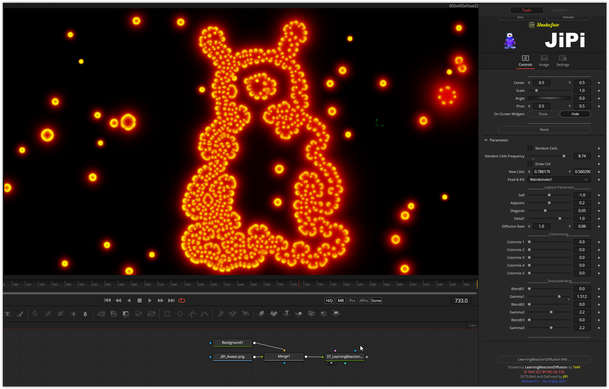

The reaction diffusion shaders cast a spell over me. This is a shader to work your way through the matter well. There is a short concise info page about the theory:
https://www.karlsims.com/rd.html

And here is a detailed description of this shader, as well as an introduction to my favorite shaders on this topic:
https://www.youtube.com/watch?v=wKhv1nPb2lk

Have fun playing

