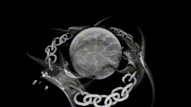
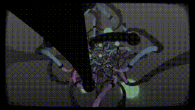
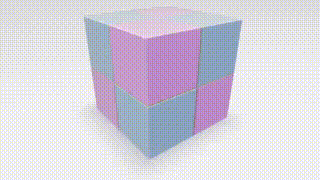
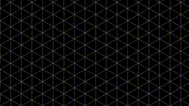

On the home page of ShaderToy.com the "Shader of the Week" is presented. As far as this can be converted to DCTL, I will set this shader here.
----
## 1th of January 2026
#### [Automata X Showcase 3x2 (3x3)](AutomataXShowcase3X23X3.md) (Shadertoy ID [ds2fD1](https://www.shadertoy.com/view/ds2fD1))

---
On the home page of ShaderToy.com the "Shader of the Week" is presented. As far as this can be converted to DCTL, I will set this shader here.
----
## 26th of Dezember 2025
#### [Fractured Orb](FracturedOrb.md) (Shadertoy ID [ttycWW](https://www.shadertoy.com/view/ttycWW))

----
## 9th of Dezember 2025
#### [Station 17](Station17.md) (Shadertoy ID [3fVyDw](https://www.shadertoy.com/view/3fVyDw))

----
## 2th of Dezember 2025
#### [Tiny Hideout](TinyHideout.md) (Shadertoy ID [DlKBDh](https://www.shadertoy.com/view/DlKBDh))

----
## 26th of November 2025
#### [Dark Transit](DarkTransit.md) (Shadertoy ID [WcdczB](https://www.shadertoy.com/view/WcdczB))

----
## 19th of November 2025
#### [CartoonRide](CartoonRide.md) (Shadertoy ID [wtXBR4](https://www.shadertoy.com/view/wtXBR4))

----
## 4th of November 2025
#### [Neonwave Sunrise](NeonwaveSunrise.md) (Shadertoy ID [7dyyRy](https://www.shadertoy.com/view/7dyyRy))

----
## 30th of October 2025
#### [Endless Living Creature](EndlessLivingCreature.md) (Shadertoy ID [tljXWy](https://www.shadertoy.com/view/tljXWy))

----
## 24th of October 2025
#### [Hexagon X5](HexagonX5.md) (Shadertoy ID [4cVfWG](https://www.shadertoy.com/view/4cVfWG))

----
## 15th of October 2025
#### [Hex At You](HexAtYou.md) (Shadertoy ID [lflcR8](https://www.shadertoy.com/view/lflcR8))

----
## 22th of September 2025
#### [Root Sanctum](RootSanctum.md) (Shadertoy ID [3c2fz1](https://www.shadertoy.com/view/3c2fz1))

----
## 12th of September 2025
#### [TiledGildedRainbowTunnel](TiledGildedRainbowTunnel.md) (Shadertoy ID [tc2cWh](https://www.shadertoy.com/view/tc2cWh))

----
## 19th of August 2025
#### [HexaGold 2](Hexagold2.md) (Shadertoy ID [sltSR2](https://www.shadertoy.com/view/sltSR2))

----
## 6th of August 2025
#### [Glassy With Odd Rotation](GlassyWithOddRotation.md) (Shadertoy ID [3XdXWX](https://www.shadertoy.com/view/3XdXWX))

----
## 23th of July 2025
#### [JustAnotherCube](JustAnotherCube.md) (Shadertoy ID [3XdXRr](https://www.shadertoy.com/view/3XdXRr))

----
## 17th of July 2025
#### [Tunnel of Lights](TunnelOfLights.md) (Shadertoy ID [w3KGRK](https://www.shadertoy.com/view/w3KGRK))

----
## 6th of July 2025
#### [Clearly a bug](ClearlyABug.md) (Shadertoy ID [33cGDj](https://www.shadertoy.com/view/33cGDj))

----
## 6th of July 2025
#### [4D Beats](D4DBeats.md) (Shadertoy ID [tfK3Dy](https://www.shadertoy.com/view/tfK3Dy))

----
## 15th of June 2025
#### [ChainSpell](ChainSpell.md) (Shadertoy ID [Ms2BRz](https://www.shadertoy.com/view/Ms2BRz))

----
## 3th of June 2025
#### [Undulating Urchin](UndulatingUrchin.md) (Shadertoy ID [332XWd](https://www.shadertoy.com/view/332XWd))

----
## 28th of May 2025
#### [Year Of Truchets #022](YearOfTruchets022.md) (Shadertoy ID [dtGGWw](https://www.shadertoy.com/view/dtGGWw))

----
## 23th of May 2025
#### [TrailingTheTwinklingTunnel](TrailingTheTwinklingTunnel.md) (Shadertoy ID [WfcGWj](https://www.shadertoy.com/view/WfcGWj))

----
## 17th of May 2025
#### [Fidget Cube](FidgetCube.md) (Shadertoy ID [XXyGzh](https://www.shadertoy.com/view/M3sXDS))

----
## 30th of April 2025
#### [Zippy Zaps [399 Chars]](ZippsZaps.md) (Shadertoy ID [XXyGzh](https://www.shadertoy.com/view/XXyGzh))

----
## 17th of April 2025
#### [DULL SKULL](DullSkull.md) (Shadertoy ID [DlyyWR](https://www.shadertoy.com/view/DlyyWR))

----
## 10th of April 2025
#### [Infrastructure](Infrastructure.md) (Shadertoy ID [ssBfz3](https://www.shadertoy.com/view/ssBfz3))

----
## 2th of April 2025
#### [CubeWave3](CubeWave3.md) (Shadertoy ID [lcSGDD](https://www.shadertoy.com/view/lcSGDD))

----
## 10th of March 2025
#### [CreationBySilexars](CreationBySilexars.md) (Shadertoy ID [XsXXDn](https://www.shadertoy.com/view/XsXXDn))

----
## 28th of Febuary 2025
#### [yee1212](yee1212.md) (Shadertoy ID [sldGRS](https://www.shadertoy.com/view/sldGRS))

----
## 5th of Febuary 2025
#### [Segmented spiral whirlpool](SegmentedSpiralWhirlpool.md) (Shadertoy ID [4ctcRl](https://www.shadertoy.com/view/4ctcRl))

----
## 31th of January 2025
#### [Eye of Phi](EyeOfPhi.md) (Shadertoy ID [7stfzB](https://www.shadertoy.com/view/7stfzB))

----
## 22th of January 2025
#### [Abstract Truchet Inversion](Abstract Truchet Inversion.md) (Shadertoy ID [7ljXWt](https://www.shadertoy.com/view/7ljXWt))

----
## 16th of Dezember 2024
#### [大龙猫 - Tunnel Cable](WeirdTruchetNewKeyboard.md) (Shadertoy ID [MfVfz3](https://www.shadertoy.com/view/MfVfz3))

----
## 28th of November 2024
#### [Weird Truchet New Keyboard](WeirdTruchetNewKeyboard.md) (Shadertoy ID [4ccfRn](https://www.shadertoy.com/view/4ccfRn))

----
## 27th of November 2024
#### [Fork Neon Tunne Infames 758](NeonTunne.md) (Shadertoy ID [lcjGWV](https://www.shadertoy.com/view/mtl3RB))

----
## 22th of November 2024
#### [Starfield](Starfield.md) (Shadertoy ID [lcjGWV](https://www.shadertoy.com/view/lcjGWV))

----
## 11th of November 2024
#### [Torus Hive](TorusHive.md) (Shadertoy ID [NsdXzf](https://www.shadertoy.com/view/NsdXzf))

----
## 22th of October 2024
#### [Unstable Universe](UnstableUniverse.md) (Shadertoy ID [wtlfz8](https://www.shadertoy.com/view/wtlfz8))

----
## 22th of October 2024
#### [Abstract Wave Thing](AlienSpaceAbstractWaveThingJockey.md) (Shadertoy ID [tttSW7](https://www.shadertoy.com/view/tttSW7))

----
## 29th of September 2024
#### [Alien Space Jockey](AlienSpaceJockey.md) (Shadertoy ID [mdB3Rh](https://www.shadertoy.com/view/mdB3Rh))

----
## 10th of September 2024
#### [Starry Planes](StarryPlanes.md) (Shadertoy ID [MfjyWK](https://www.shadertoy.com/view/MfjyWK))

----
## 17th of July 2024
#### [Alien Tunnel](AlienTunnel.md) (Shadertoy ID [X3ySRc](https://www.shadertoy.com/view/X3ySRc))

----
## 1th of July 2024
#### [Nested Octahedrons2](RussianRouletNestedOctahedrons2teAudioViz.md) (Shadertoy ID [X3cXDj](https://www.shadertoy.com/view/X3cXDj))

----
## 19th of June 2024
#### [Russian Roulette (Audio Viz)](RussianRouletteAudioViz.md) (Shadertoy ID [MfG3Ry](https://www.shadertoy.com/view/MfG3Ry))

----
## 9th of June 2024
#### [Saturday Weirdness](SaturdayWeirdness.md) (Shadertoy ID [43jXWt](https://www.shadertoy.com/view/43jXWt))

----
## 20th of May 2024
#### [Let's self reflect](LetSSelfReflect.md) (Shadertoy ID [XfyXRV](https://www.shadertoy.com/view/XfyXRV))

----
## 17th of April 2024
#### [OrbitalMegastructure](OrbitalMegastructure.md) (Shadertoy ID [WlKXzm](https://www.shadertoy.com/view/WlKXzm))

----
## 27th of March 2024
#### [SimplexTruchetTubing](SimplexTruchetTubing.md) (Shadertoy ID [XsffWj](https://www.shadertoy.com/view/XsffWj))

----
## 20th of March 2024
#### [SomethinMountainbytesPppp4KibWindows](MountainbytesPppp4KibWindows.md) (Shadertoy ID [lX2GzD](https://www.shadertoy.com/view/lX2GzD))

----
## 1th of March 2024
#### [Space At Home](SpaceAtHome.md) (Shadertoy ID [MXS3zy](https://www.shadertoy.com/view/MXS3zy))

----
## 14th of February 2024
#### [Something227](Something227.md) (Shadertoy ID [3lyBDw](https://www.shadertoy.com/view/3lyBDw))

----
## 16th of January 2024
#### [FullSpectrumCyber](FullSpectrumCyber.md) (Shadertoy ID [XcXXzS](https://www.shadertoy.com/view/XcXXzS))

----
## 5th of January 2024
#### [InsideTheTorus](InsideTheTorus.md) (Shadertoy ID [XcS3zK](https://www.shadertoy.com/view/XcS3zK))

----
## 18th of December 2023
#### [AndroidRuntime](AndroidRuntime.md) (Shadertoy ID [DltBRM](https://www.shadertoy.com/view/DltBRM))

----
## 6th of December 2023
#### [GroundCameraLightingHelix](GroundCameraLightingHelix.md) (Shadertoy ID [Mt33W2](https://www.shadertoy.com/view/Mt33W2))

----
## 16th of November 2023
#### [Decorated Christmas Spiral](DecoratedChristmasSpiral.md) (Shadertoy ID [3dVfDc](https://www.shadertoy.com/view/3dVfDc))

----
## 1th of November 2023
#### [Neural Stanford Bunny (5 kb)](NeuralStanfordBunny5Kb.md) (Shadertoy ID [wtVyWK](https://www.shadertoy.com/view/wtVyWK))

----
## 17th of September 2023
#### [Extruded Bauhaus Truchet Pattern](ExtrudedBauhausTruchetPattern.md) (Shadertoy ID [dl2fzz](https://www.shadertoy.com/view/dl2fzz))

----
## 05th of September 2023
#### [STELLAR CLOUDS](StellarClouds.md) (Shadertoy ID [DtdSz7](https://www.shadertoy.com/view/DtdSz7))

----
## 29th of August 2023
#### [Discoteq 2](Discoteq2.md) (Shadertoy ID [DtXfDr](https://www.shadertoy.com/view/DtXfDr))

----
## 22th of August 2023
#### [Inside the mandelbulb II](InsideTheMandelbulbIi.md) (Shadertoy ID [mtScRc](https://www.shadertoy.com/view/mtScRc))

----
## 15th of August 2023
#### [bomlka](bomlka.md) (Shadertoy ID [mtXyD7](https://www.shadertoy.com/view/mtXyD7))

----
## 18th of July 2023
#### [Whack-A-Mole Pistons](WhackAMolePistons.md) (Shadertoy ID [WtXcWB](https://www.shadertoy.com/view/WtXcWB))

----
## 04th of June 2023
#### [PlayingAroundShader](PlayingAroundShader.md) (Shadertoy ID [NdscDf](https://www.shadertoy.com/view/ctd3Rl))

----
## 11th of May 2023
#### [AiNotIncluded](AiNotIncluded.md) (Shadertoy ID [ctd3Rl](https://www.shadertoy.com/view/ctd3Rl))

----
## 2th of May 2023
#### [ACircleADay](ACircleADay.md) (Shadertoy ID [DdySzW](https://www.shadertoy.com/view/DdySzW)

----
## 12th of April 2023
#### [RetroVision](ShaderOfTheWeek/RetroVisionRevision2023.md) (Shadertoy ID [DdVSzR](https://www.shadertoy.com/view/DdVSzR))

----
## 30th of March 2023
#### [ElectricEelUniverse](ShaderOfTheWeek/HyperbolicGroupLimitSet.md) (Shadertoy ID [cddSRM](https://www.shadertoy.com/view/cddSRM))

----
## 08th of March 2023
#### [HyperbolicGroupLimitSet](ShaderOfTheWeek/HyperbolicGroupLimitSet.md) (Shadertoy ID [NstSDs](https://www.shadertoy.com/view/NstSDs))

----
## 03th of March 2023
#### [GreenFieldDiorama](ShaderOfTheWeek/GreenFieldDiorama.md) (Shadertoy ID [wtlXRH](https://www.shadertoy.com/view/7dSGW1))

----
## 06th of February 2023
#### [Nintendo Switch](ShaderOfTheWeek/NintendoSwitch.md) (Shadertoy ID [wtlXRH](https://www.shadertoy.com/view/wtlXRH))

----
## 26th of December 2022 to 31th of January 2023
Not a worthwhile shader for fusion
#### 4D Sun (Shadertoy ID [wtVGDR](https://www.shadertoy.com/view/wtVGDR))
#### tHe gRiD (Shadertoy ID [7tGfWy](https://www.shadertoy.com/view/7tGfWy))
#### Desire Crystal (Shadertoy ID [flfyRS](https://www.shadertoy.com/view/flfyRS))
#### 4Traveling by the mountains (Shadertoy ID [Nlcczf](https://www.shadertoy.com/view/Nlcczf))

----
## 19th of December 2022
#### [AudioFlightV2](ShaderOfTheWeek/AudioFlightV2.md) Energetic Flyby (Shadertoy ID [7tfyRl](https://www.shadertoy.com/view/7tfyRl))

----
## 05th of December 2022
#### [20221105_inercia intended one](ShaderOfTheWeek/InerciaIntended.md) (Shadertoy ID [cs2GWD](https://www.shadertoy.com/view/cs2GWD))

----
## 21th of November 2022
#### [Energetic Flyby](ShaderOfTheWeek/Energeticflyby.md) (Shadertoy ID [csjGDD](https://www.shadertoy.com/view/csjGDD))

----
## 08th of November 2022
#### [GenerativeArtDeco4](ShaderOfTheWeek/GenerativeArtDeco4.md) (Shadertoy ID [mds3DX](https://www.shadertoy.com/view/mds3DX))

----
## 02th of November 2022
#### [WednesdayMessingAround](ShaderOfTheWeek/WednesdayMessingAround.md) (Shadertoy ID [NtcyDn](https://www.shadertoy.com/view/NtcyDn))

----
## 13th of September 2022
#### [TwizzlyCircleMess](ShaderOfTheWeek/TwizzlyCircleMess.md) (Shadertoy ID [sltGRj](https://www.shadertoy.com/view/flcSW2))

----
## 31th of August 2022
#### [SimpleRefractionTest](ShaderOfTheWeek/SimpleRefractionTest.md) (Shadertoy ID [flcSW2](https://www.shadertoy.com/view/flcSW2))
[)
](ShaderOfTheWeek/SimpleRefractionTest.md)

----
## 17th of August 2022
#### [Frozen Wasteland](ShaderOfTheWeek/FrozenWasteland.md) (Shadertoy ID [Xls3D2](https://www.shadertoy.com/view/Xls3D2))

----
## 19th of July 2022
#### [ControllableMachinery](ShaderOfTheWeek/ControllableMachinery.md) (Shadertoy ID [fsXyDj](https://www.shadertoy.com/view/fsXyDj))

----
## 14th of June 2022
#### [JeweledVortex](ShaderOfTheWeek/JeweledVortex.md) (Shadertoy ID [fdjfDc](https://www.shadertoy.com/view/fdjfDc))

----
## 07th of June 2022
#### fluffballs (Shadertoy ID [fscczX](https://www.shadertoy.com/view/fscczX))
Not a worthwhile shader for fusion

----
## 03th of June 2022
#### [CoastalLandscapet](ShaderOfTheWeek/CoastalLandscape.md) (Shadertoy ID [fstyD4](https://www.shadertoy.com/view/fstyD4))

----
## 25th of May 2022
#### [NightCircuit](ShaderOfTheWeek/NightCircuit.md) (Shadertoy ID [tdyBR1](https://www.shadertoy.com/view/tdyBR1))

----
## 18th of May 2022
#### [Pig Squad](ShaderOfTheWeek/PigSquad.md) (Shadertoy ID [WdBcRh](https://www.shadertoy.com/view/WdBcRh))

----
## 12th of May 2022
#### Cubic Dispersal (Shadertoy ID [fldXWS](https://www.shadertoy.com/view/fldXWS))

----
## 05th of May 2022
#### [ColorProcessing](ShaderOfTheWeek/ColorProcessing.md) (Shadertoy ID [7tfBzs](https://www.shadertoy.com/view/7tfBzsn))

----
## 27th of April 2022
#### [SpaceShip](ShaderOfTheWeek/SpaceShip.md) (Shadertoy ID [NlsBzn](https://www.shadertoy.com/view/NlsBzn))

----
## 20th of April 2022
#### [DangerNoodle](ShaderOfTheWeek/DangerNoodle.md) (Shadertoy ID [wlVSDK](https://www.shadertoy.com/view/wlVSDK))

----
## 14th of April 2022
#### [StarsAndGalaxy](ShaderOfTheWeek/StarsAndGalaxy.md) (Shadertoy ID [stBcW1](https://www.shadertoy.com/view/stBcW1))

----
## 7th of April 2022
#### Desperate Distraction (Shadertoy ID [7ddSD7](https://www.shadertoy.com/view/7ddSD7))
Not a worthwhile shader for fusion

----
## 30th of March 2022
#### [PartyConcertVisuals2020](ShaderOfTheWeek/PartyConcertVisuals2020.md) (Shadertoy ID [WtscW4](https://www.shadertoy.com/view/WtscW4))

----
## 23th of March 2022
#### [OMZG Shader Royale](ShaderOfTheWeek/OMZGShaderRoyale.md) (Shadertoy ID [3l3Bzl](https://www.shadertoy.com/view/3l3Bzl))

----
## 16th of March 2022
#### Morning Commute (Shadertoy ID [wdKBz1](https://www.shadertoy.com/view/wdKBz1))
Not a worthwhile shader for fusion

----
## 9th of March 2022
#### Quartz - wip (Shadertoy ID [fs2GWh](https://www.shadertoy.com/view/fs2GWh))
Not a worthwhile shader for fusion

----
## 2th of March 2022
#### Synthwave song (sound) (Shadertoy ID [NddSzl](https://www.shadertoy.com/view/NddSzl))
AudioShader, which is not convertible

----
## 23th of February 2022
#### [Lover](ShaderOfTheWeek/Lover.md) (Shadertoy ID [fsjyR3](https://www.shadertoy.com/view/fsjyR3))

----
## 16th of February 2022
#### [Terraform](ShaderOfTheWeek/Terraform.md) (Shadertoy ID [NsdXDs](https://www.shadertoy.com/view/NsdXDs))

----
## 9th of February 2022
#### [StarGazingHippo](ShaderOfTheWeek/Stargazinghippo.md) (Shadertoy ID [4tGfz3](https://www.shadertoy.com/view/4tGfz3))
[!](ShaderOfTheWeek/Stargazinghippo.md)

----
## 2th of February 2022
#### [Undulating Columns](ShaderOfTheWeek/UndulatingColumns.md) (Shadertoy ID [WlXXDH](https://www.shadertoy.com/view/WlXXDH))

----
## 26th of January 2022
#### [TrippyTriangle](ShaderOfTheWeek/TrippyTriangle.md) (Shadertoy ID [fslcDS](https://www.shadertoy.com/view/fsXcR8))

----
## 19th of January 2022
#### [Exit the Matrix](ShaderOfTheWeek/ExitTheMatrix.md) (Shadertoy ID [NlsXDH](https://www.shadertoy.com/view/fsXcR8))

----
## 12th of January 2022
#### [On the salt lake](ShaderOfTheWeek/OnTheSal.md) (Shadertoy ID [tls3WB](https://www.shadertoy.com/view/fsXcR8))

----
## 5th of January 2022
#### [Recursive Donut](ShaderOfTheWeek/RecursiveDonut.md) (Shadertoy ID [tls3WB](https://www.shadertoy.com/view/tls3WB))

----
## 30th of Dezember 2021
#### [Truchet + Kaleidoscope FTW6](ShaderOfTheWeek/TruchetKaleidoscopeFTW.md) (Shadertoy ID [7lKSWW](https://www.shadertoy.com/view/7lKSWW))

----
## 16th of Dezember 2021
#### Paper Plane (Shadertoy ID [tstczS](https://www.shadertoy.com/view/tstczS))
GameShader, is not interesting as a shaderfuse, as it is intended for playing

----
## 8th of Dezember 2021
#### [HyperDough](ShaderOfTheWeek/HyperDough.md) (Shadertoy ID [7tcGWB](https://www.shadertoy.com/view/7tcGWB))

----
## 3th of Dezember 2021
#### [FractalGliding](ShaderOfTheWeek/FractalGliding.md) (Shadertoy ID [ftGGDR](https://www.shadertoy.com/view/ftGGDR))

----
## 18th of November 2021
#### [RME4-Crater](ShaderOfTheWeek/RME4Crater.md) (Shadertoy ID [MlSBDt](https://www.shadertoy.com/view/MlSBDt))

----
## 11th of November 2021
#### [FuturisticTunnel](ShaderOfTheWeek/FuturisticTunnel.md) (Shadertoy ID [wdScRd](https://www.shadertoy.com/view/wdScRd))

----
## 3th of November 2021
#### [AlexanderHornedSphereZoom](ShaderOfTheWeek/AlexanderHornedSphereZoom.md) (Shadertoy ID [Ns3XWf](https://www.shadertoy.com/view/Ns3XWf))

----
## 29th of October 2021
#### [SpiraledLayers](ShaderOfTheWeek/SpiraledLayers.md) (Shadertoy ID [Ns3XWf](https://www.shadertoy.com/view/Ns3XWf))

----
## 20th of October 2021
#### [TasteOfNoise7](ShaderOfTheWeek/TasteOfNoise7.md) (Shadertoy ID [NddSWs](https://www.shadertoy.com/view/NddSWs))

----
## 5th of October 2021
#### [20210930_CLUB-CAVE-09](ShaderOfTheWeek/20210930_CLUB-CAVE-09.md) (Shadertoy ID [NdKGWV](https://www.shadertoy.com/view/NdKGWV))

----
## 28th of September 2021
#### [SimpleSphereRaymarching](ShaderOfTheWeek/SimpleSphereRaymarching.md) (Shadertoy ID [NdKGWV](https://www.shadertoy.com/view/NdKGWV))

----
## 21th of September 2021
#### TechnoSong (Shadertoy ID [sls3WM](https://www.shadertoy.com/view/sls3WM))
AudioShader, which is not convertible

----
## 14th of September 2021
#### [Day94](ShaderOfTheWeek/Day94.md) (Shadertoy ID [tdXcWM](https://www.shadertoy.com/view/tdXcWM))

----
## 7th of September 2021
#### [Fractal Flythrough](ShaderOfTheWeek/FractalFlythrough.md) (Shadertoy ID [4s3SRN](https://www.shadertoy.com/view/4s3SRN))

