# Shader of the Week

On the frontpage of [Shadertoy.com](https://www.shadertoy.com/) you'll find a "[Shader of the Week](https://www.shadertoy.com/playlist/week)".
[JiPi](Profiles/JiPi.md), in particular, has made it his personal hobby to implement as many of these Shaders of the Week as possible.

## 2026

### 25th of September 2026
#### [The Tetris Dimension](ShaderOfTheWeek/TheTetrisDimension.md) (Shadertoy ID [NtByzD](https://www.shadertoy.com/view/NtByzD))
[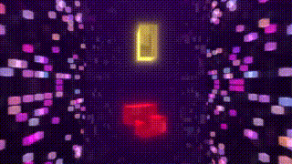](ShaderOfTheWeek/TheTetrisDimension.md)

### 3rd of September 2026
#### [Graphic Design Experiment 17](ShaderOfTheWeek/GraphicDesignExperiment17.md) (Shadertoy ID [lXXcDM](https://www.shadertoy.com/view/lXXcDM))
[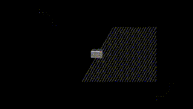](ShaderOfTheWeek/GraphicDesignExperiment17.md)

### 21st of August 2026
#### [Glass Origin](ShaderOfTheWeek/GlassOrigin.md) (Shadertoy ID [scS3Wy](https://www.shadertoy.com/view/scS3Wy))
[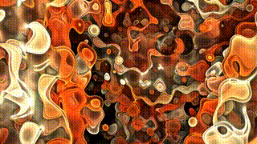](ShaderOfTheWeek/GlassOrigin.md)

### 12th of August 2026
#### [Extruded Fibonacci Zoom](ShaderOfTheWeek/ExtrudedFibonacciZoom.md) (Shadertoy ID [sfVGDG](https://www.shadertoy.com/view/sfVGDG))
[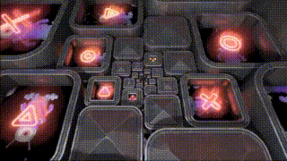](ShaderOfTheWeek/ExtrudedFibonacciZoom.md)

### 22nd of July 2026
#### [Cave Diving](ShaderOfTheWeek/CaveDiving.md) (Shadertoy ID [XcVyWD](https://www.shadertoy.com/view/XcVyWD))
[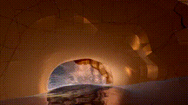](ShaderOfTheWeek/CaveDiving.md)

### 10th of July 2026
#### [More cubes for the cube lovers](ShaderOfTheWeek/MoreCubesForTheCubeLovers.md) (Shadertoy ID [mslfR2](https://www.shadertoy.com/view/mslfR2))

### 4th of June 2026
#### [Walk Like an Egyptian](ShaderOfTheWeek/WalkLikeAnEgyptian.md) (Shadertoy ID [msjGzw](https://www.shadertoy.com/view/msjGzw))

### 27th of May 2026
#### [More Fractal Ropes](ShaderOfTheWeek/MoreFractalRopes.md) (Shadertoy ID [7sscW4](https://www.shadertoy.com/view/7sscW4))
[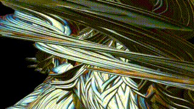](ShaderOfTheWeek/MoreFractalRopes.md)

### 22nd of May 2026
#### [Unimagined](ShaderOfTheWeek/Unimagined.md) (Shadertoy ID [NflSD8](https://www.shadertoy.com/view/NflSD8))
[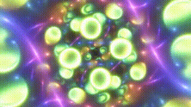](ShaderOfTheWeek/Unimagined.md)

### 12th of May 2026
#### [Reactor de Núcleo de Cristal](ShaderOfTheWeek/ReactorDeNCleoDeCristal.md) (Shadertoy ID [NXf3Rf](https://www.shadertoy.com/view/NXf3Rf))
[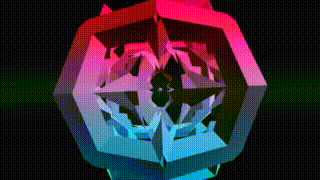](ShaderOfTheWeek/ReactorDeNCleoDeCristal.md)

### 30th of April 2026
#### [Fractal Land](ShaderOfTheWeek/FractalXLandX.md) (Shadertoy ID [XsBXWt](https://www.shadertoy.com/view/XsBXWt))
[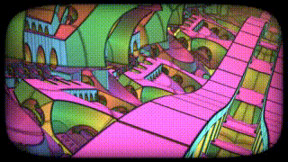](ShaderOfTheWeek/FractalXLandX.md)

### 6th of March 2026
#### [Disco Sun Vortex](ShaderOfTheWeek/DiscoSunVortex.md) (Shadertoy ID [7cfGzn](https://www.shadertoy.com/view/7cfGzn))

### 26th of February 2026
#### [UV Mapping Truchet Tiles](ShaderOfTheWeek/UvMappingTruchetTiles.md) (Shadertoy ID [NddGzH](https://www.shadertoy.com/view/NddGzH))

### 12th of February 2026
#### [Quanta half](ShaderOfTheWeek/QuantaHalf.md) (Shadertoy ID [lffSRN](https://www.shadertoy.com/view/lffSRN))

### 28th of January 2026
#### [Mandelbrot Pattern Decoration](ShaderOfTheWeek/MandelbrotPatternDecoration.md) (Shadertoy ID [ttscWn](https://www.shadertoy.com/view/ttscWn))

### 22nd of January 2026
#### [Saturday cubism experiment](ShaderOfTheWeek/SaturdayCubismExperiment.md) (Shadertoy ID [ftGfDK](https://www.shadertoy.com/view/ftGfDK))

### 14th of January 2026
#### [tm gyroid 2](ShaderOfTheWeek/TmGyroid2.md) (Shadertoy ID [tXtyW8](https://www.shadertoy.com/view/tXtyW8))

### 1st of January 2026
#### [Automata X Showcase 3x2 (3x3)](ShaderOfTheWeek/AutomataXShowcase3X23X3.md) (Shadertoy ID [ds2fD1](https://www.shadertoy.com/view/ds2fD1))

## 2025

### 26th of December 2025
#### [Fractured Orb](ShaderOfTheWeek/FracturedOrb.md) (Shadertoy ID [ttycWW](https://www.shadertoy.com/view/ttycWW))
[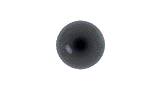](ShaderOfTheWeek/FracturedOrb.md)

### 9th of December 2025
#### [STATION 17](ShaderOfTheWeek/Station17.md) (Shadertoy ID [3fVyDw](https://www.shadertoy.com/view/3fVyDw))
[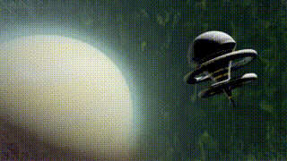](ShaderOfTheWeek/Station17.md)

### 2nd of December 2025
#### [Tiny Hideout](ShaderOfTheWeek/TinyHideout.md) (Shadertoy ID [DlKBDh](https://www.shadertoy.com/view/DlKBDh))
[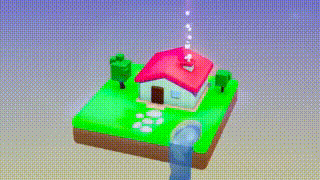](ShaderOfTheWeek/TinyHideout.md)

### 26th of November 2025
#### [Dark Transit](ShaderOfTheWeek/DarkTransit.md) (Shadertoy ID [WcdczB](https://www.shadertoy.com/view/WcdczB))

### 19th of November 2025
#### [Cartoon ride](ShaderOfTheWeek/CartoonRide.md) (Shadertoy ID [wtXBR4](https://www.shadertoy.com/view/wtXBR4))

### 4th of November 2025
#### [Neonwave sunrise](ShaderOfTheWeek/NeonwaveSunrise.md) (Shadertoy ID [7dyyRy](https://www.shadertoy.com/view/7dyyRy))

### 30th of October 2025
#### [Endless living creature](ShaderOfTheWeek/EndlessLivingCreature.md) (Shadertoy ID [tljXWy](https://www.shadertoy.com/view/tljXWy))

### 24th of October 2025
#### [Hexagon X5](ShaderOfTheWeek/HexagonX5.md) (Shadertoy ID [4cVfWG](https://www.shadertoy.com/view/4cVfWG))

### 15th of October 2025
#### [hex at you](ShaderOfTheWeek/HexAtYou.md) (Shadertoy ID [lflcR8](https://www.shadertoy.com/view/lflcR8))

### 22nd of September 2025
#### [Root Sanctum](ShaderOfTheWeek/RootSanctum.md) (Shadertoy ID [3c2fz1](https://www.shadertoy.com/view/3c2fz1))

### 12th of September 2025
#### [Tiled Gilded Rainbow Tunnel](ShaderOfTheWeek/TiledGildedRainbowTunnel.md) (Shadertoy ID [tc2cWh](https://www.shadertoy.com/view/tc2cWh))

### 19th of August 2025
#### [HexaGold 2](ShaderOfTheWeek/Hexagold2.md) (Shadertoy ID [sltSR2](https://www.shadertoy.com/view/sltSR2))

### 6th of August 2025
#### [Glassy with odd rotation](ShaderOfTheWeek/GlassyWithOddRotation.md) (Shadertoy ID [3XdXWX](https://www.shadertoy.com/view/3XdXWX))

### 23rd of July 2025
#### [Just another cube](ShaderOfTheWeek/JustAnotherCube.md) (Shadertoy ID [3XdXRr](https://www.shadertoy.com/view/3XdXRr))

### 17th of July 2025
#### [Tunnel of Lights](ShaderOfTheWeek/TunnelOfLights.md) (Shadertoy ID [w3KGRK](https://www.shadertoy.com/view/w3KGRK))

### 6th of July 2025
#### [Clearly a bug](ShaderOfTheWeek/ClearlyABug.md) (Shadertoy ID [33cGDj](https://www.shadertoy.com/view/33cGDj))

### 6th of July 2025
#### [4D Beats](ShaderOfTheWeek/D4DBeats.md) (Shadertoy ID [tfK3Dy](https://www.shadertoy.com/view/tfK3Dy))

### 15th of June 2025
#### [Chain Spell](ShaderOfTheWeek/ChainSpell.md) (Shadertoy ID [Ms2BRz](https://www.shadertoy.com/view/Ms2BRz))
[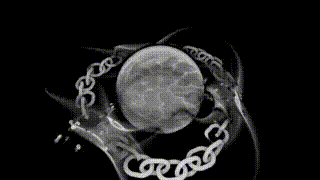](ShaderOfTheWeek/ChainSpell.md)

### 3rd of June 2025
#### [Undulating Urchin](ShaderOfTheWeek/UndulatingUrchin.md) (Shadertoy ID [332XWd](https://www.shadertoy.com/view/332XWd))

### 28th of May 2025
#### [Year of Truchets #022](ShaderOfTheWeek/YearOfTruchets022.md) (Shadertoy ID [dtGGWw](https://www.shadertoy.com/view/dtGGWw))
[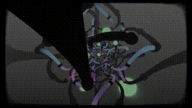](ShaderOfTheWeek/YearOfTruchets022.md)

### 23rd of May 2025
#### [Trailing the Twinkling Tunnel ..](ShaderOfTheWeek/TrailingTheTwinklingTunnel.md) (Shadertoy ID [WfcGWj](https://www.shadertoy.com/view/WfcGWj))

### 17th of May 2025
#### [Fidget Cube](ShaderOfTheWeek/FidgetCube.md) (Shadertoy ID [M3sXDS](https://www.shadertoy.com/view/M3sXDS))
[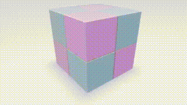](ShaderOfTheWeek/FidgetCube.md)

### 30th of April 2025
#### [Zippy Zaps](ShaderOfTheWeek/ZippyZaps.md) (Shadertoy ID [XXyGzh](https://www.shadertoy.com/view/XXyGzh))

### 17th of April 2025
#### [DULL SKULL](ShaderOfTheWeek/DullSkull.md) (Shadertoy ID [DlyyWR](https://www.shadertoy.com/view/DlyyWR))

### 10th of April 2025
#### [Infrastructure](ShaderOfTheWeek/Infrastructure.md) (Shadertoy ID [ssBfz3](https://www.shadertoy.com/view/ssBfz3))

### 2nd of April 2025
#### [cube wave 3](ShaderOfTheWeek/CubeWave3.md) (Shadertoy ID [lcSGDD](https://www.shadertoy.com/view/lcSGDD))
[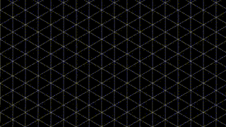](ShaderOfTheWeek/CubeWave3.md)

### 10th of March 2025
#### [Creation by Silexars](ShaderOfTheWeek/CreationBySilexars.md) (Shadertoy ID [XsXXDn](https://www.shadertoy.com/view/XsXXDn))
[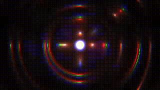](ShaderOfTheWeek/CreationBySilexars.md)

### 28th of February 2025
#### [yee1212](ShaderOfTheWeek/Yee1212.md) (Shadertoy ID [sldGRS](https://www.shadertoy.com/view/sldGRS))
[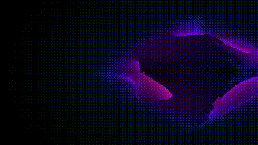](ShaderOfTheWeek/Yee1212.md)

### 5th of February 2025
#### [Segmented spiral whirlpool](ShaderOfTheWeek/SegmentedSpiralWhirlpool.md) (Shadertoy ID [4ctcRl](https://www.shadertoy.com/view/4ctcRl))
[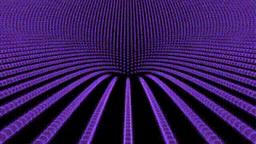](ShaderOfTheWeek/SegmentedSpiralWhirlpool.md)

### 31st of January 2025
#### [Eye of Phi](ShaderOfTheWeek/EyeOfPhi.md) (Shadertoy ID [7stfzB](https://www.shadertoy.com/view/7stfzB))

### 22nd of January 2025
#### [Abstract Truchet Inversion ](ShaderOfTheWeek/AbstractTruchetInversion.md) (Shadertoy ID [7ljXWt](https://www.shadertoy.com/view/7ljXWt))

## 2024

### 16th of December 2024
#### [大龙猫 - Tunnel Cable](ShaderOfTheWeek/TunnelCable.md) (Shadertoy ID [MfVfz3](https://www.shadertoy.com/view/MfVfz3))
[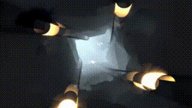](ShaderOfTheWeek/TunnelCable.md)

### 28th of November 2024
#### [Weird Truchet | New Keyboard](ShaderOfTheWeek/WeirdTruchetNewKeyboard.md) (Shadertoy ID [4ccfRn](https://www.shadertoy.com/view/4ccfRn))
[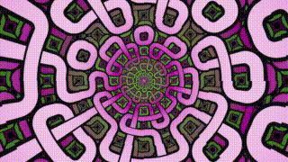](ShaderOfTheWeek/WeirdTruchetNewKeyboard.md)

### 27th of November 2024
#### [Fork Neon Tunne Infames 758](ShaderOfTheWeek/NeonTunne.md) (Shadertoy ID [mtl3RB](https://www.shadertoy.com/view/mtl3RB))
[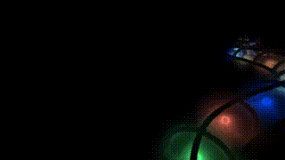](ShaderOfTheWeek/NeonTunne.md)

### 22nd of November 2024
#### [大龙猫 - Starfield](ShaderOfTheWeek/Starfield.md) (Shadertoy ID [lcjGWV](https://www.shadertoy.com/view/lcjGWV))
[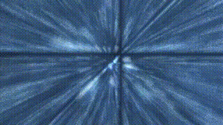](ShaderOfTheWeek/Starfield.md)

### 11th of November 2024
#### [Torus Hive](ShaderOfTheWeek/TorusHive.md) (Shadertoy ID [NsdXzf](https://www.shadertoy.com/view/NsdXzf))
[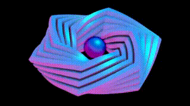](ShaderOfTheWeek/TorusHive.md)

### 22nd of October 2024
#### [Abstract Wave Thing](ShaderOfTheWeek/AbstractWaveThing.md) (Shadertoy ID [tttSW7](https://www.shadertoy.com/view/tttSW7))
[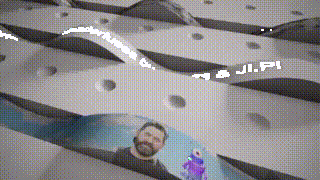](ShaderOfTheWeek/AbstractWaveThing.md)

### 22nd of October 2024
#### [Unstable Universe](ShaderOfTheWeek/UnstableUniverse.md) (Shadertoy ID [wtlfz8](https://www.shadertoy.com/view/wtlfz8))
[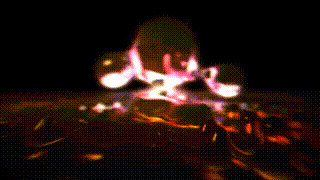](ShaderOfTheWeek/UnstableUniverse.md)

### 29th of September 2024
#### [Alien Space Jockey](ShaderOfTheWeek/AlienSpaceJockey.md) (Shadertoy ID [mdB3Rh](https://www.shadertoy.com/view/mdB3Rh))

### 10th of September 2024
#### [Starry planes](ShaderOfTheWeek/StarryPlanes.md) (Shadertoy ID [MfjyWK](https://www.shadertoy.com/view/MfjyWK))
[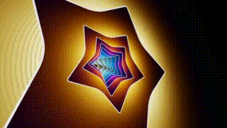](ShaderOfTheWeek/StarryPlanes.md)

### 17th of July 2024
#### [Alien Tunnel](ShaderOfTheWeek/AlienTunnel.md) (Shadertoy ID [X3ySRc](https://www.shadertoy.com/view/X3ySRc))
[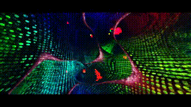](ShaderOfTheWeek/AlienTunnel.md)

### 1st of July 2024
#### [nested octahedrons 2](ShaderOfTheWeek/NestedOctahedrons2.md) (Shadertoy ID [X3cXDj](https://www.shadertoy.com/view/X3cXDj))
[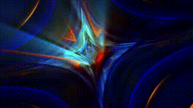](ShaderOfTheWeek/NestedOctahedrons2.md)

### 19th of June 2024
#### [Russian Roulette (Audio Viz)](ShaderOfTheWeek/RussianRouletteAudioViz.md) (Shadertoy ID [MfG3Ry](https://www.shadertoy.com/view/MfG3Ry))
[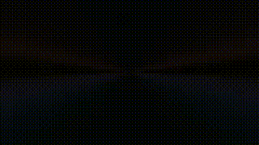](ShaderOfTheWeek/RussianRouletteAudioViz.md)

### 9th of June 2024
#### [Saturday weirdness](ShaderOfTheWeek/SaturdayWeirdness.md) (Shadertoy ID [43jXWt](https://www.shadertoy.com/view/43jXWt))
[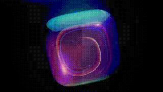](ShaderOfTheWeek/SaturdayWeirdness.md)

### 20th of May 2024
#### [Let's self reflect](ShaderOfTheWeek/LetSSelfReflect.md) (Shadertoy ID [XfyXRV](https://www.shadertoy.com/view/XfyXRV))
[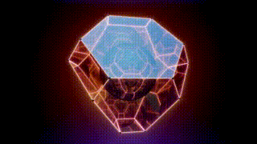](ShaderOfTheWeek/LetSSelfReflect.md)

### 17th of April 2024
#### [Orbital Megastructure](ShaderOfTheWeek/OrbitalMegastructure.md) (Shadertoy ID [WlKXzm](https://www.shadertoy.com/view/WlKXzm))
[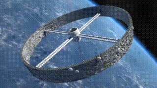](ShaderOfTheWeek/OrbitalMegastructure.md)

### 27th of March 2024
#### [Simplex Truchet Tubing](ShaderOfTheWeek/SimplexTruchetTubing.md) (Shadertoy ID [XsffWj](https://www.shadertoy.com/view/XsffWj))
[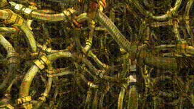](ShaderOfTheWeek/SimplexTruchetTubing.md)

### 20th of March 2024
#### [MountainBytes: PPPP 4KiB Windows](ShaderOfTheWeek/MountainbytesPppp4KibWindows.md) (Shadertoy ID [lX2GzD](https://www.shadertoy.com/view/lX2GzD))
[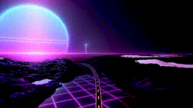](ShaderOfTheWeek/MountainbytesPppp4KibWindows.md)

### 1st of March 2024
#### [Space At Home](ShaderOfTheWeek/SpaceAtHome.md) (Shadertoy ID [MXS3zy](https://www.shadertoy.com/view/MXS3zy))

### 14th of February 2024
#### [Something  227](ShaderOfTheWeek/Something227.md) (Shadertoy ID [3lyBDw](https://www.shadertoy.com/view/3lyBDw))
[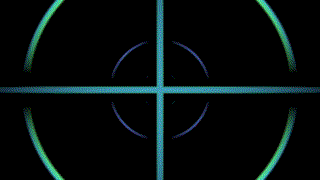](ShaderOfTheWeek/Something227.md)

### 16th of January 2024
#### [Full Spectrum Cyber](ShaderOfTheWeek/FullSpectrumCyber.md) (Shadertoy ID [XcXXzS](https://www.shadertoy.com/view/XcXXzS))
[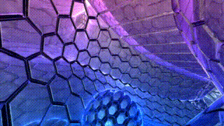](ShaderOfTheWeek/FullSpectrumCyber.md)

### 5th of January 2024
#### [Inside the torus](ShaderOfTheWeek/InsideTheTorus.md) (Shadertoy ID [XcS3zK](https://www.shadertoy.com/view/XcS3zK))
[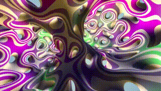](ShaderOfTheWeek/InsideTheTorus.md)

## 2023

### 18th of December 2023
#### [Android Runtime](ShaderOfTheWeek/AndroidRuntime.md) (Shadertoy ID [DltBRM](https://www.shadertoy.com/view/DltBRM))
[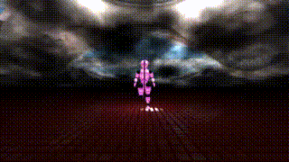](ShaderOfTheWeek/AndroidRuntime.md)

### 6th of December 2023
#### [Ground, Camera, Lighting, Helix](ShaderOfTheWeek/GroundCameraLightingHelix.md) (Shadertoy ID [Mt33W2](https://www.shadertoy.com/view/Mt33W2))
[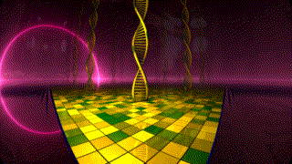](ShaderOfTheWeek/GroundCameraLightingHelix.md)

### 16th of November 2023
#### [Decorated Christmas Spiral](ShaderOfTheWeek/DecoratedChristmasSpiral.md) (Shadertoy ID [3dVfDc](https://www.shadertoy.com/view/3dVfDc))

### 1st of November 2023
#### [Neural Stanford Bunny (5 kb)](ShaderOfTheWeek/NeuralStanfordBunny5Kb.md) (Shadertoy ID [wtVyWK](https://www.shadertoy.com/view/wtVyWK))
[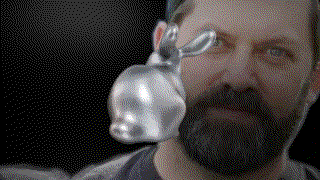](ShaderOfTheWeek/NeuralStanfordBunny5Kb.md)

### 17th of October 2023
#### [Straight Flagstone Tiles](ShaderOfTheWeek/StraightFlagstoneTiles.md) (Shadertoy ID [7tKGRc](https://www.shadertoy.com/view/7tKGRc))
[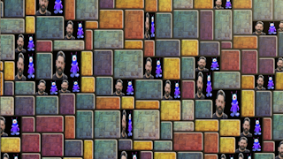](ShaderOfTheWeek/StraightFlagstoneTiles.md)

### 17th of September 2023
#### [Extruded Bauhaus Truchet Pattern](ShaderOfTheWeek/ExtrudedBauhausTruchetPattern.md) (Shadertoy ID [dl2fzz](https://www.shadertoy.com/view/dl2fzz))
[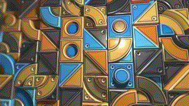](ShaderOfTheWeek/ExtrudedBauhausTruchetPattern.md)

### 5th of September 2023
#### [STELLAR CLOUDS](ShaderOfTheWeek/StellarClouds.md) (Shadertoy ID [DtdSz7](https://www.shadertoy.com/view/DtdSz7))
[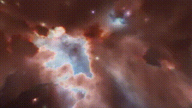](ShaderOfTheWeek/StellarClouds.md)

### 29th of August 2023
#### [Discoteq 2](ShaderOfTheWeek/Discoteq2.md) (Shadertoy ID [DtXfDr](https://www.shadertoy.com/view/DtXfDr))
[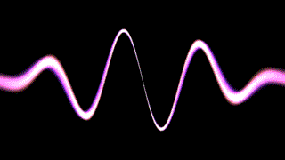](ShaderOfTheWeek/Discoteq2.md)

### 22nd of August 2023
#### [Inside the mandelbulb II](ShaderOfTheWeek/InsideTheMandelbulbIi.md) (Shadertoy ID [mtScRc](https://www.shadertoy.com/view/mtScRc))
[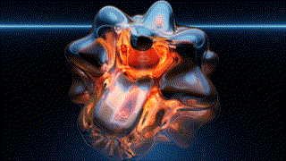](ShaderOfTheWeek/InsideTheMandelbulbIi.md)

### 15th of August 2023
#### [bomlka](ShaderOfTheWeek/Bomlka.md) (Shadertoy ID [mtXyD7](https://www.shadertoy.com/view/mtXyD7))
[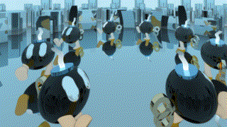](ShaderOfTheWeek/Bomlka.md)

### 18th of July 2023
#### [Whack-A-Mole Pistons](ShaderOfTheWeek/WhackAMolePistons.md) (Shadertoy ID [WtXcWB](https://www.shadertoy.com/view/WtXcWB))
[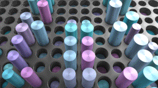](ShaderOfTheWeek/WhackAMolePistons.md)

### 4th of June 2023
#### [Playing around shader](ShaderOfTheWeek/PlayingAroundShader.md) (Shadertoy ID [NdscDf](https://www.shadertoy.com/view/NdscDf))
[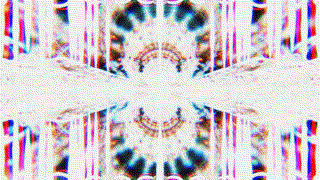](ShaderOfTheWeek/PlayingAroundShader.md)

### 11th of May 2023
#### [AI not included](ShaderOfTheWeek/AiNotIncluded.md) (Shadertoy ID [ctd3Rl](https://www.shadertoy.com/view/ctd3Rl))

### 2nd of May 2023
#### [A circle a day](ShaderOfTheWeek/ACircleADay.md) (Shadertoy ID [DdySzW](https://www.shadertoy.com/view/DdySzW))
[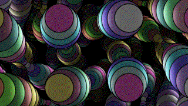](ShaderOfTheWeek/ACircleADay.md)

### 12th of April 2023
#### [RetroVision (Revision 2023)](ShaderOfTheWeek/RetrovisionRevision2023.md) (Shadertoy ID [DdVSzR](https://www.shadertoy.com/view/DdVSzR))

### 30th of March 2023
#### [Electric Eel Universe](ShaderOfTheWeek/ElectricEelUniverse.md) (Shadertoy ID [cdV3DW](https://www.shadertoy.com/view/cdV3DW))

### 8th of March 2023
#### [Green Field Diorama](ShaderOfTheWeek/HyperbolicGroupLimitSet.md) (Shadertoy ID [NstSDs](https://www.shadertoy.com/view/NstSDs))
[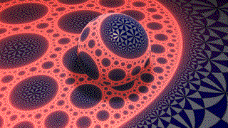](ShaderOfTheWeek/HyperbolicGroupLimitSet.md)

### 3rd of March 2023
#### [Green Field Diorama](ShaderOfTheWeek/GreenFieldDiorama.md) (Shadertoy ID [7dSGW1](https://www.shadertoy.com/view/7dSGW1))
[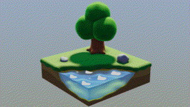](ShaderOfTheWeek/GreenFieldDiorama.md)

### 6th of February 2023
#### [NintendoSwitch](ShaderOfTheWeek/NintendoSwitch.md) (Shadertoy ID [wtlXRH](https://www.shadertoy.com/view/wtlXRH))
[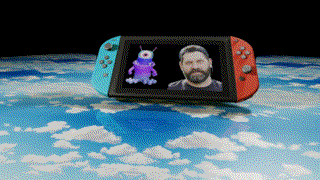](ShaderOfTheWeek/NintendoSwitch.md)

### 26th of December 2022 to 31th of January 2023
Not a worthwhile shader for fusion
#### 4D Sun (Shadertoy ID [wtVGDR](https://www.shadertoy.com/view/wtVGDR))
#### tHe gRiD (Shadertoy ID [7tGfWy](https://www.shadertoy.com/view/7tGfWy))
#### Desire Crystal (Shadertoy ID [flfyRS](https://www.shadertoy.com/view/flfyRS))
#### 4Traveling by the mountains (Shadertoy ID [Nlcczf](https://www.shadertoy.com/view/Nlcczf))

## 2022

### 19th of December 2022
#### [Audio Flight v2 (strobes)](ShaderOfTheWeek/AudioFlightv2.md) (Shadertoy ID [7tfyRl](https://www.shadertoy.com/view/7tfyRl))
[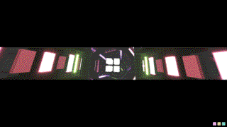](ShaderOfTheWeek/AudioFlightv2.md)

### 5th of December 2022
#### [ 20221105_inercia intended one](Audio/InerciaIntended.md) (Shadertoy ID [cs2GWD](https://www.shadertoy.com/view/cs2GWD))
[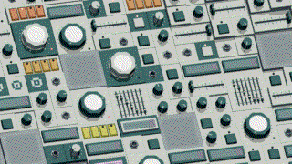](Audio/InerciaIntended.md)

### 21st of November 2022
#### [[Inércia 2022] Energetic Flyby](ShaderOfTheWeek/Energeticflyby.md) (Shadertoy ID [csjGDD](https://www.shadertoy.com/view/csjGDD))
[![[Inércia 2022] Energetic Flyby](ShaderOfTheWeek/Energeticflyby.gif)](ShaderOfTheWeek/Energeticflyby.md)

### 8th of November 2022
#### [generative art deco 4](ShaderOfTheWeek/GenerativeArtDeco4.md) (Shadertoy ID [mds3DX](https://www.shadertoy.com/view/mds3DX))
[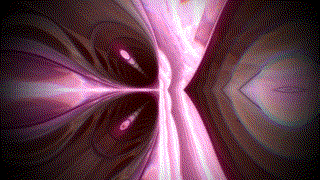](ShaderOfTheWeek/GenerativeArtDeco4.md)

### 2nd of November 2022
#### [Wednesday messing around](ShaderOfTheWeek/WednesdayMessingAround.md) (Shadertoy ID [NtcyDn](https://www.shadertoy.com/view/NtcyDn))

### 13th of September 2022
#### [Twizzly Circle Mess](ShaderOfTheWeek/TwizzlyCircleMess.md) (Shadertoy ID [sltGRj](https://www.shadertoy.com/view/sltGRj))
[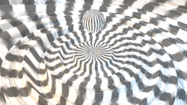](ShaderOfTheWeek/TwizzlyCircleMess.md)

### 31st of August 2022
#### [simple refraction test](ShaderOfTheWeek/SimpleRefractionTest.md) (Shadertoy ID [flcSW2](https://www.shadertoy.com/view/flcSW2))
[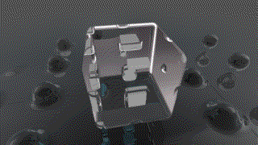](ShaderOfTheWeek/SimpleRefractionTest.md)

### 17th of August 2022
#### [Frozen wasteland](ShaderOfTheWeek/FrozenWasteland.md) (Shadertoy ID [Xls3D2](https://www.shadertoy.com/view/Xls3D2))

### 19th of July 2022
#### [Controllable Machinery](ShaderOfTheWeek/ControllableMachinery.md) (Shadertoy ID [fsXyDj](https://www.shadertoy.com/view/fsXyDj))
[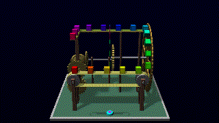](ShaderOfTheWeek/ControllableMachinery.md)

### 14th of June 2022
#### [Jeweled Vortex](ShaderOfTheWeek/JeweledVortex.md) (Shadertoy ID [fdjfDc](https://www.shadertoy.com/view/fdjfDc))
[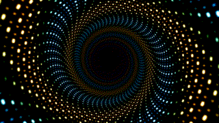](ShaderOfTheWeek/JeweledVortex.md)

### 7th of June 2022
#### fluffballs (Shadertoy ID [fscczX](https://www.shadertoy.com/view/fscczX))
Not a worthwhile shader for fusion

### 3rd of June 2022
#### [Coastal Landscape](ShaderOfTheWeek/CoastalLandscape.md) (Shadertoy ID [fstyD4](https://www.shadertoy.com/view/fstyD4))
[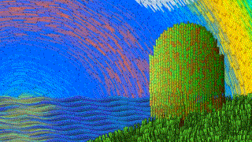](ShaderOfTheWeek/CoastalLandscape.md)

### 25th of May 2022
#### [Night circuit](ShaderOfTheWeek/NightCircuit.md) (Shadertoy ID [tdyBR1](https://www.shadertoy.com/view/tdyBR1))
[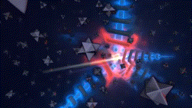](ShaderOfTheWeek/NightCircuit.md)

### 18th of May 2022
#### [Pig Squad 9 Year Anniversary](ShaderOfTheWeek/PigSquad.md) (Shadertoy ID [WdBcRh](https://www.shadertoy.com/view/WdBcRh))
[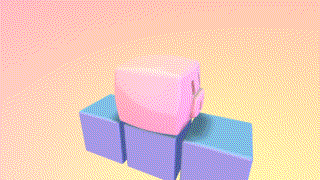](ShaderOfTheWeek/PigSquad.md)

### 12th of May 2022
#### [Cubic Dispersal](ShaderOfTheWeek/CubicDispersal.md) (Shadertoy ID [fldXWS](https://www.shadertoy.com/view/fldXWS))
[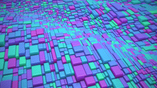](ShaderOfTheWeek/CubicDispersal.md)

### 5th of May 2022
#### [Color processing](ShaderOfTheWeek/ColorProcessing.md) (Shadertoy ID [7tfBzs](https://www.shadertoy.com/view/7tfBzs))
[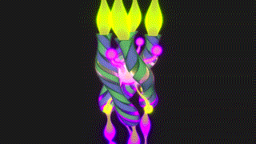](ShaderOfTheWeek/ColorProcessing.md)

### 27th of April 2022
#### [Space ship](ShaderOfTheWeek/SpaceShip.md) (Shadertoy ID [NlsBzn](https://www.shadertoy.com/view/NlsBzn))
[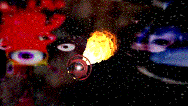](ShaderOfTheWeek/SpaceShip.md)

### 20th of April 2022
#### [DangerNoodle](ShaderOfTheWeek/DangerNoodle.md) (Shadertoy ID [wlVSDK](https://www.shadertoy.com/view/wlVSDK))
[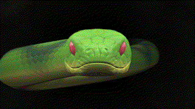](ShaderOfTheWeek/DangerNoodle.md)

### 14th of April 2022
#### [Stars and galaxy](ShaderOfTheWeek/StarsAndGalaxy.md) (Shadertoy ID [stBcW1](https://www.shadertoy.com/view/stBcW1))
[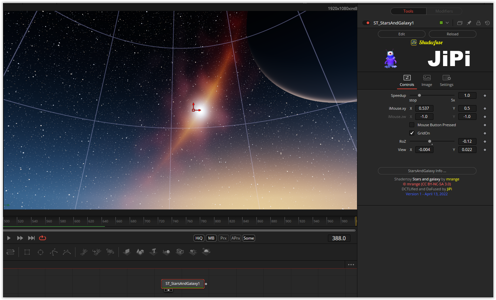](ShaderOfTheWeek/StarsAndGalaxy.md)

### 7th of April 2022
#### Desperate Distraction (Shadertoy ID [7ddSD7](https://www.shadertoy.com/view/7ddSD7))
Not a worthwhile shader for fusion

### 30th of March 2022
#### [@Party Concert Visuals 2020](ShaderOfTheWeek/PartyConcertVisuals2020.md) (Shadertoy ID [WtscW4](https://www.shadertoy.com/view/WtscW4))
[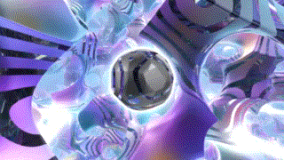](ShaderOfTheWeek/PartyConcertVisuals2020.md)

### 23rd of March 2022
#### [OMZG Shader Royale](ShaderOfTheWeek/OMZGShaderRoyale.md) (Shadertoy ID [3l3Bzl](https://www.shadertoy.com/view/3l3Bzl))
[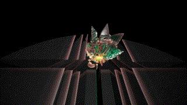](ShaderOfTheWeek/OMZGShaderRoyale.md)

## 16th of March 2022
#### Morning Commute (Shadertoy ID [wdKBz1](https://www.shadertoy.com/view/wdKBz1))
Not a worthwhile shader for fusion

### 9th of March 2022
#### Quartz - wip (Shadertoy ID [fs2GWh](https://www.shadertoy.com/view/fs2GWh))
Not a worthwhile shader for fusion

### 2th of March 2022
#### Synthwave song (sound) (Shadertoy ID [NddSzl](https://www.shadertoy.com/view/NddSzl))
AudioShader, which is not convertible

### 23rd of February 2022
#### [Lover](ShaderOfTheWeek/Lover.md) (Shadertoy ID [fsjyR3](https://www.shadertoy.com/view/fsjyR3))
[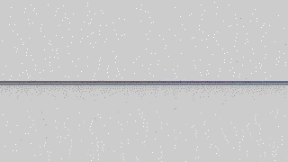](ShaderOfTheWeek/Lover.md)

### 16th of February 2022
#### [Terraform](ShaderOfTheWeek/Terraform.md) (Shadertoy ID [NsdXDs](https://www.shadertoy.com/view/NsdXDs))
[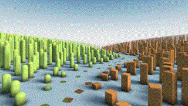](ShaderOfTheWeek/Terraform.md)

### 9th of February 2022
#### [StarGazingHippo](ShaderOfTheWeek/StarGazingHippo.md) (Shadertoy ID [4tGfz3](https://www.shadertoy.com/view/4tGfz3))
[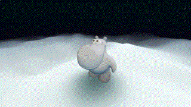](ShaderOfTheWeek/StarGazingHippo.md)

### 2nd of February 2022
#### [Undulating Columns](ShaderOfTheWeek/UndulatingColumns.md) (Shadertoy ID [WlXXDH](https://www.shadertoy.com/view/WlXXDH))
[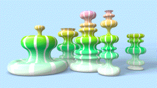](ShaderOfTheWeek/UndulatingColumns.md)

### 26th of January 2022
#### [Trippy Triangle](ShaderOfTheWeek/TrippyTriangle.md) (Shadertoy ID [fslcDS](https://www.shadertoy.com/view/fslcDS))
[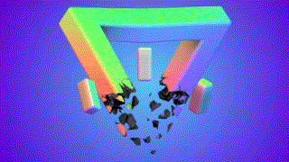](ShaderOfTheWeek/TrippyTriangle.md)

### 19th of January 2022
#### [Exit the Matrix](ShaderOfTheWeek/ExitTheMatrix.md) (Shadertoy ID [NlsXDH](https://www.shadertoy.com/view/NlsXDH))

### 12th of January 2022
#### [On the salt lake](ShaderOfTheWeek/OnTheSal.md) (Shadertoy ID [fsXcR8](https://www.shadertoy.com/view/fsXcR8))
[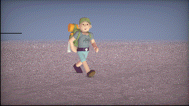](ShaderOfTheWeek/OnTheSal.md)

### 5th of January 2022
#### [Recursive Donut](ShaderOfTheWeek/RecursiveDonut.md) (Shadertoy ID [tls3WB](https://www.shadertoy.com/view/tls3WB))
[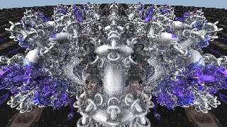](ShaderOfTheWeek/RecursiveDonut.md)

## 2021

### 30th of December 2021
#### [Truchet + Kaleidoscope FTW](ShaderOfTheWeek/TruchetKaleidoscopeFTW.md) (Shadertoy ID [7lKSWW](https://www.shadertoy.com/view/7lKSWW))

### 16th of Dezember 2021
#### Paper Plane (Shadertoy ID [tstczS](https://www.shadertoy.com/view/tstczS))
GameShader, is not interesting as a shaderfuse, as it is intended for playing

### 8th of December 2021
#### [HyperDough](ShaderOfTheWeek/HyperDough.md) (Shadertoy ID [7tcGWB](https://www.shadertoy.com/view/7tcGWB))
[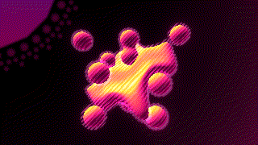](ShaderOfTheWeek/HyperDough.md)

### 3rd of December 2021
#### [Fractal Gliding](ShaderOfTheWeek/FractalGliding.md) (Shadertoy ID [ftGGDR](https://www.shadertoy.com/view/ftGGDR))
[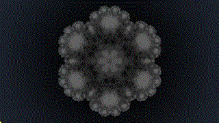](ShaderOfTheWeek/FractalGliding.md)

### 18th of November 2021
#### [RME4 - Crater](ShaderOfTheWeek/RME4Crater.md) (Shadertoy ID [MlSBDt](https://www.shadertoy.com/view/MlSBDt))
[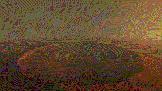](ShaderOfTheWeek/RME4Crater.md)

### 11th of November 2021
#### [Futuristic Tunnel](ShaderOfTheWeek/FuturisticTunnel.md) (Shadertoy ID [wdScRd](https://www.shadertoy.com/view/wdScRd))
[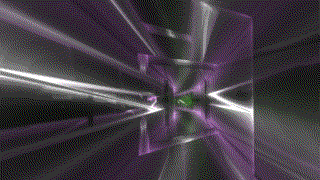](ShaderOfTheWeek/FuturisticTunnel.md)

### 3rd of November 2021
#### [Alexander horned sphere zoom](ShaderOfTheWeek/AlexanderHornedSphereZoom.md) (Shadertoy ID [ttyGzW](https://www.shadertoy.com/view/ttyGzW))
[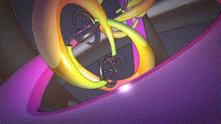](ShaderOfTheWeek/AlexanderHornedSphereZoom.md)

### 29th of October 2021
#### [Spiraled Layers](ShaderOfTheWeek/SpiraledLayers.md) (Shadertoy ID [Ns3XWf](https://www.shadertoy.com/view/Ns3XWf))
[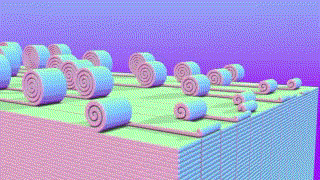](ShaderOfTheWeek/SpiraledLayers.md)

### 20th of October 2021
#### [Taste Of Noise 7](ShaderOfTheWeek/TasteOfNoise7.md) (Shadertoy ID [NddSWs](https://www.shadertoy.com/view/NddSWs))
[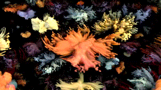](ShaderOfTheWeek/TasteOfNoise7.md)

### 5th of October 2021
#### [20210930_CLUB-CAVE-09](ShaderOfTheWeek/ClubCave09.md) (Shadertoy ID [ss3SD8](https://www.shadertoy.com/view/ss3SD8))
[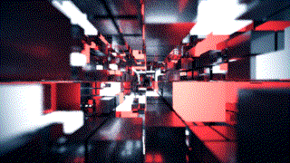](ShaderOfTheWeek/ClubCave09.md)

### 28th of September 2021
#### [SimpleSphereRaymarching](ShaderOfTheWeek/SimpleSphereRaymarching.md) (Shadertoy ID [NdKGWV](https://www.shadertoy.com/view/NdKGWV))
[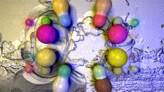](ShaderOfTheWeek/SimpleSphereRaymarching.md)

### 21st of September 2021
#### TechnoSong (Shadertoy ID [sls3WM](https://www.shadertoy.com/view/sls3WM))
AudioShader, which is not convertible

### 14th of September 2021
#### [Day94](ShaderOfTheWeek/Day94.md) (Shadertoy ID [tdXcWM](https://www.shadertoy.com/view/tdXcWM))
[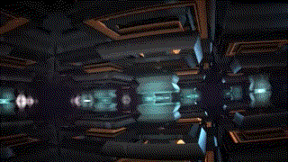](ShaderOfTheWeek/Day94.md)

### 7th of September 2021
#### [FractalFlythrough](ShaderOfTheWeek/FractalFlythrough.md) (Shadertoy ID [4s3SRN](https://www.shadertoy.com/view/4s3SRN))
[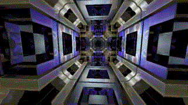](ShaderOfTheWeek/FractalFlythrough.md)
