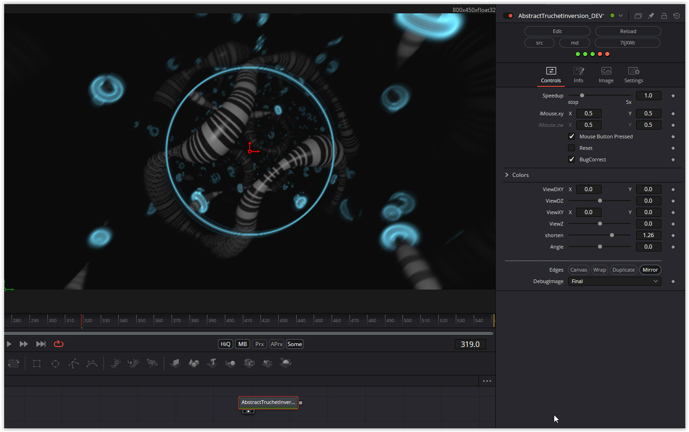

I found a bug with this shader. In any case, the DCTL shader does not produce the result of the WebGL original. I found a workaround.

Have fun playing

### Description of the Shader in Shadertoy:
Just taking a play day and pushing out some i've been kicking around - concept from older shader. Two woven truchet tile patterns, with some glow effects. Using buffer tab to feed in color for Fog to get trail effect.