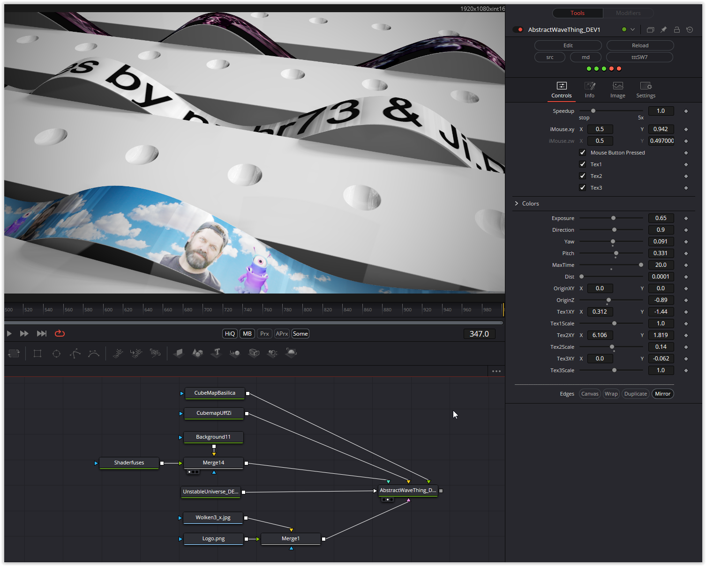

Extensive parameters invite you to play. The three waves can be given textures, their position and size can be adjusted and I have added extensive options for adjusting the viewing angle and section. Please note that the first two image inputs require cube maps, which affect the reflections and shadows.

Have fun playing

