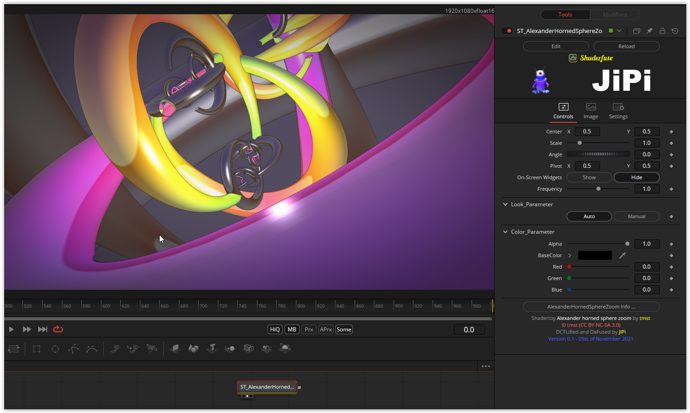

An interesting implementation of a mathematically pathological structure. A sphere embedded in space with an infinitely fine, recursively generated object structure.
In the implementation, both mat3 and mat4 matrices are used extensively.

Have fun playing

