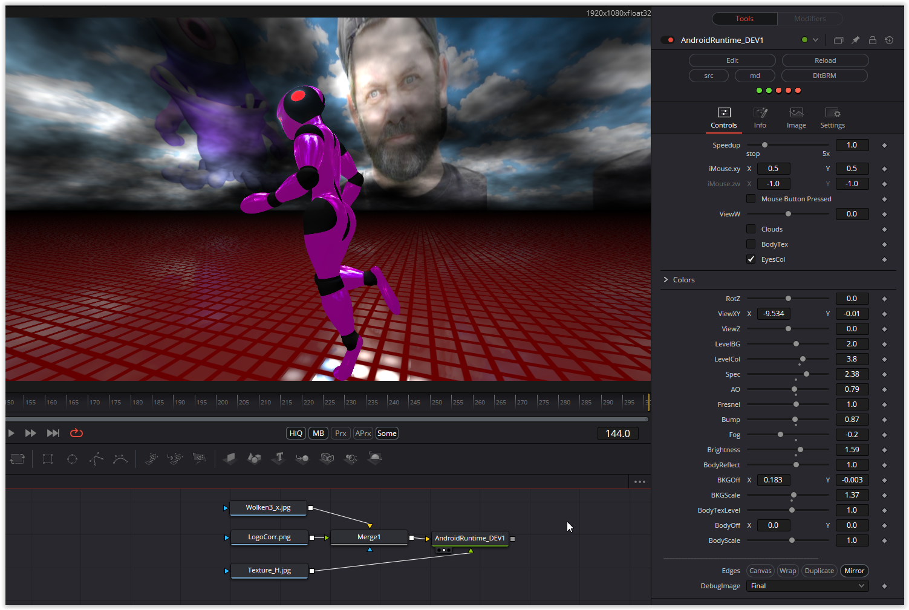

A great shader that simulates running movement very well. Colors and camera panning are implemented and you can set textures for the background and the runner.
Have fun playing

### Description of the Shader in Shadertoy:
Attempt at trying to simulate mocap motion with simple trig.

