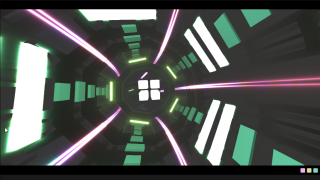

# AudioFlightv2

Based on '_[Audio Flight v2 (strobes)](https://www.shadertoy.com/view/dd2XDd)_' by [byt3_m3chanic](https://www.shadertoy.com/user/byt3_m3chanic) and ported by [JiPi](../../Site/Profiles/JiPi.md)

A beautiful tunnel flight with audio visualization. Extensive parameters allow you to customize the look and flow. Unfortunately, the shader behaves a bit differently when using OpenCL.

## Compatibility
- [ ] Tested on macOS/Metal
- [ ] Tested on macOS/OpenCL
- [X] Tested on Windows/Cuda
- [X] Tested on Windows/OpenCL, but it differs from Original
